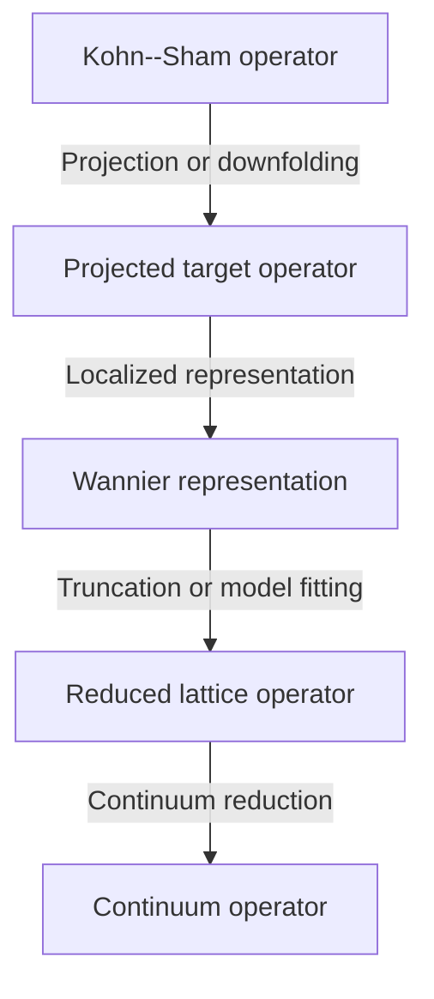
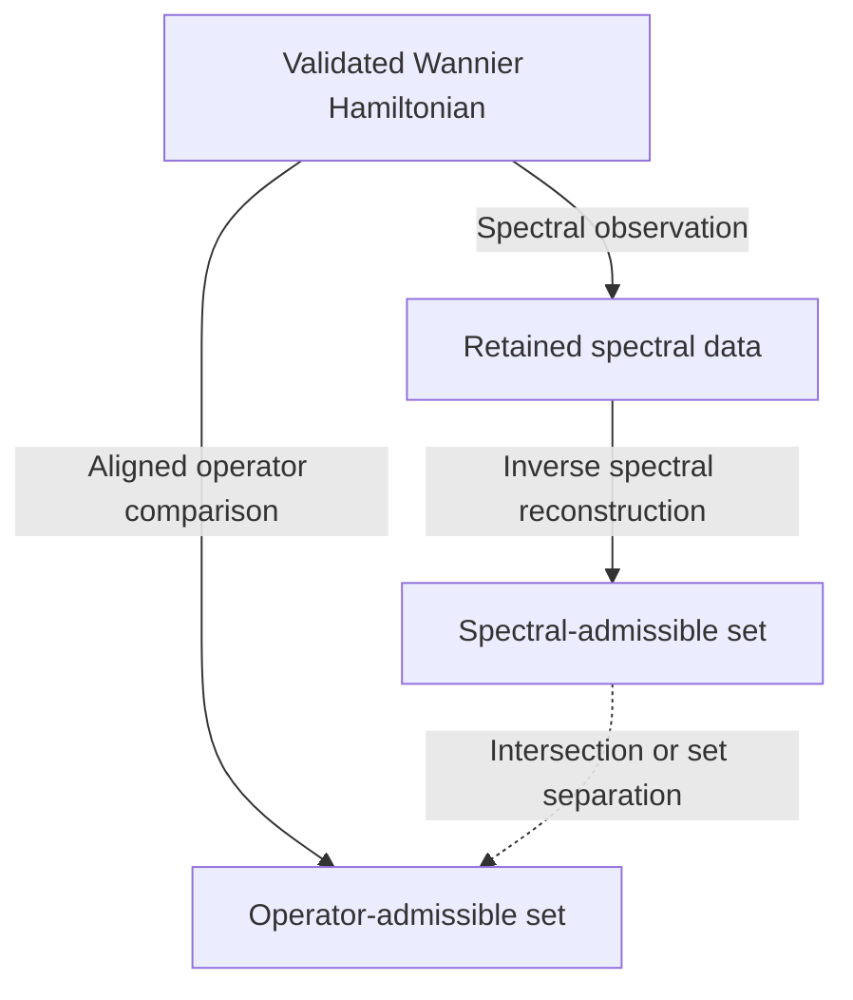
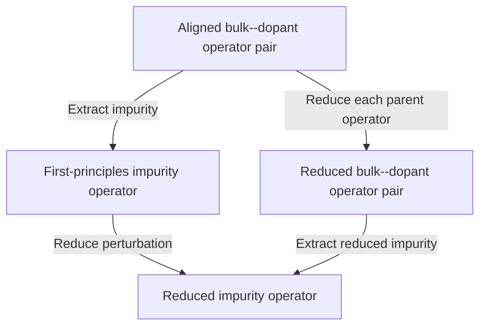
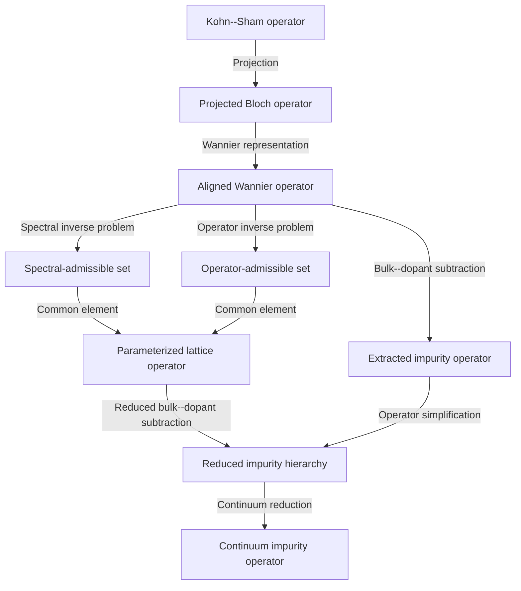

back_to: [[ksdft2Effmass.00]]
# Categorical Organization of Operator Reductions

## Scope

This section provides a compositional organization of the operator reductions defined in [[ksdft2Effmass.01]]--[[ksdft2Effmass.09]]. It does not replace the spectral, numerical, and multiscale analysis developed there. Its purpose is to state when reduction procedures can be composed, when alternative reduction paths should agree, and how their failure to agree can be measured.

The categorical structure is therefore introduced after the concrete state spaces, operators, alignments, and error metrics have been defined. In the present program it is a proposed organizational framework and a source of testable consistency conditions, rather than an established theorem about all electronic-structure reductions.

## Reduction Diagram

The principal sequence of model levels is

$$
\hat{H}_{\mathrm{KS}}
\longrightarrow
\hat{H}^{(P)}
\longrightarrow
\mathbf{H}_{\mathrm{W}}
\longrightarrow
\mathbf{H}_{\mathrm{red}}
\longrightarrow
\hat{H}_{\mathrm{cont}},
$$

where $\hat{H}_{\mathrm{KS}}$ is a self-consistent Kohn--Sham operator, $\hat{H}^{(P)}$ is its compression to a target subspace, $\mathbf{H}_{\mathrm{W}}$ is a localized Wannier representation of the compressed operator, $\mathbf{H}_{\mathrm{red}}$ is a reduced lattice Hamiltonian, and $\hat{H}_{\mathrm{cont}}$ is a continuum effective-mass operator.

The arrows in this diagram do not all have the same mathematical status. A unitary change of basis is invertible and preserves the represented operator exactly. Projection, truncation, parameter fitting, and continuum approximation generally discard information. A categorical account must preserve this distinction.

## Operator Models as Objects

An operator model is represented by an object

$$
\mathsf{M}
=
\left(
\mathcal{H},
\hat{H},
\hat{\Pi},
\mathscr{O},
\mathscr{D}
\right),
$$

where:

- $\mathcal{H}$ is the state space of the model;
- $\hat{H}$ is the Hamiltonian acting on $\mathcal{H}$;
- $\hat{\Pi}$ is the projector onto the states against which the model is to be validated;
- $\mathscr{O}$ is a specified collection of target observables;
- $\mathscr{D}$ is the stated domain of physical and numerical validity.

The validation projector $\hat{\Pi}$ need not equal the projector $\hat{P}$ used to construct a reduced state space. The construction projector $\hat{P}$ defines which states are retained, whereas $\hat{\Pi}$ defines which states are used to assess a particular approximation. They may coincide, but that equality must not be assumed.

The validity specification $\mathscr{D}$ records the conditions under which comparisons are meaningful. Depending on the model, it may include an energy interval, a region of the Brillouin zone, a spatial exterior region, a set of dopants, a range of supercell sizes, or a collection of target observables.

The same physical operator may admit several objects with different validation data. For example, a Wannier Hamiltonian validated throughout a full energy window and the same Hamiltonian validated only near the silicon conduction valleys are distinct model specifications even if their Hamiltonian matrices are identical.

## Transformations Between Models

Let

$$
\Phi
:
\mathsf{M}_1
\longrightarrow
\mathsf{M}_2
$$

denote an admissible transformation from model $\mathsf{M}_1$ to model $\mathsf{M}_2$. The symbol $\Phi$ denotes the complete transformation procedure, including any state-space map, operator construction, parameter choice, alignment, and declared validity conditions.

Examples include:

- a unitary change of basis;
- identification and alignment of two projected subspaces;
- compression to a target subspace;
- downfolding of eliminated degrees of freedom;
- truncation of real-space matrix elements;
- fitting within a prescribed tight-binding model class;
- replacement of a lattice operator by a continuum operator.

Successive transformations compose. If

$$
\Phi
:
\mathsf{M}_1
\longrightarrow
\mathsf{M}_2
$$

and

$$
\Psi
:
\mathsf{M}_2
\longrightarrow
\mathsf{M}_3,
$$

then

$$
\Psi\circ\Phi
:
\mathsf{M}_1
\longrightarrow
\mathsf{M}_3
$$

denotes the procedure that first applies $\Phi$ and then applies $\Psi$. The composition is admissible only when the output specification of $\Phi$ supplies the state space, operator data, and validity information required as input by $\Psi$.

For every model $\mathsf{M}$, the identity transformation

$$
\operatorname{id}_{\mathsf{M}}
:
\mathsf{M}
\longrightarrow
\mathsf{M}
$$

leaves the complete model specification unchanged. Associative composition and identity transformations supply the elementary categorical structure.

This construction defines a category only after the admissible objects, transformations, and composition rules have been fixed. The notation used here should therefore be read as a proposed category of validated operator models, denoted by

$$
\mathsf{OpMod},
$$

rather than as a claim that every physically conceivable approximation belongs to one universal category.

## Exact Equivalences and the Gauge Groupoid

Within a fixed retained subspace, two orthonormal bases may be related by a unitary operator

$$
\hat{U}
:
\mathcal{H}^{(P)}
\longrightarrow
\mathcal{H}^{(P)}.
$$

The corresponding Hamiltonians satisfy

$$
\hat{H}'
=
\hat{U}
\hat{H}
\hat{U}^{\dagger}.
$$

Because $\hat{U}^{-1}=\hat{U}^{\dagger}$ exists, this transformation changes the representation without discarding operator information. Wannier gauges related in this manner form a groupoid: the objects are admissible representations, and every morphism between them is invertible.

The gauge-equivalence class of $\hat{H}$ is

$$
\left[
\hat{H}
\right]_{\mathrm{g}}
=
\left\{
\hat{U}
\hat{H}
\hat{U}^{\dagger}
:
\hat{U}\in\mathcal{G}
\right\},
$$

where $\mathcal{G}$ is the set of admissible unitary gauge transformations. Physical claims about the projected operator should be claims about this equivalence class or about gauge-invariant quantities, rather than about one arbitrary matrix representation.

This distinction is essential for impurity extraction. A matrix difference between bulk and dopant Wannier Hamiltonians is meaningful only after a physically justified alignment has identified the two representations, as defined in [[ksdft2Effmass.04]].

## Irreversible Reduction Morphisms

A reduction morphism

$$
\mathcal{R}
:
\mathsf{M}
\longrightarrow
\mathsf{M}_{\mathrm{red}}
$$

changes the model class or retained information. In general, no inverse morphism reconstructs the complete parent model from $\mathsf{M}_{\mathrm{red}}$.

For a projection,

$$
\hat{H}
\longmapsto
\hat{P}
\hat{H}
\hat{P}
\big|_{\operatorname{Range}(\hat{P})},
$$

the eliminated complement $\operatorname{Ker}(\hat{P})$ is not retained unless it is represented through an explicit energy-dependent downfolding term. For a real-space truncation, matrix elements outside the retained hopping domain are discarded. For a parameterized tight-binding fit, the reference operator is replaced by an element of a smaller prescribed model class.

The existence of an arrow

$$
\mathsf{M}
\xrightarrow{\mathcal{R}}
\mathsf{M}_{\mathrm{red}}
$$

therefore does not imply an equivalence between the two objects. It asserts only that a documented reduction procedure relates them over the declared validity domain.

## Reduction Schemes as Functors

Let $\mathsf{FP}$ denote a category whose objects are first-principles model instances and whose morphisms are admissible relations between those instances. Such relations may include changes of supercell size, crystal geometry, dopant species, or representation, provided the required state-space identifications have been defined.

Let $\mathsf{Eff}$ denote a category of effective operator models. A systematic reduction scheme is represented by a candidate functor

$$
\mathcal{R}
:
\mathsf{FP}
\longrightarrow
\mathsf{Eff}.
$$

On objects, the functor assigns an effective model to each first-principles model:

$$
\mathcal{R}
\left(
\mathsf{M}
\right)
=
\mathsf{M}_{\mathrm{eff}}.
$$

On a morphism

$$
f
:
\mathsf{M}_1
\longrightarrow
\mathsf{M}_2,
$$

it assigns an induced effective-model transformation

$$
\mathcal{R}(f)
:
\mathcal{R}(\mathsf{M}_1)
\longrightarrow
\mathcal{R}(\mathsf{M}_2).
$$

Exact functoriality requires

$$
\mathcal{R}
\left(
\operatorname{id}_{\mathsf{M}}
\right)
=
\operatorname{id}_{\mathcal{R}(\mathsf{M})}
$$

and

$$
\mathcal{R}
\left(
g\circ f
\right)
=
\mathcal{R}(g)
\circ
\mathcal{R}(f),
$$

where $f$ and $g$ are composable morphisms in $\mathsf{FP}$. The first equation requires the reduction to preserve identity transformations. The second requires a composed transformation of the parent models to induce the same effective transformation as reducing the two stages separately.

Most practical reductions in this program will satisfy these relations only approximately. Functoriality is therefore a hypothesis to be tested, not a property conferred by notation.

## Gauge Equivariance as a Consistency Condition

Let $\mathcal{R}$ be a reduction scheme and let $\hat{U}$ be an admissible gauge transformation of a parent Hamiltonian. Let $\widetilde{\mathbf{U}}$ denote the transformation induced on the reduced coordinate space. Gauge stability requires

$$
\mathcal{R}
\left(
\hat{U}
\hat{H}
\hat{U}^{\dagger}
\right)
\approx
\widetilde{\mathbf{U}}
\mathcal{R}
\left(
\hat{H}
\right)
\widetilde{\mathbf{U}}^{\dagger}.
$$

After both sides have been represented on a common finite-dimensional space, define the gauge-equivariance defect by

$$
\boxed{
\varepsilon_{\mathrm{g}}(\mathcal{R},\hat{U})
=
\frac{
\left\|
\mathcal{R}
\left(
\hat{U}\hat{H}\hat{U}^{\dagger}
\right)
-
\widetilde{\mathbf{U}}
\mathcal{R}
\left(
\hat{H}
\right)
\widetilde{\mathbf{U}}^{\dagger}
\right\|_2
}{
\left\|
\mathcal{R}
\left(
\hat{H}
\right)
\right\|_2
}
}.
$$

Here $\|\cdot\|_2$ is the spectral norm. If the denominator vanishes, the absolute numerator must be reported instead. A nonzero value indicates that the reduction depends on the chosen representation. Some dependence may be unavoidable when truncation is defined relative to localized orbitals, but its magnitude must be quantified.

## Parallel Operator Reconstructions within a Tight-Binding Class

The bulk-silicon pilot in [[ksdft2Effmass.05]] begins from a validated Wannier Hamiltonian $\mathbf{H}_{\mathrm{W},b}$ representing the selected first-principles subspace. It then asks two inverse questions within the same prescribed tight-binding model class $\mathfrak{M}_m$.

The inverse spectral reconstruction uses

$$
\mathbf{y}_{\mathrm{spec}}^{\mathrm{ref}}
=
\mathcal{S}
\left[
\mathbf{H}_{\mathrm{W},b}
\right]
$$

and returns the spectral-admissible parameter set

$$
\mathcal{A}_{\mathrm{spec}}^{(m)}
=
\left\{
\boldsymbol{\theta}\in\Theta_m:
\varepsilon_{\mathrm{spec},m}(\boldsymbol{\theta})
\leq
\tau_{\mathrm{spec},m}
\right\}.
$$

The direct aligned-operator reconstruction returns

$$
\mathcal{A}_{\mathrm{op}}^{(m)}
=
\left\{
\boldsymbol{\theta}\in\Theta_m:
\varepsilon_{\mathrm{op},m}(\boldsymbol{\theta})
\leq
\tau_{\mathrm{op},m}
\right\}.
$$

The two reconstruction routes form the diagram

These reconstructions are generally set-valued:

$$
\mathcal{R}_{\mathrm{spec}}^{(m)}
\left(
\mathbf{H}_{\mathrm{W},b}
\right)
=
\mathscr{H}_m
\left(
\mathcal{A}_{\mathrm{spec}}^{(m)}
\right)
$$

and

$$
\mathcal{R}_{\mathrm{op}}^{(m)}
\left(
\mathbf{H}_{\mathrm{W},b}
\right)
=
\mathscr{H}_m
\left(
\mathcal{A}_{\mathrm{op}}^{(m)}
\right),
$$

where $\mathscr{H}_m(\mathcal{A})$ denotes the Hamiltonian image of parameter set $\mathcal{A}$. A deterministic reduction morphism arises only after a selection rule chooses a representative Hamiltonian or after identifiability and the imposed tolerances reduce an admissible set to a singleton.

Compatibility requires

$$
\boxed{
\mathcal{A}_{\mathrm{spec}}^{(m)}
\cap
\mathcal{A}_{\mathrm{op}}^{(m)}
\neq
\varnothing
}.
$$

This criterion asks whether a single model-class element satisfies both reconstructions. It does not require the independently selected minimizers of the two error functionals to coincide.

When the intersection is empty and both sets are nonempty, their incompatibility is diagnosed by the normalized real-space Hamiltonian separation

$$
d_{H,m}
\left(
\mathcal{A}_{\mathrm{spec}}^{(m)},
\mathcal{A}_{\mathrm{op}}^{(m)}
\right),
$$

defined in [[ksdft2Effmass.08]]. If either set is empty, the failure is model-class infeasibility for the corresponding criterion rather than separation between two admissible families.

If representative selection rules are introduced, let

$$
\boldsymbol{\theta}_{\mathrm{spec},m}^{\star}
\in
\mathcal{A}_{\mathrm{spec}}^{(m)}
$$

and

$$
\boldsymbol{\theta}_{\mathrm{op},m}^{\star}
\in
\mathcal{A}_{\mathrm{op}}^{(m)}
$$

denote the selected spectral and operator representatives. Their corresponding tight-binding Hamiltonians are

$$
\mathbf{H}_{\mathrm{TB},m}^{(\mathrm{spec})}(\mathbf{k})
=
\mathbf{H}_{\mathrm{TB}}
\left(
\mathbf{k};
\boldsymbol{\theta}_{\mathrm{spec},m}^{\star}
\right)
$$

and

$$
\mathbf{H}_{\mathrm{TB},m}^{(\mathrm{op})}(\mathbf{k})
=
\mathbf{H}_{\mathrm{TB}}
\left(
\mathbf{k};
\boldsymbol{\theta}_{\mathrm{op},m}^{\star}
\right).
$$

After alignment to the same orbital ordering, energy reference, and matrix dimension, their representative path-consistency defect may be evaluated as

$$
\varepsilon_{\mathrm{path},m}
=
\frac{
\left[
\sum_{\mathbf{k}\in\mathcal{K}_{\mathrm{val}}}
\omega_{\mathbf{k}}
\left\|
\mathbf{H}_{\mathrm{TB},m}^{(\mathrm{spec})}(\mathbf{k})
-
\mathbf{H}_{\mathrm{TB},m}^{(\mathrm{op})}(\mathbf{k})
\right\|_{\mathrm{F}}^2
\right]^{1/2}
}{
\left[
\sum_{\mathbf{k}\in\mathcal{K}_{\mathrm{val}}}
\omega_{\mathbf{k}}
\left\|
\mathbf{H}_{\mathrm{W},b}(\mathbf{k})
\right\|_{\mathrm{F}}^2
\right]^{1/2}
}.
$$

Here $\mathcal{K}_{\mathrm{val}}$ is a withheld set of validation wavevectors, $\omega_{\mathbf{k}}\geq 0$ is the prescribed weight assigned to $\mathbf{k}$, and $\|\cdot\|_{\mathrm{F}}$ is the Frobenius norm.

This defect measures disagreement between two selected representatives. It depends on the selection rules and therefore does not characterize the complete admissible families. The primary compatibility criterion remains

$$
\mathcal{A}_{\mathrm{spec}}^{(m)}
\cap
\mathcal{A}_{\mathrm{op}}^{(m)}
\neq
\varnothing.
$$

When the intersection is empty but both admissible sets are nonempty, the set separation

$$
d_{H,m}
\left(
\mathcal{A}_{\mathrm{spec}}^{(m)},
\mathcal{A}_{\mathrm{op}}^{(m)}
\right)
$$

is the appropriate measure of model-class incompatibility.
## Natural Comparison of Reduction Schemes

Let

$$
\mathcal{R}_1,
\mathcal{R}_2
:
\mathsf{FP}
\longrightarrow
\mathsf{Eff}
$$

denote two deterministic reduction schemes. In the bulk-silicon compatibility problem, these may be representative-selection maps applied to the spectral- and operator-admissible sets. A natural transformation

$$
\eta
:
\mathcal{R}_1
\Rightarrow
\mathcal{R}_2
$$

would assign to every first-principles object $\mathsf{M}$ a comparison morphism

$$
\eta_{\mathsf{M}}
:
\mathcal{R}_1(\mathsf{M})
\longrightarrow
\mathcal{R}_2(\mathsf{M}).
$$

For a morphism

$$
f
:
\mathsf{M}_1
\longrightarrow
\mathsf{M}_2,
$$

exact naturality requires

$$
\eta_{\mathsf{M}_2}
\circ
\mathcal{R}_1(f)
=
\mathcal{R}_2(f)
\circ
\eta_{\mathsf{M}_1}.
$$

This equation states that comparing the two reduced models after applying $f$ must agree with transporting the comparison already defined for the first system.

For this program, exact naturality is not assumed. An approximate naturality test may instead be defined by

$$
\boxed{
\varepsilon_{\mathrm{nat}}(f)
=
d_{\mathrm{Eff}}
\left(
\eta_{\mathsf{M}_2}
\circ
\mathcal{R}_1(f),
\mathcal{R}_2(f)
\circ
\eta_{\mathsf{M}_1}
\right)
},
$$

where $d_{\mathrm{Eff}}$ is a stated distance between the resulting effective-model transformations. In a finite common representation, $d_{\mathrm{Eff}}$ may be induced by one of the operator norms defined in [[ksdft2Effmass.08]].

A small value for one material does not establish naturality. The comparison must be repeated over a defined family of systems, such as several numerical discretizations, supercells, strain states, or dopant species.

## Impurity Extraction Before or After Reduction

Let

$$
\mathsf{E}_d
$$

denote the aligned impurity-extraction procedure for dopant $d$. Applied to a bulk--dopant pair, it produces

$$
\mathsf{E}_d
\left(
\hat{H}_{\mathrm{b}}^{(P)},
\hat{H}_d^{(P)}
\right)
=
\hat{H}_d^{(P)}
-
\hat{U}_d
\hat{H}_{\mathrm{b}}^{(P)}
\hat{U}_d^{\dagger},
$$

where $\hat{U}_d$ identifies the projected bulk state space with the projected dopant state space.

There are two possible reduction paths:

Let $\mathcal{R}_{\Delta}$ reduce the already extracted impurity operator, and let $\mathcal{R}_{\mathrm{pair}}$ reduce the bulk and dopant parent operators separately. The two outputs are

$$
\Delta\mathbf{H}_{d}^{(1)}
=
\mathcal{R}_{\Delta}
\left[
\mathsf{E}_d
\left(
\hat{H}_{\mathrm{b}}^{(P)},
\hat{H}_d^{(P)}
\right)
\right]
$$

and

$$
\Delta\mathbf{H}_{d}^{(2)}
=
\mathsf{E}_{d,\mathrm{red}}
\left[
\mathcal{R}_{\mathrm{pair}}
\left(
\hat{H}_{\mathrm{b}}^{(P)},
\hat{H}_d^{(P)}
\right)
\right],
$$

where $\mathsf{E}_{d,\mathrm{red}}$ is impurity extraction on the reduced comparison space.

The impurity-reduction commutator is defined by

$$
\boxed{
\mathbf{C}_{\mathrm{ext},d}
=
\Delta\mathbf{H}_{d}^{(1)}
-
\Delta\mathbf{H}_{d}^{(2)}
}.
$$

Its normalized defect is

$$
\boxed{
\varepsilon_{\mathrm{ext},d}
=
\frac{
\left\|
\mathbf{C}_{\mathrm{ext},d}
\right\|_w
}{
\left\|
\Delta\mathbf{H}_{d}^{(1)}
\right\|_w
}
},
$$

where $\|\cdot\|_w$ is the weighted real-space operator norm defined in [[ksdft2Effmass.08]]. If the denominator vanishes, the absolute defect must be reported.

This defect measures whether impurity extraction and model reduction commute over the chosen comparison space. It is expected to be nonzero when the reduction is nonlinear, when bulk and dopant fits use different weights or model classes, or when the alignment changes after reduction.

## Approximate Commutativity

More generally, consider two paths from a model $\mathsf{M}_0$ to a model $\mathsf{M}_3$:

$$
\mathsf{M}_0
\xrightarrow{\Phi_1}
\mathsf{M}_1
\xrightarrow{\Phi_2}
\mathsf{M}_3
$$

and

$$
\mathsf{M}_0
\xrightarrow{\Psi_1}
\mathsf{M}_2
\xrightarrow{\Psi_2}
\mathsf{M}_3.
$$

The diagram commutes exactly if

$$
\Phi_2\circ\Phi_1
=
\Psi_2\circ\Psi_1.
$$

If the outputs are Hamiltonians represented on a common finite-dimensional state space, define the commutativity defect by

$$
\boxed{
\varepsilon_{\mathrm{comm}}
=
\frac{
\left\|
\mathbf{H}_{\Phi}
-
\mathbf{H}_{\Psi}
\right\|_2
}{
\left\|
\mathbf{H}_{\Phi}
\right\|_2
}
},
$$

where $\mathbf{H}_{\Phi}$ and $\mathbf{H}_{\Psi}$ are the aligned Hamiltonian matrices obtained along the two paths. A different norm may be used when appropriate, but it must be stated and used consistently.

Exact commutativity is appropriate for changes of representation that are implemented without truncation or numerical error. Approximate commutativity is the relevant criterion for independently fitted, truncated, or continuum-reduced models.

## Error-Labeled Morphisms

Associate with each reduction morphism $\Phi$ an error label

$$
\boldsymbol{\varepsilon}(\Phi)
=
\left(
\varepsilon_H,
\varepsilon_{\Pi},
\varepsilon_{\mathrm{obs}}
\right)_{\Phi},
$$

where $\varepsilon_H$ is an operator-reconstruction error, $\varepsilon_{\Pi}$ is a target-subspace error, and $\varepsilon_{\mathrm{obs}}$ denotes the collection of observable-specific errors. The definitions of these quantities are given in [[ksdft2Effmass.08]].

The label must be accompanied by the validity domain

$$
\mathscr{D}_{\Phi},
$$

because an error bound obtained in one energy window, spatial region, or material family does not automatically apply outside it.

For composable reductions

$$
\mathsf{M}_1
\xrightarrow{\Phi}
\mathsf{M}_2
\xrightarrow{\Psi}
\mathsf{M}_3,
$$

an operator-error bound may take the form

$$
\boxed{
\varepsilon_H
\left(
\Psi\circ\Phi
\right)
\leq
L_{\Psi}
\varepsilon_H(\Phi)
+
\varepsilon_H(\Psi)
},
$$

where $L_{\Psi}\geq0$ is a stability factor measuring the amplification by $\Psi$ of errors already present at its input. The applicable validity domain is at most

$$
\mathscr{D}_{\Psi\circ\Phi}
\subseteq
\mathscr{D}_{\Phi}
\cap
\mathscr{D}_{\Psi}.
$$

Neither the bound nor the value of $L_{\Psi}$ is automatic. They must be derived analytically or estimated numerically for the specific reductions under study. When such composition laws are available, the model category may be treated as error-enriched: morphisms carry quantitative approximation data in addition to their source and target.

## Representation of the Complete Program

The concrete program can be summarized by the following diagram:

The two arrows entering the parameterized lattice operator define the spectral--operator compatibility test. The two arrows entering the reduced impurity hierarchy define the impurity-extraction commutativity test. Gauge transformations at the projected and Wannier levels define the gauge-equivariance test.

These tests convert the diagram into a computational research program:

$$
\boxed{
\text{define the paths}
\longrightarrow
\text{align their outputs}
\longrightarrow
\text{measure their defects}
\longrightarrow
\text{identify the validity domain}
}.
$$

## Research Claims Supported by This Structure

The categorical organization can support claims of the following form:

1. a reduction is invariant or stable under an admissible change of representation;
2. inverse spectral and direct aligned-operator reconstructions admit a common low-energy operator within stated tolerances;
3. impurity extraction and model reduction commute within a quantified defect;
4. a hierarchy of reductions composes with a controlled error-propagation law;
5. a reduction procedure transfers across a stated family of physical systems.

Each claim requires numerical or analytical evidence. The mere existence of a diagram, functor symbol, or natural-transformation symbol does not establish the corresponding property.

## Limits of the Categorical Description

Category theory does not determine:

- which Kohn--Sham functional or pseudopotential is accurate;
- which Bloch subspace should be retained;
- whether a Wannier construction is sufficiently localized;
- which tight-binding model class is physically adequate;
- the spatial decay of an impurity perturbation;
- the donor or acceptor binding spectrum;
- the continuum crossover radius $r_{c,d}$.

Those questions remain matters of first-principles calculation, spectral and subspace analysis, operator comparison, and multiscale modeling. The categorical structure organizes the relations among the resulting models and exposes consistency questions that can be tested.

## Epistemic Status

The immediate mathematical foundation of the program remains

$$
\boxed{
\text{spectral theory}
+
\text{subspace perturbation theory}
+
\text{gauge geometry}
+
\text{operator norms}
+
\text{multiscale analysis}
}.
$$

The categorical layer becomes substantive only after the reduction maps and their errors have been constructed. Its first empirical content will be the measured defects

$$
\varepsilon_{\mathrm{g}},
\qquad
d_{H,m},
\qquad
\varepsilon_{\mathrm{ext},d},
\qquad
\varepsilon_{\mathrm{comm}},
$$

which quantify gauge equivariance, separation of the spectral- and operator-admissible Hamiltonian sets, compatibility of impurity extraction with reduction, and general path independence, respectively.

If these quantities remain controlled across a defined family of systems, the computational results may support a formal theory of composable operator reductions. If they do not, the failures identify where representation dependence, model-class restriction, or nonlinear fitting obstructs such a theory.