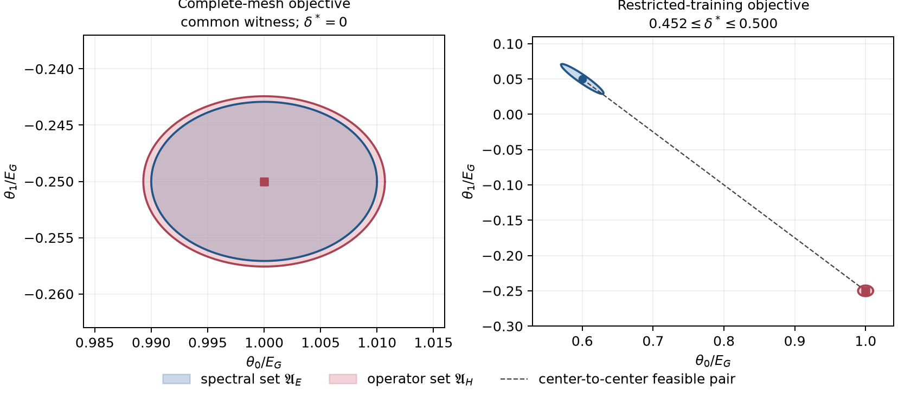

# Direct admissible-set demonstration report

## Status

**Calculated controlled numerical verification.** This report concerns a synthetic
one-dimensional scalar Hamiltonian. It does not report a material result, silicon
validation, uncertainty quantification, or protected calculator execution.

## Question

Can the paper's spectral and operator admissible sets be instantiated directly in a
common low-dimensional model class, with one constructive compatibility case and one
certified separated case?

## Frozen construction

The parent has hoppings $(h_0,h_{\pm1},h_{\pm2})=(1,-1/4,1/10)$ in units of
$E_G=1$. The candidate class retains only $(\theta_0,\theta_1)$ through
$E_{\boldsymbol\theta}(k)=\theta_0+2\theta_1\cos k$. Spectral weights are equal
and normalized on each declared training set. The operator loss covers
$R=-2,\ldots,2$ and uses the singleton identity alignment. Both parameter scales are
one. Every threshold is the exact analytic loss floor plus the predeclared excess
budget $10^{-4}$.

The operator normalization denominator is $229/200$, its irreducible omitted-tail
floor is $4/229$, and its threshold is $40229/2290000$. Translation-resolved residuals
at the operator optimum are zero for $R=0,\pm1$ and $1/10$ for $R=\pm2$.

## Compatible complete-mesh case

On $k\in\{0,\pi/3,2\pi/3,\pi,4\pi/3,5\pi/3\}$, the represented
translations $R=0,\pm1,\pm2$ are distinct and the first- and second-neighbor Fourier
columns are orthogonal. The spectral quadratic is centered at $(1,-1/4)$, with exact
minimum $1/50$ and threshold $201/10000$. The operator quadratic has the same center.

The point

$$
(\theta_0,\theta_1)=(1,-1/4)
$$

satisfies both thresholds exactly as a retained common feasible witness. Therefore the
set separation is zero and the frozen-case disposition is
`COMPATIBLE_COMMON_WITNESS`.

This is a constructive compatibility result relative to the declared model class,
losses, thresholds, alignment family, and finite domains. It does not establish that
the criteria are equivalent, that the witness is unique, or that another contract has
the same intersection.

## Separated restricted-training case

On $k\in\{-\pi/3,0,\pi/3\}$, the spectral fit absorbs the omitted second-neighbor
term and has center $(3/5,1/20)$ with zero training residual. The operator center remains
$(1,-1/4)$. Their Euclidean distance is exactly $1/2$.

The exact quadratic and rational radius bounds give

$$
0.452=\frac{113}{250}\leq\delta^\ast\leq\frac12=0.500.
$$

The lower bound follows from the reverse triangle inequality after enclosing the
spectral set within radius $37/1000$ and the operator set within radius $11/1000$ of
their respective centers. The upper bound is supplied by the feasible pair of centers.
Because the lower bound is positive, the frozen-case disposition is
`INCOMPATIBLE_CERTIFIED_SEPARATION`.

The restricted spectral center has zero training RMS error but a withheld RMS error of
$0.7211102551E_G$ on the four disjoint withheld points. The operator center has withheld
RMS error $0.1000000000E_G$. The withheld values diagnose generalization only; they do
not alter either admissible set or the certificate.

**Figure 1.** Analytic quadratic admissible sets. The plotted curves are sampled only
for visualization. The left disposition follows from an exact common witness. The right
disposition follows from exact rational enclosures, not the plotted sampling density.

## Evidence disposition

| Case | Spectral training | Result | Bounded disposition |
|---|---|---|---|
| Complete six-point mesh | Equal-weight complete mesh | Exact common witness $(1,-1/4)$ | Compatible for the frozen contract |
| Restricted three-point set | Equal-weight restricted domain | $0.452\leq\delta^\ast\leq0.500$ | Incompatible for the frozen contract |

The calculation answers the controlled question affirmatively. It does not transfer the
thresholds or either disposition to the earlier cosine-continuum experiments, to a
multiorbital model, or to silicon.
