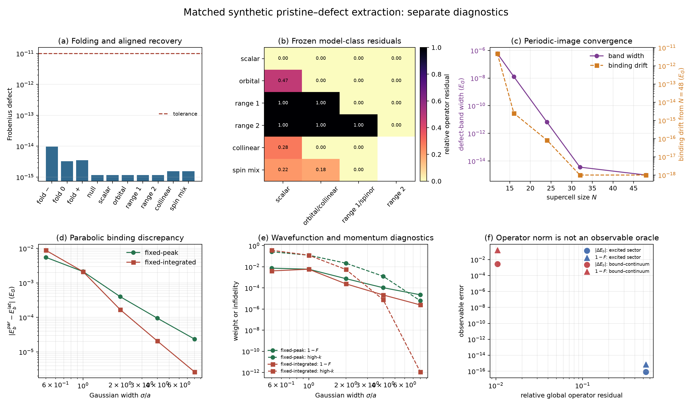

# Matched pristine–defect extraction in one dimension

## Abstract

A reduced impurity operator is meaningful only after pristine and defect
Hamiltonians have been placed in the same represented space. We test that
requirement with a bounded synthetic one-dimensional benchmark derived from the
accepted periodic-1D hopping records. Exact primitive-to-supercell folding is
verified first. Known null, local, nonlocal, collinear-spin, and spin-mixing
operators are then planted in matched supercells whose defect representation is
scrambled by a known translation, orbital permutation and gauge, spin-frame
rotation, and scalar energy-reference shift. Direct subtraction is rejected by metadata;
after applying the declared inverse maps, all plants are recovered with
Frobenius defects below $1.4\times10^{-15}E_G$. Omitting only the scalar
reference correction creates an exterior false offset of $0.750E_G$ in the
spinless controls. A Gaussian-defect sequence reduces the lowest defect-band
width from $5.95\times10^{-7}E_G$ at 12 cells to the numerical floor at 48
cells while its binding energy and localization measures stabilize. Frozen
model hierarchies select exactly the planted scalar, orbital, range-one,
range-two, collinear, and general spinor classes. Finally, lattice–parabolic
scans and constructed counterexamples show why operator, spectral, and
wavefunction errors must remain separate. These are synthetic numerical and
software verification results, not semiconductor validation.

## 1. Question and evidence boundary

The exercise asks a deliberately narrow question: if pristine and defect finite
Hamiltonians are generated from a common represented parent and the relation
between their coordinate systems is known, can the planted impurity operator be
recovered without confusing representation errors with model error?

The parent is not a material calculation. It consists of the accepted scalar
lowest-band hopping record and the accepted smooth two-band `low_pair` hopping
record from the periodic-1D exercise. The latter is truncated to $|R|\leq4$
for the supercell controls. All defects, transformations, and expected operators
are authored synthetic data. The benchmark therefore supports only the stated
software and numerical-verification claims.

## 2. Construction

### 2.1 Exact supercell representation

For two-orbital blocks $h_R$, the primitive Bloch matrix is

$$
H(k)=\sum_R e^{2\pi i kR}h_R.
$$

An $N$-cell supercell matrix is assembled directly from the same blocks, with
the correct Bloch phase on hoppings that cross its boundary. The explicit
Fourier folding map compares this matrix with the direct sum of the $N$ folded
primitive matrices. This is a representation identity, not a fitted relation.

### 2.2 Planted defects and coordinate changes

At $N=16$, the benchmark plants seven operators: zero, scalar onsite,
two-orbital onsite, range-one hopping, range-two hopping, collinear spin, and
spin mixing. The defect Hamiltonian is transformed by a known unitary combining
a cyclic translation by three cells, an orbital swap, an orbital rotation of
$0.41$ radians, orbital phases, a site phase, and, for spinful cases, a
$0.63$-radian global spin rotation. Its energy zero is shifted by $0.137E_G$.

Raw subtraction is intentionally prohibited: the pristine and transformed
defect records declare different site and orbital orderings, coordinate frames,
energy references, and, where applicable, spin frames. The extraction is
performed only after applying the explicit inverse unitary and scalar shift.
Six additional controls remove rank, spin-space, geometry, site,
retained-subspace, or energy-reference compatibility; all stop without returning
a nominal residual.

### 2.3 Independent numerical studies

The finite-size sequence repeats one fixed-peak Gaussian orbital defect in
12–48-cell supercells and samples 65 reduced supercell momenta. A separate
scalar-parent study compares the exact lattice dispersion with its quadratic
edge approximation on the same $N=128$ Fourier grid for fixed-peak and
fixed-integrated Gaussian families. The latter is a band-limited parabolic
comparator, not a claim of continuum convergence.

## 3. Results

### 3.1 Folding and extraction

Across the three tested supercell momenta, the maximum folded-operator
Frobenius defect is $9.69\times10^{-15}E_G$ and the maximum eigenvalue defect is
$7.77\times10^{-16}E_G$. The largest folding-map unitarity defect is
$1.86\times10^{-14}$, comfortably below the frozen $10^{-11}$ algebraic
threshold.

Every raw comparison stops for declared incompatibilities. Nevertheless, raw
matrix differences range around $2E_G$ and could easily be mistaken for large
impurity operators if metadata were ignored. After alignment, the maximum
planted-recovery defect over all seven cases is
$1.32\times10^{-15}E_G$. The null control returns
$8.72\times10^{-16}E_G$ in Frobenius norm, consistent with the numerical floor.

The scalar energy reference is independently consequential. When its known
$0.137E_G$ shift is omitted, the spinless controls contain a false exterior
operator norm of $0.750E_G$; after correction the null exterior norm is
$8.39\times10^{-16}E_G$. Thus localization cannot be assessed before the
energy-reference relation is fixed.

### 3.2 Frozen model classes

The predetermined nested model classes identify the authored structures without
changing the tolerance:

| planted operator | first adequate class | preceding relative residual |
|---|---:|---:|
| scalar onsite | scalar onsite | — |
| orbital onsite | orbital onsite | $0.474$ (scalar) |
| nearest-neighbor | range-one nonlocal | $1.000$ (onsite) |
| range-two hopping | range-two nonlocal | $1.000$ (range one) |
| collinear spin | collinear onsite | $0.278$ (spin independent) |
| spin mixing | general spinor onsite | $0.184$ (collinear) |

The exercise therefore distinguishes coordinate compatibility from model
adequacy: alignment makes subtraction meaningful, but it does not make an
underspecified model class adequate.

### 3.3 Periodic-image convergence

The fixed Gaussian defect produces two bound states at zero supercell momentum
throughout the sequence. The lowest defect-band width falls from
$5.95\times10^{-7}E_G$ at $N=12$ to $1.26\times10^{-8}E_G$ at $N=16$,
$6.60\times10^{-12}E_G$ at $N=24$, and the numerical floor by $N=32$.
The band-center binding changes by only $4.76\times10^{-12}E_G$ between
$N=12$ and $N=48$.

The lowest-state RMS radius stabilizes from $0.733783a$ to $0.733776a$, its core
probability remains approximately $0.999136$, and its inverse participation
ratio stabilizes near $0.384103$. The core-restricted planted operator is
identical across sizes by construction, while the explicitly retained exterior
norm is $2.07\times10^{-5}E_G$. These independent quantities distinguish a
fixed local operator from the decaying interaction between its periodic bound
states.

### 3.4 Lattice and parabolic comparisons

For the fixed-peak family, widening the Gaussian changes both smoothness and its
integrated strength. The absolute lattice–parabolic binding discrepancy falls
from $5.53\times10^{-3}E_G$ at $\sigma=0.5a$ to
$2.36\times10^{-5}E_G$ at $8a$, while state fidelity rises from $0.99254$ to
$0.999977$. The number of bound states differs at broad widths because the
integrated attraction grows with $\sigma$.

The continuum-normalized fixed-integrated family isolates a different path
through parameter space. Its actual discrete profile sum is retained and differs
by about $1.4\%$ from $|g|=0.3E_Ga$ at $\sigma=0.5a$ because a site sum is not a
continuum integral. Its binding discrepancy falls from $8.84\times10^{-3}E_G$ to
$2.65\times10^{-6}E_G$, fidelity rises from $0.99591$ to $0.9999975$, and the
lattice high-momentum weight falls from $0.367$ to $1.16\times10^{-12}$.
The lattice and parabolic bound-state counts agree at $\sigma=8a$ but not at all
narrower widths. These trends are consistent with improved quadratic-band
adequacy for smoother, low-momentum states. Because only one finite Fourier
grid is tested, they do not establish a converged continuum crossover.

### 3.5 Operator and observable metrics are noninterchangeable

The first controlled counterexample adds a rank-one residual of norm
$0.500E_G$ entirely in the highest excited eigenstate. Its global residual is
$0.539$ relative to the full reference Hamiltonian, yet its lowest binding
energy changes by only $8.33\times10^{-17}E_G$ and its lowest-state fidelity is
unity to numerical precision.

The second residual is much smaller: its Frobenius norm is
$9.66\times10^{-3}E_G$, only $0.0104$ relative to the full Hamiltonian. Because
it directly couples the lowest bound state to the first unbound state, it
changes the binding by $2.83\times10^{-3}E_G$ and lowers the state fidelity to
$0.8536$. The bound-state count remains nine in both controls. A global operator
norm therefore neither bounds nor replaces the observable diagnostics used
here without additional spectral information.

## 4. Verification and limitations

The independent verifier imports no calculation code. It reloads the exact
parent artifacts, reconstructs the folding and alignment maps, all planted and
projected operators, finite-size spectra, parabolic comparisons, and metric
counterexamples, and checks every retained matrix digest and numerical field.
Ruff, mypy, checksum verification, and the independent reconstruction are part
of the reproduction gate.

The frozen model classes use analytic orthogonal projections, so iterative
optimization error is absent rather than merged with class inadequacy. The
inherited parent-reduction error, extraction error, finite-size behavior,
class residual, and observable discrepancies remain distinct.

The benchmark does not test imperfect basis matching, disentanglement between
different calculations, material-dependent screening, a physical dopant, or a
continuum discretization limit. Its spin matrices test represented spin-space
bookkeeping; they do not implement explicit $\mathbf L\cdot\mathbf S$ coupling
or relativistic first-principles physics. Parent-representation error,
finite-size error, model-class residual, and observable error are never added
into one scalar estimate because no justified relation among them is assumed.

## 5. Conclusion

For exactly matched synthetic supercells, impurity extraction is algebraically
stable once translation, orbital gauge, spin frame, and scalar energy reference
are explicitly aligned. The null and planted controls demonstrate the complete
known answer, while the stopping cases demonstrate when no answer should be
returned. The finite-size, model-hierarchy, lattice–parabolic, and metric
counterexamples then show that representation compatibility is necessary but
not sufficient for model adequacy. The result is a bounded verification of the
extraction procedure, not evidence that the same reductions are accurate for a
semiconductor impurity.
