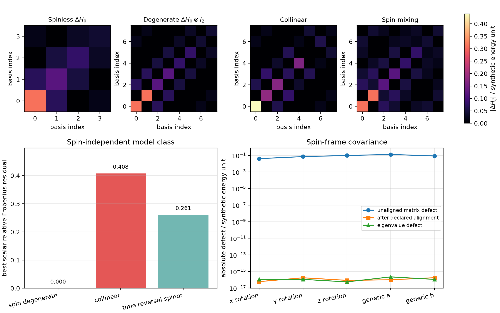

# Controlled spin-space embeddings for finite impurity operators

## Abstract

Impurity-operator comparisons become ill-defined when spinless, spin-degenerate, collinear, and spinor matrices are treated as if equal array shape or related spectra supplied a common state space. This controlled synthetic study constructs those four representations from an authored four-orbital operator, retains every ordering and spin-frame map, and tests exact lift, normalization, covariance, time-reversal, model-class, and incompatibility identities. The spin-degenerate lift reproduces both spin-sector pullbacks exactly and satisfies the expected $\sqrt{2}$ Frobenius scaling to $1.11\times10^{-16}$. An unaligned block-order change produces a $5.60\times10^{-1}$ matrix defect, whereas the declared permutation removes it exactly. Five nontrivial spin-frame rotations produce unaligned defects from $4.01\times10^{-2}$ to $1.28\times10^{-1}$ but aligned defects no larger than $1.77\times10^{-16}$. The optimal spin-independent class exactly recovers the degenerate lift and retains relative residuals of $0.408$ and $0.261$ for the planted collinear and spin-mixing terms. Structured comparison stops prevent spinless--spinful subtraction, unaligned block subtraction, and subtraction across different energy references. These are calculated numerical-verification results for synthetic matrices; they do not validate a material spin Hamiltonian or establish transferability to phosphorus, boron, or silicon.

## 1. Motivation

The pristine pilot and the eventual dopant branches do not all use the same spin representation. A spinless orbital matrix acts on $\mathcal V$, a nonmagnetic spinful lift acts on $\mathcal V\otimes\mathbb C^2$, a collinear representation separates spin blocks, and a noncollinear spinor representation permits spin mixing. Direct matrix subtraction is meaningful only after state-space identity, ordering, spin frame, units, energy reference, and geometry have been made compatible.

This exercise isolates those requirements before supercell folding, pristine--defect alignment, finite-size effects, or model fitting are introduced. Because every matrix and map is known by construction, failures can be assigned to representation or model class without appealing to a material calculation.

## 2. Methods

### 2.1 Synthetic orbital data

The input contains a real-symmetric four-orbital Hamiltonian $H_0$, a real-symmetric impurity operator $\Delta H_0$, a real-symmetric collinear splitting $Z$, and three real antisymmetric generators $A_j$. The Hermitian spin-orbital coefficients are $B_j=iA_j$. All quantities use one synthetic energy unit and a shared-zero reference. No spatial geometry or material identity is attached.

The canonical spinful ordering is orbital-major. A separately retained permutation maps spin-major coordinates into that basis. Five $SU(2)$ rotations cover the three coordinate axes and two generic axes.

### 2.2 Represented operators

The calculation constructs

$$
\Delta H_{\mathrm{deg}}=\Delta H_0\otimes I_2,
$$

$$
\Delta H_{\mathrm{col}}
=
\Delta H_0\otimes I_2+Z\otimes\sigma_z,
$$

and

$$
\Delta H_{\mathrm{spin}}
=
\Delta H_0\otimes I_2+
\sum_{j=x,y,z}B_j\otimes\sigma_j.
$$

Each stored operator identifies its state space, represented dimension, orbital order, spin representation, basis ordering, spin frame, unit, energy reference, and geometry convention.

### 2.3 Exact controls

The spin injections pull both diagonal sectors of $\Delta H_{\mathrm{deg}}$ back to $\Delta H_0$ and require a zero cross-spin block. The norm identity

$$
\|\Delta H_0\otimes I_2\|_F
=
\sqrt{2}\|\Delta H_0\|_F
$$

is checked independently. Block-order and spin-frame changes are treated as coordinate transformations, not physical perturbations. Time reversal uses $\Theta=(I\otimes i\sigma_y)K$ and the correctly transformed antiunitary representation in each rotated frame.

The best spin-independent approximation is the Frobenius projection

$$
M_{\mathrm{scalar}}
=
\left(\frac12\operatorname{Tr}_{\mathrm{spin}}M\right)\otimes I_2.
$$

Its residual is compared with closed-form values for the degenerate, collinear, and spin-mixing constructions. Full definitions and stopping rules are retained in `protocol.md`.

## 3. Results



**Figure 1.** Absolute represented matrices for the spinless, spin-degenerate, collinear, and time-reversal-symmetric spin-mixing impurity operators; relative residual of the optimal spin-independent model class; and aligned versus unaligned defects for five spin-frame rotations. The heatmaps show coordinates, not different physical operators under a mere basis change. Values at the numerical floor are displayed on a logarithmic scale only to separate them from the finite unaligned defects.

### 3.1 Exact lift and normalization

The authored spinless impurity has $\|\Delta H_0\|_F=0.3686461718$. Its spin-degenerate lift has norm $0.5213444159$, agreeing with $\sqrt{2}\|\Delta H_0\|_F$ to $1.11\times10^{-16}$. Both spin-sector pullback defects and the cross-spin block norm are exactly zero in the retained arithmetic. Normalizing by the square root of represented dimension gives $0.1843230859$ in both spaces. This verifies the normalization change caused solely by duplicating the represented spin sector.

### 3.2 Ordering is a comparison map, not a label

In spin-major order the collinear matrix contains the exact blocks $\Delta H_0+Z$ and $\Delta H_0-Z$, with zero off-diagonal spin blocks. Comparing its raw array with the orbital-major array gives a Frobenius defect of $0.5601356978$, even though the maximum eigenvalue discrepancy is only $3.33\times10^{-16}$. Applying the declared permutation removes the matrix defect exactly. The compatibility action therefore stops direct subtraction when the two ordering identifiers differ.

### 3.3 Spin-frame covariance

The five rotations produce unaligned Frobenius defects between $0.0401324$ and $0.128478$. After conjugating by the declared spin-frame map, the maximum matrix defect is $1.76\times10^{-16}$. Across the same cases, the largest eigenvalue defect is $2.22\times10^{-16}$, the largest Frobenius-norm defect is $1.11\times10^{-16}$, the largest transformed-frame time-reversal residual is $6.36\times10^{-17}$, and the largest Hermiticity residual is $2.78\times10^{-17}$. Direct comparison is rejected before alignment because the spin-frame identifiers differ.

### 3.4 Time reversal and model-class adequacy

The degenerate and spin-mixing constructions have zero canonical-frame time-reversal residual. The deliberately spin-split collinear operator has residual $0.4659442027$, exactly equal to $2\sqrt{2}\|Z\|_F$ for the declared convention.

The optimal spin-independent class reproduces $\Delta H_{\mathrm{deg}}$ exactly. It cannot represent the planted collinear splitting: the absolute residual is $0.2329721013$, or $0.4079852850$ relative to the full collinear operator. For the planted spin-mixing operator the absolute residual is $0.1410673598$, or $0.2611910695$ relative. Both absolute residuals agree with their Pauli-orthogonality formulas to $2.78\times10^{-17}$. These are controlled model-class failures, not failed coordinate alignments.

### 3.5 Structured stopping controls

No nominal difference is returned for any incompatible case. Spinless versus spinful comparison reports state-space, dimension, spin-representation, basis-order, and spin-frame incompatibilities. Orbital-major versus spin-major comparison reports the missing basis-order alignment. Identical matrices carrying different energy-reference identifiers report an energy-reference incompatibility. This behavior prevents a plausible-looking residual from being attached to an undefined subtraction.

## 4. Independent verification

`verify_result.py` reads the authored input independently of the runner, reconstructs every represented matrix, recomputes the spin injections, permutation, partial spin trace, analytical residuals, time-reversal transformations, and five $SU(2)$ rotations, and verifies the exact structured stop codes. It also checks the retained input and runner SHA-256 identities. The verifier passes under the frozen input and $10^{-12}$ algebraic tolerance.

The verification separates three error classes. Algebraic roundoff is reported by exact-identity defects. State-space and coordinate errors are represented by structured stops and aligned-versus-unaligned comparisons. Model-class discrepancy is represented by the best scalar residual. These quantities are not combined.

## 5. Limitations

The matrices are synthetic and finite. The orbital basis is authored rather than obtained from projection or Wannier localization, and every alignment map is exactly known. The time-reversal construction checks a declared finite-matrix convention, not the symmetry of a material Hamiltonian. The exercise contains neither spin--orbit pseudopotentials nor a Kohn--Sham parent and does not determine a spin quantization axis for phosphorus or a spinor gauge for boron. It therefore verifies representation machinery only.

## 6. Conclusions

The controlled calculation establishes four methodological facts for the declared finite model. First, a spinless operator and its spin-degenerate lift require an explicit embedding and a dimension-aware norm convention. Second, block ordering and spin frame are comparison-critical coordinates: raw differences can be large while declared alignment restores the same operator to roundoff. Third, scalar model adequacy is logically separate from coordinate compatibility and fails analytically for the planted splitting and spin-mixing terms. Fourth, incompatible metadata must stop subtraction rather than merely annotate a computed norm.

These conclusions provide a verified prerequisite for later synthetic pristine--defect extraction. They are not evidence that any silicon impurity operator has been constructed or validated.

## 7. Reproduction

From `python/`:

```bash
uv run python \
  ../calculations/research-monograph/impurity-spin-spaces/run_experiment.py \
  --input ../calculations/research-monograph/impurity-spin-spaces/input.json \
  --output ../calculations/research-monograph/impurity-spin-spaces/result.json

uv run python \
  ../calculations/research-monograph/impurity-spin-spaces/verify_result.py \
  ../calculations/research-monograph/impurity-spin-spaces/result.json

uv run --extra notebooks python \
  ../calculations/research-monograph/impurity-spin-spaces/plot_result.py \
  ../calculations/research-monograph/impurity-spin-spaces/result.json \
  --output ../calculations/research-monograph/impurity-spin-spaces/summary.png
```

The calculation is deterministic, operates on matrices no larger than $8\times8$, and is expected to complete in seconds on a laptop. `SHA256SUMS` records the maintained artifact identities.
