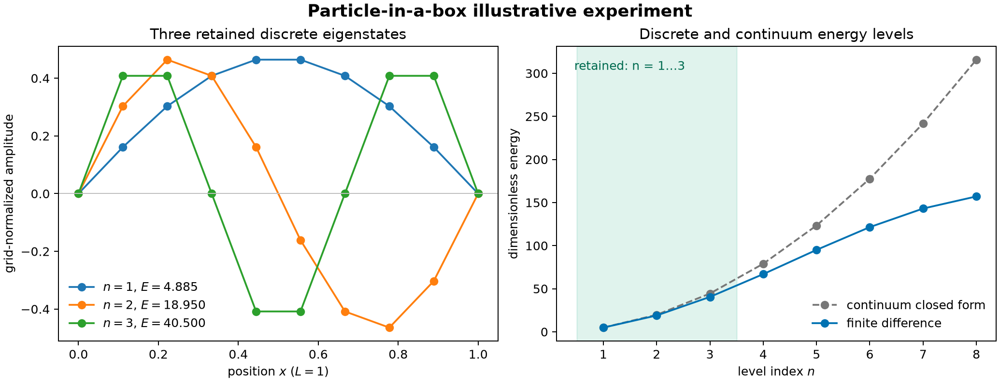
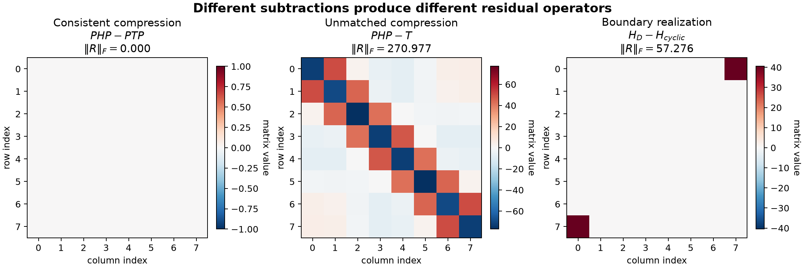
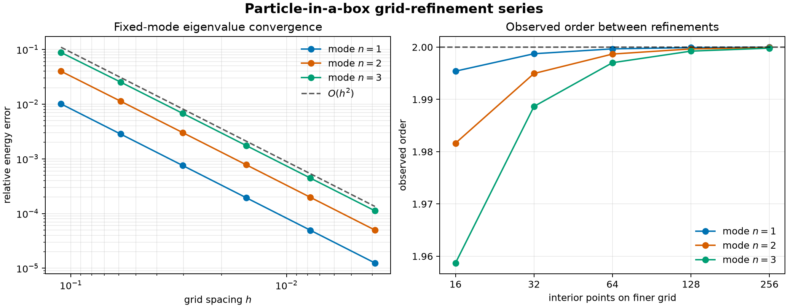
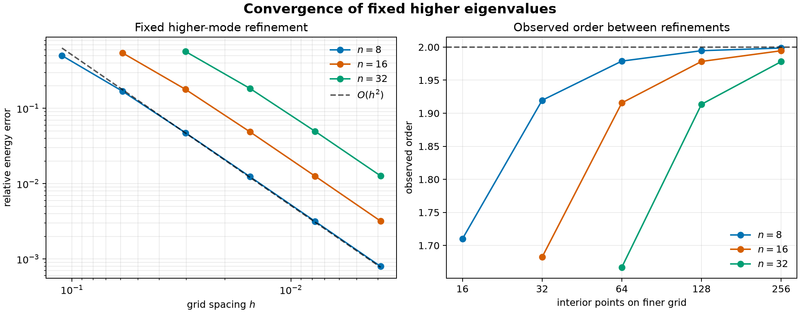
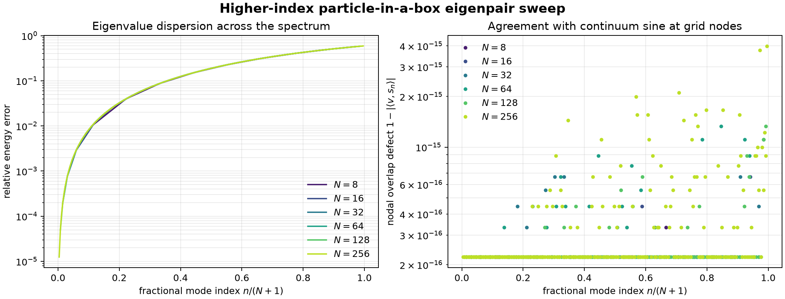
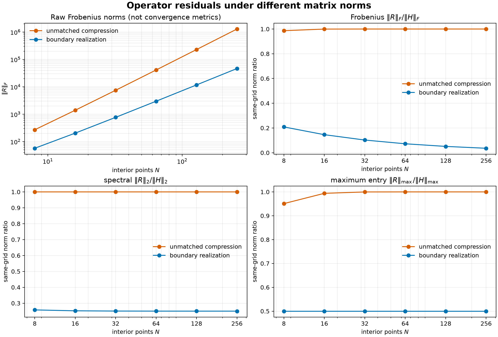
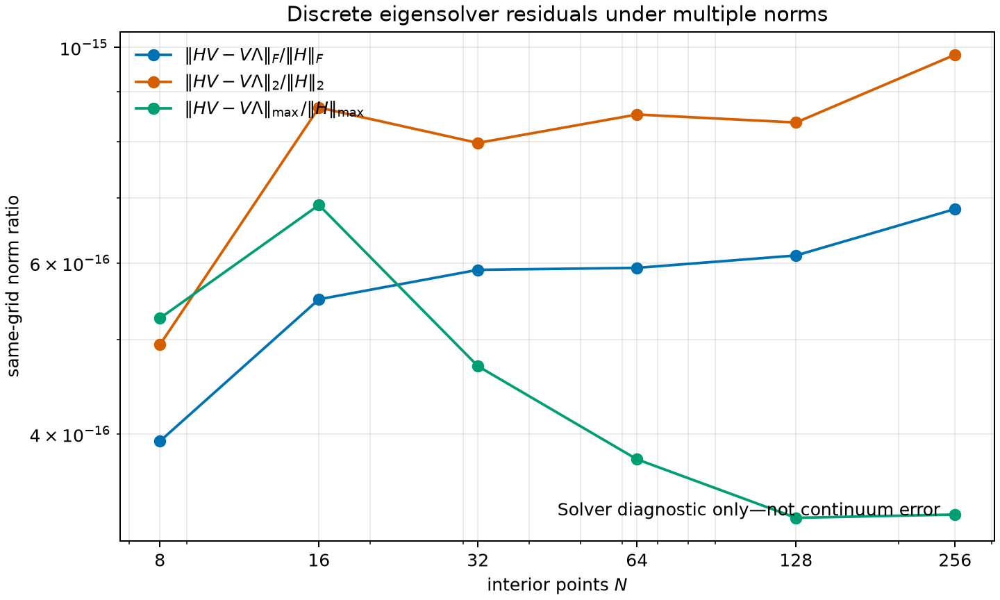
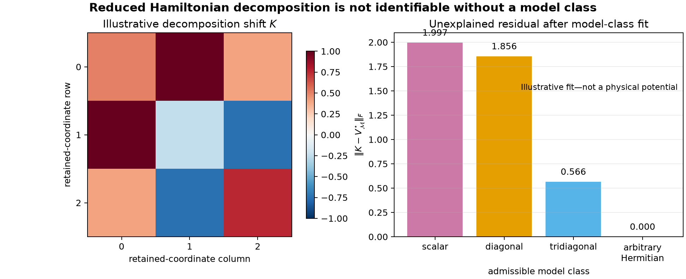

# Particle-in-a-box residuals and identifiability

## Provisional experiment report and Appendix D draft

**Status:** Calculated illustrative numerical experiment and provisional
manuscript draft.

This report is derived from the retained calculations in this directory. It is
not a reviewed manuscript, released research result, semiconductor calculation,
scientific validation result, or uncertainty-quantification study. The current
Appendix D source remains
`docs/publications/research-monograph/appendices/D-particle-in-a-box-residuals.tex`.
The mathematical experiment protocol is `protocol.md`.

## Abstract

The one-dimensional particle in a box provides a closed-form setting in which a
continuum operator, its domain, a finite representation, spectral retention,
and reduced-model interpretation can be kept distinct. This report uses that
setting to test three matrix residuals that could otherwise be conflated under
the label of an effective potential. Consistent compression of the Dirichlet
Hamiltonian and kinetic operator gives zero potential. Compressing only the
Hamiltonian produces the negative discarded kinetic sector. Subtracting a
cyclic finite-space reference produces a boundary-realization difference. The
three objects have different mathematical origins despite all being obtained by
matrix subtraction.

Grid-refinement calculations over $N=8,16,32,64,128,256$ interior points verify
second-order convergence for fixed eigenvalue indices. A full-spectrum sweep
shows that this convergence is not uniform when the mode index grows with the
grid dimension. Frobenius, spectral, and maximum-entry norm studies show that a
residual can become small in an aggregate same-grid norm while remaining
significant in a worst-case norm. Finally, two distinct exact decompositions of
the same retained Hamiltonian and four model-class fits demonstrate the central
identifiability result: a reduced Hamiltonian does not select a unique
kinetic--potential decomposition. A reference operator and an admissible model
class must be specified before a residual can receive a physical
interpretation.

## 1. Purpose

The purpose is not to solve a difficult spectrum. The spectrum is known in
closed form. The purpose is to separate five ingredients that are easily mixed
in a more complicated reduction:

1. the continuum Hamiltonian and its domain;
2. the finite numerical representation;
3. the full and retained state spaces;
4. the projection and embedding maps; and
5. the physical interpretation assigned to a residual.

The controlled example asks what can be concluded from a subtraction such as

$$
H_{\mathrm{eff}}-T.
$$

The answer depends on which Hamiltonian and kinetic reference are used, whether
they act on the same space, whether both have passed through the same reduction
map, and which potential model class is admissible. Numerical convergence alone
does not answer those questions.

## 2. Continuum operator and finite realization

For a particle of mass $m$ on $(0,L)$, the continuum reference is the
Dirichlet realization

$$
\hat H_{\mathrm{box}}
=-\frac{\hbar^2}{2m}\frac{d^2}{dx^2},
\qquad
\mathcal D(\hat H_{\mathrm{box}})=H^2(0,L)\cap H_0^1(0,L).
$$

The boundary conditions are $\psi(0)=\psi(L)=0$. The eigenpairs are

$$
\psi_n(x)=\sqrt{\frac{2}{L}}\sin\left(\frac{n\pi x}{L}\right),
\qquad
E_n=\frac{\hbar^2\pi^2n^2}{2mL^2}.
$$

The interior physical potential is zero. Confinement is represented by the
domain of the Dirichlet kinetic operator rather than by a finite-valued
multiplication potential inside the interval.

For $N$ interior points and spacing $h=L/(N+1)$, the finite coordinate space is
$\mathcal V_h\cong\mathbb R^N$. The centered second-order realization is

$$
\mathbf H_h
=
\frac{\hbar^2}{2mh^2}
\begin{bmatrix}
2 & -1 & 0 & \cdots & 0\\
-1 & 2 & -1 & \ddots & \vdots\\
0 & -1 & 2 & \ddots & 0\\
\vdots & \ddots & \ddots & \ddots & -1\\
0 & \cdots & 0 & -1 & 2
\end{bmatrix}.
$$

The calculated experiments use the dimensionless convention
$L=m=\hbar=1$.

## 3. Spectral retention and explicit state-space maps

Let $\boldsymbol\Phi_M\in\mathbb R^{N\times M}$ contain the lowest $M$
orthonormal eigenvectors of $\mathbf H_h$. Define

$$
\mathbf P_M=\boldsymbol\Phi_M\boldsymbol\Phi_M^T,
\qquad
\mathbf Q_M=\mathbf I-\mathbf P_M.
$$

Two matrix representations of the retained operator are needed:

$$
\mathbf H_h^{(P_M)}
=
\mathbf P_M\mathbf H_h\mathbf P_M
\in\mathbb R^{N\times N},
$$

and

$$
\mathbf H_{\mathrm{red}}
=
\boldsymbol\Phi_M^T\mathbf H_h\boldsymbol\Phi_M
\in\mathbb R^{M\times M}.
$$

The first is an embedded rank-$M$ matrix on the full numerical space. The
second is the same retained operator in retained spectral coordinates. Their
dimensions differ, so an embedding must be declared before comparing them.

For the retained $N=8$, $M=3$ calculation, the numerical checks were:

| Diagnostic | Calculated value |
|---|---:|
| Discrete spectrum maximum absolute oracle error | $8.53\times10^{-14}$ |
| Spectral reconstruction Frobenius error | $3.04\times10^{-13}$ |
| Projector idempotency Frobenius error | $8.48\times10^{-16}$ |
| Retained-coordinate Frobenius error | $2.46\times10^{-14}$ |
| Retained embedding Frobenius error | $1.02\times10^{-14}$ |

These are binary64 numerical-verification diagnostics. They do not establish a
physical interpretation.

## 4. Three inequivalent residual constructions

### 4.1 Consistently compressed physical potential

In this model, the finite Dirichlet Hamiltonian is the finite Dirichlet kinetic
operator:

$$
\mathbf H_h=\mathbf T_{\mathrm D,h}.
$$

Applying the same compression to both terms gives

$$
\mathbf P_M\mathbf H_h\mathbf P_M
-
\mathbf P_M\mathbf T_{\mathrm D,h}\mathbf P_M
=
\mathbf0.
$$

The calculated Frobenius norm is exactly zero. This is the consistently reduced
physical potential for the declared box model.

### 4.2 Compressed Hamiltonian minus uncompressed kinetic operator

If only the Hamiltonian is compressed,

$$
\widetilde{\mathbf R}_h
=
\mathbf P_M\mathbf H_h\mathbf P_M
-
\mathbf T_{\mathrm D,h},
$$

then spectral commutation gives

$$
\widetilde{\mathbf R}_h
=
-\mathbf Q_M\mathbf T_{\mathrm D,h}\mathbf Q_M.
$$

For $N=8$ and $M=3$, the calculated Frobenius norm is $270.977$, and the
Frobenius error against the negative discarded-sector oracle is
$8.75\times10^{-14}$. The nonzero matrix is caused by unmatched reduction. It is
not the physical box potential.

### 4.3 Difference between boundary realizations

A cyclic closure was declared as a comparison reference on the same finite
coordinate space. The difference

$$
\mathbf B_h
=
\mathbf H_{\mathrm D,h}-\mathbf H_{\mathrm{cyclic},h}
$$

contains two corner couplings. At $N=8$, its Frobenius norm is $57.276$. This is
a finite boundary-realization difference relative to the declared cyclic
reference. It is not a representation-independent continuum potential.

The comparison establishes that identical subtraction syntax can produce a
physical zero potential, a discarded kinetic sector, or a boundary-reference
operator. The state-space maps and reference choice determine which object has
been constructed.

## 5. Fixed-mode convergence

The convergence study was retained because the finite representation must be
verified independently of residual interpretation. The grid sequence was

$$
N=8,16,32,64,128,256.
$$

For each fixed mode, the relative energy error was

$$
\varepsilon_n(N)
=
\frac{|E_{n,h}-E_n|}{E_n}.
$$

### 5.1 Low fixed modes

| $N$ | $n=1$ | $n=2$ | $n=3$ |
|---:|---:|---:|---:|
| 8 | $1.0113\times10^{-2}$ | $3.9962\times10^{-2}$ | $8.8109\times10^{-2}$ |
| 16 | $2.8427\times10^{-3}$ | $1.1332\times10^{-2}$ | $2.5352\times10^{-2}$ |
| 32 | $7.5502\times10^{-4}$ | $3.0174\times10^{-3}$ | $6.7788\times10^{-3}$ |
| 64 | $1.9465\times10^{-4}$ | $7.7842\times10^{-4}$ | $1.7508\times10^{-3}$ |
| 128 | $4.9423\times10^{-5}$ | $1.9768\times10^{-4}$ | $4.4474\times10^{-4}$ |
| 256 | $1.2452\times10^{-5}$ | $4.9809\times10^{-5}$ | $1.1207\times10^{-4}$ |

The final observed orders were 1.99998, 1.99991, and 1.99981 for
$n=1,2,3$, respectively. This is the expected second-order behavior for fixed
resolved modes.

### 5.2 Fixed higher modes

A fixed higher mode enters when it exists on the grid. The series therefore
starts at $N=8$ for $n=8$, at $N=16$ for $n=16$, and at $N=32$ for $n=32$.

| Mode | First-grid relative error | $N=256$ relative error | Final observed order |
|---:|---:|---:|---:|
| 8 | $5.0253\times10^{-1}$ at $N=8$ | $7.9670\times10^{-4}$ | 1.99863 |
| 16 | $5.4637\times10^{-1}$ at $N=16$ | $3.1837\times10^{-3}$ | 1.99451 |
| 32 | $5.6997\times10^{-1}$ at $N=32$ | $1.2686\times10^{-2}$ | 1.97805 |

The initial points are under-resolved and pre-asymptotic. Each fixed mode moves
toward second-order behavior as the number of grid points per wavelength
increases.

## 6. Full-spectrum eigenpair sweep

Fixed-index convergence is not uniform spectral convergence. To expose that
distinction, the full discrete spectra were calculated for every grid in the
same $N=8$ through $N=256$ sequence.

When the fractional mode index

$$
q=\frac{n}{N+1}
$$

is held approximately fixed, the relative eigenvalue error remains substantial
as $N$ grows. At $N=256$, representative values were:

| $q$ | Mode | Relative energy error |
|---:|---:|---:|
| $0.249$ | 64 | $4.998\times10^{-2}$ |
| $0.498$ | 128 | $1.881\times10^{-1}$ |
| $0.751$ | 193 | $3.858\times10^{-1}$ |
| $0.996$ | 256 | $5.916\times10^{-1}$ |

The near-collapse of the curves as functions of $q$ is a finite-difference
dispersion result. Refining the grid improves each fixed physical mode, but it
does not make the entire growing discrete spectrum uniformly accurate.

The maximum nodal overlap defect against sampled continuum sine vectors was
$4.00\times10^{-15}$, and the maximum scaled algebraic eigenpair residual was
$7.14\times10^{-16}$ at $N=256$. These values show that the discrete eigenpairs
were solved accurately and that the discrete sine vectors agree at the grid
nodes. They do not measure the error of an interpolated continuum wavefunction.

## 7. Dependence on matrix norm

A residual does not have one universal magnitude. The study therefore records
Frobenius, spectral, and maximum-entry norms. For a residual $\mathbf R_h$, the
same-grid ratios are

$$
\frac{\|\mathbf R_h\|_F}{\|\mathbf H_h\|_F},
\qquad
\frac{\|\mathbf R_h\|_2}{\|\mathbf H_h\|_2},
\qquad
\frac{\|\mathbf R_h\|_{\max}}{\|\mathbf H_h\|_{\max}}.
$$

Raw norms are also retained, but they are not interpreted as convergence
metrics across changing spaces because both matrix dimension and the $h^{-2}$
kinetic scale change.

### 7.1 Unmatched compression

| $N$ | Frobenius ratio | Spectral ratio | Maximum-entry ratio |
|---:|---:|---:|---:|
| 8 | 0.9865 | 1.0000 | 0.9510 |
| 16 | 0.9994 | 1.0000 | 0.9940 |
| 32 | 1.0000 | 1.0000 | 0.9998 |
| 64 | 1.0000 | 1.0000 | 1.0000 |
| 128 | 1.0000 | 1.0000 | 1.0000 |
| 256 | 1.0000 | 1.0000 | 1.0000 |

A fixed three-state retention discards nearly all of the increasingly resolved
operator norm. The spectral ratio is one because the largest discrete kinetic
eigenvalue is in the discarded sector. This residual does not approach zero.

### 7.2 Boundary realization

| $N$ | Frobenius ratio | Spectral ratio | Maximum-entry ratio |
|---:|---:|---:|---:|
| 8 | 0.2085 | 0.2578 | 0.5000 |
| 16 | 0.1459 | 0.2521 | 0.5000 |
| 32 | 0.1026 | 0.2506 | 0.5000 |
| 64 | 0.0724 | 0.2501 | 0.5000 |
| 128 | 0.0511 | 0.2500 | 0.5000 |
| 256 | 0.0361 | 0.2500 | 0.5000 |

The Frobenius ratio decreases because two boundary couplings become small
relative to the aggregate norm of an $N\times N$ Hamiltonian. The spectral
ratio approaches 0.25, so worst-case Euclidean action remains a fixed fraction
of the Hamiltonian scale. The maximum-entry ratio remains 0.5 in the declared
grid basis. These statements are compatible because the norms answer different
questions.

The full-eigensystem algebraic residual matrix

$$
\mathbf H_h\mathbf V-\mathbf V\boldsymbol\Lambda
$$

has same-grid norm ratios below $10^{-15}$ throughout the series. This is an
eigensolver diagnostic only.

## 8. Residual identifiability

The reduced Hamiltonian does not uniquely identify a kinetic--potential
partition. On the $M=3$ retained coordinate space, the declared physical box
decomposition is

$$
\mathbf H_{\mathrm{red}}
=
\mathbf T_{\mathrm D,red}+\mathbf0.
$$

For the declared illustrative real-symmetric shift $\mathbf K$, the same matrix
also satisfies

$$
\mathbf H_{\mathrm{red}}
=
(\mathbf T_{\mathrm D,red}-\mathbf K)+\mathbf K.
$$

The physical decomposition reconstructed with zero Frobenius error. The shifted
decomposition reconstructed with error $1.11\times10^{-16}$. The second equality
is algebraically valid but does not make $\mathbf K$ a physical potential. It
exists to demonstrate nonuniqueness.

## 9. Dependence on the admissible model class

The illustrative shift was fitted in Frobenius norm to four nested model
classes. If $\mathcal M_V$ is the chosen class, the unexplained residual is

$$
\mathbf E_{\mathcal M}
=
\mathbf K-\mathbf V_{\mathcal M}^{\star}.
$$

| Admissible model class | $\|\mathbf E_{\mathcal M}\|_F$ |
|---|---:|
| Scalar identity | 1.9967 |
| Diagonal in the retained basis | 1.8561 |
| Real symmetric tridiagonal | 0.5657 |
| Arbitrary real symmetric | 0.0000 |

The unrestricted class fits exactly by construction and is therefore
uninformative. Restricted classes leave different unexplained residuals. This
is the executable form of the Appendix D argument: the scientific inverse
problem begins only after locality, range, symmetry, differential form,
parameter sharing, transferability, or another admissible structure has been
specified.

## 10. What the combined study establishes

The calculated illustrative experiment establishes the following finite
statements under the retained inputs and binary64 implementation:

1. The centered finite-difference spectrum agrees with its closed-form discrete
   oracle.
2. Fixed-index eigenvalues converge at the expected second order once resolved.
3. The growing full spectrum is not uniformly accurate.
4. Consistent reduction gives the zero physical potential for the box.
5. Unmatched reduction gives the negative discarded kinetic sector.
6. The declared boundary subtraction gives a finite boundary-reference
   operator.
7. Frobenius, spectral, and maximum-entry norms emphasize different aspects of
   the same residual.
8. Accurate solution of the discrete eigenproblem does not imply continuum
   accuracy.
9. The same reduced Hamiltonian permits distinct exact algebraic decompositions.
10. The unexplained residual depends on the admissible model class.

The central conclusion is therefore not that one residual norm is preferable in
all circumstances. It is that a residual can be interpreted only after the
state spaces, maps, reference operator, norm, and admissible model class have
been declared.

## 11. Limitations

- The cyclic closure is a declared finite comparison reference, not a unique
  continuum reference operator.
- Same-grid normalization does not align operators across changing numerical
  spaces.
- Fixed-mode convergence does not establish uniform spectral or operator
  convergence.
- Nodal eigenvector overlap does not establish continuum interpolation error.
- The illustrative shift $\mathbf K$ has no physical assignment.
- The model-class comparison uses a declared retained basis and Frobenius
  metric; changing either changes the fit.
- No result in this report validates a material model or supplies evidence
  about silicon, DFT, Wannier localization, or impurity physics.

## 12. Reproduction and retained evidence

The exact commands are recorded in `README.md`. The retained evidence consists
of:

- frozen JSON inputs;
- standalone calculation scripts;
- independent verification scripts;
- retained JSON results;
- calculated graphics;
- Python, NumPy, floating-point, and eigensolver identities; and
- `SHA256SUMS` covering every maintained experiment artifact.

Passing verification establishes agreement with the stated finite mathematics
and analytical oracles. It does not provide scientific validation or human
acceptance of a physical model.
