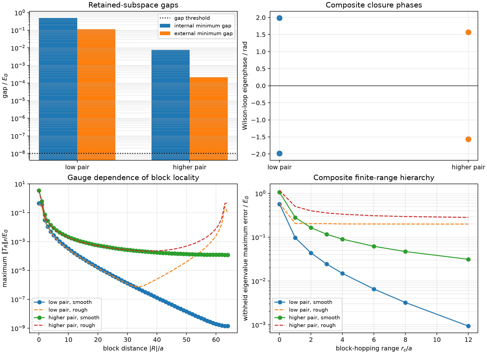
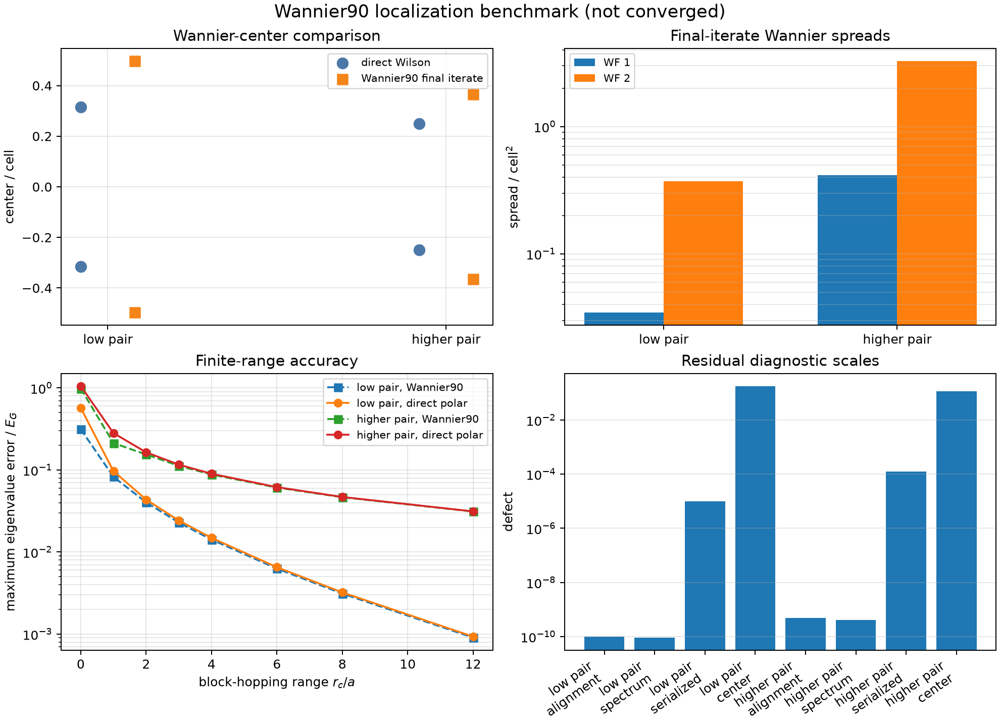
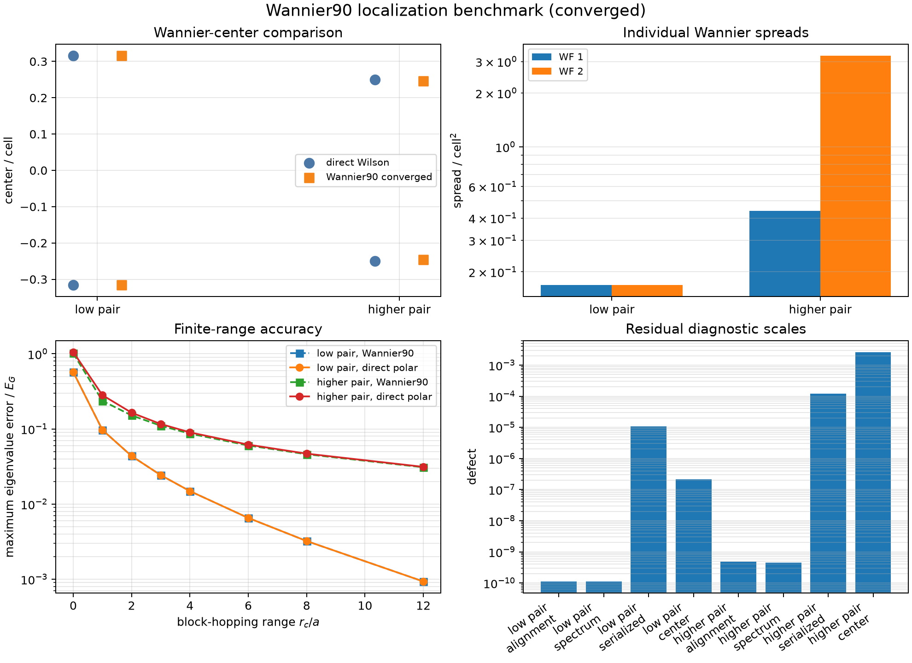

# Gauge, Alignment, and Block Locality in a Two-Band Cosine-Lattice Reduction

## Status

**Provisional calculated research note — illustrative numerical verification.**

This note reports direct and bounded independent-route composite-band results
for the one-dimensional periodic-reduction exercise. It has not been peer
reviewed and does not include material validation or uncertainty quantification.
Initial Wannier90 runs failed to satisfy the declared spread convergence rule
at 500 iterations, and a low-pair iteration-only extension also failed at 5000.
Read-only diagnosis identified Wannier90's documented preconditioner as the
smallest objective-preserving remedy. Fresh preconditioned runs then converged
at iterations 69 and 4176. The resulting centers, spreads, gauges, and hopping
comparisons are reported as converged synthetic-interface results.

## Abstract

Higher energy-ordered bands of a periodic Hamiltonian can become nearly
degenerate, making separate scalar-band gauges poorly conditioned even when the
combined subspace remains usable. We test the composite-space remedy in the
one-dimensional cosine Hamiltonian by retaining two two-band groups: bands
0--1 as a well-conditioned baseline and bands 2--3 as a more difficult case.
Neighboring overlap matrices, direct polar transport, reciprocal sewing,
Wilson-loop closure, controlled $U(2)$ gauge attacks, pointwise alignment,
$2\times2$ block hoppings, and finite-range reductions are all represented
explicitly. The low and higher pairs have minimum external gaps
$1.14\times10^{-1}E_G$ and $2.16\times10^{-4}E_G$, while their minimum
neighboring-overlap singular values are 0.9917 and 0.7083. Projectors and
Wilson-loop eigenphases remain invariant under a controlled momentum-dependent
$U(2)$ rotation to binary64 precision, and pointwise Procrustes alignment
recovers the reference frames and represented operators within
$6.9\times10^{-15}$. Complete block hoppings reconstruct both reciprocal
operators within $3.3\times10^{-14}E_G$. Smooth polar gauges produce decaying
blocks and systematically improving finite-range models; a deliberately rough
periodic gauge preserves exact spectra but leaves large long-range blocks and
poor truncated models. At range $12a$, smooth-gauge withheld maximum errors are
$9.32\times10^{-4}E_G$ and $3.13\times10^{-2}E_G$, compared with
$1.99\times10^{-1}E_G$ and $2.82\times10^{-1}E_G$ in the rough gauge. Direct
uniform-mesh Fourier fitting and mediated block truncation agree within
$2.5\times10^{-15}$ in coefficient norm. The calculation verifies that
composite subspaces resolve scalar-label instability while demonstrating that
finite-range locality remains gauge dependent. Separately authorized,
preconditioned Wannier90 3.1.0 calculations converged at iterations 69 and 4176.
Their center-set discrepancies from the direct Wilson centers are
$2.16\times10^{-7}$ and $2.63\times10^{-3}$ cell, while pointwise alignment
recovers the represented operators within $4.9\times10^{-10}E_G$. At range
$12a$, their maximum errors are $9.32\times10^{-4}E_G$ and
$3.09\times10^{-2}E_G$. The independent implementation therefore confirms the
low-pair center construction and gives a bounded higher-pair discrepancy under
the deliberately difficult small-gap condition.

## 1. Purpose and claim boundary

The preceding isolated-band stress test showed that higher-band gaps and
neighboring overlaps deteriorate rapidly. The purpose of this calculation is to
test the proposed remedy:

> Replace unstable individual-band labels with an aligned composite subspace,
> preserve its gauge-covariant operator, and determine whether a smooth frame
> supports a useful finite-range block Hamiltonian.

The calculation asks:

1. Are the selected two-band spaces separated from excluded bands?
2. Are neighboring subspaces sufficiently compatible for polar transport?
3. Do projector and Wilson-loop information survive controlled $U(2)$ gauge
   rotations?
4. Can pointwise alignment recover a common frame and operator?
5. Do complete matrix hoppings reconstruct the represented composite operator?
6. Does gauge smoothness control block-hopping decay and truncation error?
7. Do direct and mediated matrix-valued reductions agree under the same ideal
   projection conditions?

These are numerical-verification questions in a frozen mathematical model. They
do not establish that either pair is a material-specific low-energy space.

## 2. Parent operator and retained spaces

The parent remains

$$
\hat H=-\frac{\hbar^2}{2m}\frac{d^2}{dx^2}+V_0\cos(Gx),
$$

with $a=2\pi$, $G=1$, $E_G=1$, and $V_0/E_G=0.5$. Bloch fibers use a
$P=15$ plane-wave basis on a uniform half-open 128-point reciprocal mesh.
Withheld eigenvalue errors are evaluated on an independent 257-point mesh.

Two retained groups are studied:

- **low pair:** energy-ordered bands 0--1;
- **higher pair:** energy-ordered bands 2--3.

The low pair is a well-conditioned baseline. The higher pair tests whether a
composite frame remains operational after the scalar-band stress test has
revealed much smaller gaps and poorer neighboring overlaps.

## 3. Composite transport and closure

For an orthonormal frame $V_j$ at reciprocal point $k_j$, the neighboring
overlap is

$$
M_j=V_j^\dagger V_{j+1}.
$$

If $M_j=L_j\Sigma_jR_j^\dagger$, the next frame is right-rotated by
$R_jL_j^\dagger$, making the transported overlap positive Hermitian. The
smallest singular value of every neighboring and sewn closure overlap is
retained as a compatibility diagnostic.

After transport around the reciprocal loop, the unitary part of the sewn
closure is diagonalized. Its two eigenphases are the discrete Wilson-loop
phases. Fractional powers of that unitary are distributed over the mesh to
produce a smooth periodic frame.

## 4. Gauge attack and alignment

A deterministic smooth momentum-dependent $U(2)$ rotation is applied to every
raw frame. The calculation then repeats polar transport independently. It
compares:

- projectors before and after the attack;
- Wilson-loop eigenphase sets;
- represented eigenvalues;
- pointwise aligned frames; and
- operators after the same pointwise alignment.

Alignment uses the unitary Procrustes factor of the overlap between candidate
and reference frames. This is an explicit basis alignment, not direct
subtraction of operators in unidentified coordinates.

A second, deliberately rough periodic $U(2)$ gauge alternates rapidly between
neighboring reciprocal points. It preserves the exact composite projector and
pointwise spectrum but is designed to damage real-space block locality.

## 5. Block hoppings and finite-range models

For a represented $2\times2$ reciprocal Hamiltonian $H(k)$,

$$
T_R=\frac{1}{N_k}\sum_k e^{-ikRa}H(k),
\qquad
H(k)=\sum_R e^{ikRa}T_R.
$$

The complete centered representative set is $R/a=-64,\ldots,63$. Finite-range
models retain $|R|\leq r_c$ for
$r_c/a=0,1,2,3,4,6,8,12$. Each range records the omitted block norm and maximum
training and withheld eigenvalue errors in both the smooth and rough gauges.

The direct route performs equal-weight least squares on the complete uniform
mesh using the same matrix Fourier class at $r_c=4a$. The mediated route
truncates the complete block transform to that same class.

## 6. Results



**Figure 1.** Direct composite-band verification. Both retained groups remain
externally isolated at the declared threshold, but the higher pair is less
well-conditioned. Smooth polar frames yield decaying block hoppings; a rough
unitary gauge preserves exact spectra while defeating short-range truncation.

### 6.1 Subspace isolation and overlap conditioning

| Group | Internal minimum gap ($E_G$) | External minimum gap ($E_G$) | Minimum neighboring singular value |
|---|---:|---:|---:|
| Bands 0--1 | $4.92\times10^{-1}$ | $1.14\times10^{-1}$ | 0.991696 |
| Bands 2--3 | $7.66\times10^{-3}$ | $2.16\times10^{-4}$ | 0.708327 |

Both external gaps exceed the declared $10^{-8}E_G$ threshold. The higher pair
is nevertheless substantially less conditioned, so the singular values must be
retained rather than replacing subspace compatibility with a binary band label.

### 6.2 Wilson closure and gauge covariance

The Wilson-loop eigenphases are:

- bands 0--1: $-1.98562$ and $+1.98562$ radians;
- bands 2--3: $-1.56593$ and $+1.56593$ radians.

Under the controlled smooth $U(2)$ attack:

- projector defects remain below $5.1\times10^{-16}$;
- Wilson-phase set defects remain below $2.5\times10^{-15}$;
- represented eigenvalue defects remain below $7.6\times10^{-15}E_G$;
- aligned-frame defects remain below $2.1\times10^{-15}$; and
- aligned-operator defects remain below $6.9\times10^{-15}E_G$.

Thus the subspace and Wilson spectrum are gauge invariant under the tested
transformation, while explicit alignment recovers a common matrix
representation.

### 6.3 Complete block reconstruction

The complete block transforms reconstruct the represented reciprocal operators
within $3.8\times10^{-15}E_G$ for the low pair and
$3.3\times10^{-14}E_G$ for the higher pair. The maximum smooth-gauge block
Hermiticity residual is below $8.1\times10^{-17}E_G$.

The unaligned smooth-versus-rough hopping differences are large—0.944 and 2.13
in block-$\ell^2$ norm—despite identical pointwise spectra. Hopping blocks are
therefore coordinate dependent and cannot be compared before gauge alignment.

### 6.4 Finite-range hierarchy and gauge locality

| Group | Gauge | $r_c=4a$ withheld maximum error ($E_G$) | $r_c=12a$ withheld maximum error ($E_G$) |
|---|---|---:|---:|
| Bands 0--1 | Smooth | $1.49\times10^{-2}$ | $9.32\times10^{-4}$ |
| Bands 0--1 | Rough | $2.00\times10^{-1}$ | $1.99\times10^{-1}$ |
| Bands 2--3 | Smooth | $9.00\times10^{-2}$ | $3.13\times10^{-2}$ |
| Bands 2--3 | Rough | $3.34\times10^{-1}$ | $2.82\times10^{-1}$ |

Smooth-gauge errors decrease monotonically throughout the retained hierarchy.
The higher pair converges more slowly, consistent with its smaller external gap
and poorer overlap conditioning. In the rough gauge, long-range block weight
remains large and extending the cutoff gives little improvement. Exact spectral
covariance therefore does not imply gauge-independent truncation quality.

### 6.5 Direct versus mediated composite routes

At $r_c=4a$, direct and mediated coefficient defects are
$6.1\times10^{-16}$ for the low pair and $2.44\times10^{-15}$ for the higher
pair. Their maximum training-operator defects remain below
$4.9\times10^{-15}E_G$. The matrix-valued routes therefore agree under the same
complete uniform mesh, equal weights, aligned frame, and Fourier class.

## 7. Bounded Wannier90 comparison

The local Wannier90 3.1.0 comparison was separately authorized and executed for
both retained pairs. The first low-pair preprocessing attempt failed because the
default reciprocal-shell search was too short for the
$128\times1\times1$ embedding. After explicit authorization, adding only
`search_shells = 130` allowed both preprocessing stages to produce their exact
neighbor lists. The generated `.mmn` overlaps use the same parent eigenvectors
and reciprocal sewing as the direct calculation, with a declared unit transverse
form factor for inactive-direction reciprocal shifts.

Both localization invocations exited successfully in less than 0.5 seconds and
below 24 MB measured resident memory. Neither satisfied the frozen
$10^{-12}$ spread-convergence criterion before reaching 500 iterations. Their
outputs are therefore calculated final iterates, not converged localization
references.



**Figure 2.** Bounded independent-route comparison. The retained unitary frames
recover the represented operators after alignment and give finite-range errors
close to the direct polar gauges. The center-set discrepancies and final-iterate
spreads remain nonconverged outputs.

### 7.1 Final-iterate localization data

| Group | Centers / cell | Individual spreads / cell$^2$ | Total spread / cell$^2$ | Direct-center set defect / cell |
|---|---|---|---:|---:|
| Bands 0--1 | $+0.497211,-0.497210$ | $0.03457,0.37090$ | 0.40547 | 0.18119 |
| Bands 2--3 | $+0.364505,-0.364324$ | $0.41374,3.27099$ | 3.68472 | 0.11528 |

The center discrepancies are not interpreted as a contradiction between
converged gauges because the Wannier90 optimization did not meet its declared
criterion.

### 7.2 Alignment and block reduction

The formatted Wannier90 unitary matrices are unitary within
$2.1\times10^{-10}$. Pointwise unitary alignment recovers the direct frames
within $1.1\times10^{-10}$ and the represented operators within
$4.9\times10^{-10}E_G$. Before alignment, the direct-versus-Wannier90 hopping
norm defects are 0.566 and 0.796; after alignment they fall below
$2.8\times10^{-10}E_G$. This again shows why raw matrix blocks cannot be
subtracted across unaligned gauges.

At $r_c=12a$, the Wannier90-gauge training errors are
$9.06\times10^{-4}E_G$ and $3.12\times10^{-2}E_G$, close to the direct-polar
values $9.32\times10^{-4}E_G$ and $3.13\times10^{-2}E_G$. The formatted
`hr.dat` serialization introduces maximum training eigenvalue discrepancies of
$1.02\times10^{-5}E_G$ and $1.24\times10^{-4}E_G$, consistent with its printed
numeric precision and retained separately from localization error.

### 7.3 Iteration-ceiling study

A separately authorized fresh study changed only `num_iter` from 500 to 5000;
the `.eig`, `.amn`, and `.mmn` interfaces remained byte-identical. The low-pair
run reached iteration 5000 without satisfying the unchanged convergence rule.
Its final spread was 0.362284855 cell$^2$, its last spread change was
$-3.24\times10^{-5}$, and its last RMS gradient was 0.02098. The corresponding
centers, $+0.353910a$ and $-0.353873a$, remain nonconverged values. The declared
stop rule prevented higher-pair localization.

Increasing the iteration ceiling alone was therefore not an adequate convergence
remedy. The attempted shell virtual-memory guard was not accepted by the
operating system; measured resident memory nevertheless remained below 24 MB.
This procedural limitation is retained with the execution record.

### 7.4 Preconditioned converged comparison

Read-only inspection showed that the spread decreased monotonically and that
even the smallest late-stage change remained above Wannier90's default
convergence tolerance. The failure was therefore not repaired by weakening the
criterion. Wannier90 documents `precond = true` for slow spread minimization on
fine reciprocal grids, matching the 128-point active mesh. A final authorized
study added only that setting; the parent, interface, objective, 5000-iteration
ceiling, and $10^{-12}$ convergence rule remained fixed.

Both seeds converged: the low pair at iteration 69 and the higher pair at
iteration 4176. No resource retry was used. The total spreads are 0.337439093
and 3.673238490 cell$^2$. The low-pair centers are
$\{+0.316021,-0.316021\}a$, agreeing with the direct Wilson-center set within
$2.16\times10^{-7}$ cell. Modulo lattice translations, the higher-pair centers
are approximately $\{-0.246592,+0.246600\}a$, with a
$2.63\times10^{-3}$-cell discrepancy from the direct Wilson set. The latter is
retained as a numerical difference for the externally weakly isolated higher
pair rather than erased by alignment or tolerance changes.



**Figure 3.** Converged preconditioned Wannier90 comparison. Center coordinates
are shown modulo a lattice period. Complete represented operators agree after
alignment, whereas center and locality differences remain visible for the
more weakly isolated higher pair.

The exported gauges remain unitary within $1.9\times10^{-10}$ at printed
precision. Pointwise alignment recovers represented operators within
$4.9\times10^{-10}E_G$. At $r_c=12a$, the converged Wannier90-gauge errors are
$9.32\times10^{-4}E_G$ and $3.09\times10^{-2}E_G$, compared with direct-polar
values $9.32\times10^{-4}E_G$ and $3.13\times10^{-2}E_G$. These close spectral
errors do not imply equality of raw hopping blocks: the unaligned block defects
remain 0.768 and 0.888 because the gauges differ.

## 8. Discussion

The experiment supplies the missing constructive response to the isolated-band
stress test. Instead of following poorly conditioned individual eigenvectors,
it transports the retained projector through a two-dimensional frame. The
higher pair remains usable as a composite space even though its scalar members
are much less robust than the lowest band.

This remedy is not automatic. It requires an externally isolated retained
space, nonsingular neighboring overlaps, explicit reciprocal sewing, and a
declared closure convention. Moreover, the represented matrix operator and its
real-space blocks remain gauge covariant rather than gauge invariant. A smooth
gauge is therefore part of a finite-range model specification, not merely a
visual preference for localized orbitals.

The rough-gauge attack makes that distinction concrete: complete operators have
identical spectra, but truncation errors differ by large factors. Conversely,
pointwise alignment restores the common represented operator to binary64
precision. This is the direct one-dimensional analogue of the basis-alignment
requirement for multiorbital pristine and doped semiconductor Hamiltonians.

## 9. Limitations and remaining work

This calculation does not include:

- a material-derived transverse embedding, trial-orbital, or disentanglement problem;
- convergence studies across reciprocal meshes, initial projections, or optimizers;
- more than two retained bands;
- a physical criterion selecting one hopping range;
- a material-specific multiorbital Hamiltonian;
- scientific validation; or
- uncertainty quantification.

The direct result verifies the composite construction and its gauge and
truncation behavior. The preconditioned Wannier90 result establishes convergence
under the declared spread criterion for the fixed synthetic interface and
supports an independent implementation comparison. The higher-pair center
discrepancy and sensitivity to optimizer conditioning remain numerical
limitations, not semiconductor validation or transferability evidence.

## 10. Reproduction and provenance

From `python/`, execute:

```bash
uv run python \
  ../calculations/research-monograph/periodic-1d/run_composite.py \
  --input ../calculations/research-monograph/periodic-1d/composite-input.json \
  --output ../calculations/research-monograph/periodic-1d/composite-result.json

uv run python \
  ../calculations/research-monograph/periodic-1d/verify_composite.py \
  ../calculations/research-monograph/periodic-1d/composite-result.json

uv run --extra notebooks python \
  ../calculations/research-monograph/periodic-1d/plot_composite.py \
  ../calculations/research-monograph/periodic-1d/composite-result.json \
  --output ../calculations/research-monograph/periodic-1d/composite-summary.png

uv run python \
  ../calculations/research-monograph/periodic-1d/extract_wannier90.py \
  --input ../calculations/research-monograph/periodic-1d/composite-input.json \
  --workdir "${WANNIER90_RUN_ROOT}" \
  --output ../calculations/research-monograph/periodic-1d/wannier90-result.json

uv run python \
  ../calculations/research-monograph/periodic-1d/verify_wannier90.py \
  ../calculations/research-monograph/periodic-1d/wannier90-result.json

uv run python \
  ../calculations/research-monograph/periodic-1d/verify_wannier90.py \
  ../calculations/research-monograph/periodic-1d/wannier90-preconditioned-result.json

uv run --extra notebooks python \
  ../calculations/research-monograph/periodic-1d/plot_wannier90.py \
  ../calculations/research-monograph/periodic-1d/wannier90-preconditioned-result.json \
  --composite ../calculations/research-monograph/periodic-1d/composite-result.json \
  --output ../calculations/research-monograph/periodic-1d/wannier90-preconditioned-summary.png
```

`composite-result.json` retains the represented reciprocal Hamiltonians,
smooth and rough hopping blocks, conventions, gauge and alignment diagnostics,
finite-range errors, content identities, and source provenance.
`wannier90-execution.json` and the convergence-attempt records preserve the
failed stages. `wannier90-preconditioned-execution.json` and
`wannier90-preconditioned-result.json` retain the converged process record,
compact exported unitary data, and independently verified comparison metrics
while native `.chk`, `.wout`, and interface outputs remain external.
`SHA256SUMS` identifies every maintained artifact.
