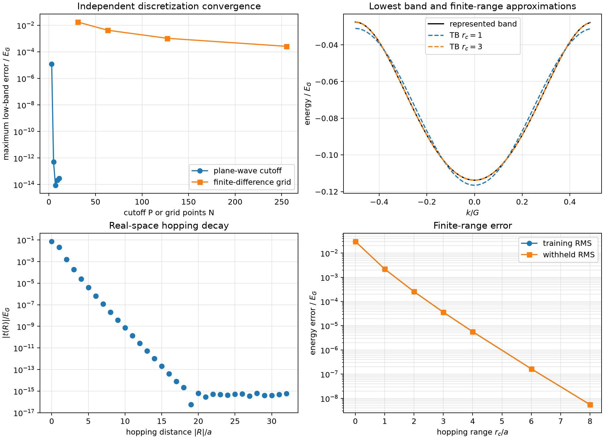
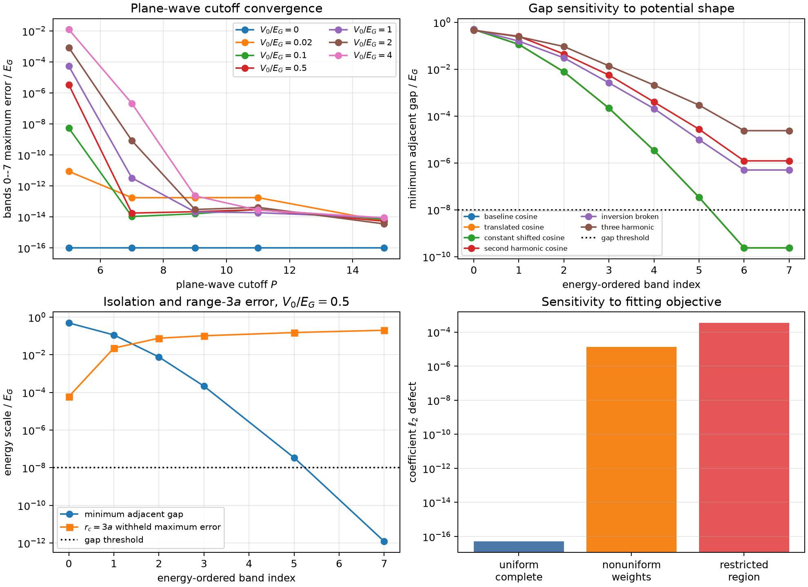

# From Bloch Fibers to Finite-Range Hoppings in a One-Dimensional Cosine Lattice

## Status

**Provisional calculated research note — illustrative numerical verification.**

This note reports the frozen isolated-band slice of the one-dimensional
periodic-reduction exercise. It has not been peer reviewed and does not present
scientific validation of a material model. The subsequent direct composite-band
calculation and converged preconditioned Wannier90 comparison are reported
separately in `composite-report.md`.

## Abstract

A reduced tight-binding model is meaningful only after its parent operator,
state space, basis, reciprocal sampling, gauge, and truncation convention have
been identified. We test that full chain in the one-dimensional cosine
Hamiltonian, where independent plane-wave and real-space representations,
Mathieu references, Bloch gauge transport, Wannier-like localization, and
Fourier hopping reconstruction are all explicit. Plane-wave convergence reaches
binary64-level agreement with a $P=15$ reference by $P=5$ for the declared
low-band samples. A centered finite-difference representation shows
approximately second-order convergence, with its lowest-three-band error
falling from $1.75\times10^{-2}E_G$ at $N=31$ to
$2.60\times10^{-4}E_G$ at $N=255$. Selected energies agree with independent
Mathieu characteristic values within $1.2\times10^{-16}E_G$. Parallel transport
of the lowest isolated band is stable, with minimum neighboring overlap
0.999466, closure holonomy $\pi$, and a Wannier center at $-a/2$ modulo $a$.
The complete hopping transform reconstructs the represented band within
$2.1\times10^{-16}E_G$. Truncating the hopping range reduces withheld root-mean-
square error from $3.04\times10^{-2}E_G$ at $r_c=0$ to
$5.55\times10^{-9}E_G$ at $r_c=8a$. Direct least-squares fitting and
Fourier-mediated truncation agree to binary64 precision when they use the same
complete uniform mesh, equal weights, and Fourier model class. An adversarial extension then sweeps amplitudes from the
free limit through $V_0/E_G=4$, compares the first eight bands, varies reciprocal
mesh density, and perturbs the potential with translations, energy shifts, and
additional cosine and sine harmonics. It exposes the expected failure of
isolated-band reasoning at gap closures, rapidly worsening conditioning and
finite-range accuracy for higher bands, and the loss of route equivalence when
weights or training domains differ. The calculation therefore verifies the
isolated-band reduction workflow under declared conditions while identifying
where its assumptions fail and which conclusions do not transfer to composite
bands or silicon.

## 1. Question and claim boundary

The central question is:

> Can a periodic parent be independently represented, aligned, localized,
> transformed into real-space hoppings, and reduced to finite range while each
> source of numerical and model-reduction error remains identifiable?

The calculation addresses six operational questions:

1. Do independent plane-wave and finite-difference parents converge toward the
   same retained band information?
2. Is operator comparison well-defined after explicit transport to common
   reciprocal coordinates?
3. Can an isolated band be placed in a stable periodic parallel-transport gauge
   and localized reproducibly?
4. Do the complete real-space hoppings reconstruct the represented band?
5. Does a symmetric finite hopping range converge on both training and withheld
   reciprocal points?
6. Do direct spectral fitting and Fourier-mediated hopping truncation agree
   when their mathematical objectives are identical?

The evidence is numerical verification for a frozen illustrative cosine model.
It does not establish material adequacy, scientific validation, uncertainty
quantification, or transferability to silicon.

## 2. Mathematical model

The parent Hamiltonian is

$$
\hat H=-\frac{\hbar^2}{2m}\frac{d^2}{dx^2}+V_0\cos(Gx),
$$

with lattice period $a=2\pi/G$. The frozen dimensionless convention is

$$
a=2\pi,\qquad G=1,\qquad
E_G=\frac{\hbar^2G^2}{2m}=1,\qquad \frac{V_0}{E_G}=0.5.
$$

The first Brillouin zone is $-G/2\leq k<G/2$. The represented finite operators
are Bloch fibers; the tight-binding hierarchy approximates the retained lowest
band or its scalar Bloch operator. It is not interpreted as converging directly
to the multiplication potential $V_0\cos(Gx)$.

## 3. Numerical representations and alignment

### 3.1 Plane-wave representation

The plane-wave basis contains reciprocal indices $n=-P,\ldots,P$. In the
chosen units,

$$
H^{\mathrm{PW}}_{nm}(k)
=(k+n)^2\delta_{nm}
+\frac{V_0}{2}
(\delta_{n,m+1}+\delta_{n,m-1}).
$$

The cutoff sequence is $P=3,5,7,9,11$, with $P=15$ used as the declared
numerical reference for the sampled low bands.

### 3.2 Finite-difference representation

The independent representation uses $N=31,63,127,255$ points on one periodic
cell with a centered second-order kinetic stencil. The corner couplings carry
conjugate Bloch phases. These phases are part of the represented operator; an
inconsistent pair would violate Hermiticity rather than describe new physics.

The two full matrices generally have different dimensions and are never
subtracted directly. For the operator comparison, the finite-difference matrix
is transported through sampled Bloch plane waves into the common ordered sector
$|n|\leq3$. Only then is the Frobenius discrepancy formed.

### 3.3 Independent structural references

The calculation checks:

- inversion symmetry $E_n(k)=E_n(-k)$;
- translation equivalence under $V_0\mapsto -V_0$;
- the weak-potential first zone-boundary gap $\Delta\simeq|V_0|$; and
- zone-center and zone-boundary energies from SciPy's independent Mathieu
  characteristic-value implementation under the declared conversion
  $q=2V_0/E_G$ and $E/E_G=A/4$.

These checks constrain representation errors without treating agreement between
two unconverged discretizations as convergence.

## 4. Gauge, localization, and hopping representation

The lowest band is evaluated on a complete uniform $N_k=64$ mesh. Neighboring
eigenvectors are parallel transported by making their overlaps real and
nonnegative. Reciprocal closure uses explicit index sewing under $k\mapsto k+G$;
the resulting holonomy is distributed over the mesh to obtain a periodic gauge.

A Born--von Karman inverse Bloch transform produces a localized representative.
The retained record stores its quadrature norm, center modulo $a$, spread,
sample count, and canonical density SHA-256 identity rather than a dense profile
array.

For centered lattice representatives $r=-32,\ldots,31$, the complete scalar
hoppings are

$$
t_r=\frac{1}{N_k}\sum_k e^{-ikra}E(k),
$$

with inverse reconstruction

$$
E(k)=\sum_r e^{ikra}t_r.
$$

Finite-range models retain $|r|\leq r_c$ for
$r_c=0,1,2,3,4,6,8$. Errors are measured both on the transform mesh and on an
independent 257-point withheld mesh.

## 5. Direct and mediated reduction routes

The mediated route computes the complete discrete hopping transform and removes
coefficients outside the selected range. The direct route solves an equal-weight
least-squares problem on the same complete uniform mesh using exactly the same
Fourier columns. Under these conditions, both are orthogonal projections onto
the same finite Fourier subspace and should agree algebraically.

This test does not presume route agreement under nonuniform weights, incomplete
training regions, shared-parameter constraints, additional observables, or
momentum-dependent composite-band gauges.

## 6. Verification protocol

The independent verifier checks:

- retained input and script SHA-256 identities;
- plane-wave and finite-difference refinement behavior;
- common-coordinate operator refinement;
- inversion and potential-sign translation residuals;
- independent Mathieu values and weak-gap behavior;
- the complete discrete Fourier transform and inverse reconstruction;
- Hermitian-real hopping behavior;
- localization normalization and overlap conditioning;
- Parseval agreement between omitted hoppings and reciprocal residuals;
- direct-versus-mediated coefficient equality; and
- training and withheld-mesh error records.

Passing these checks establishes only the stated mathematical and numerical
claims under binary64 arithmetic.

## 7. Results: answers to the six questions



**Figure 1.** Nominal isolated-band verification. The four panels separate
parent-discretization convergence, represented-band reconstruction, hopping
decay, and finite-range training and withheld errors.

### 7.1 Independent parent representations

**Answer: yes, under independent refinement.**

The maximum error in the lowest three sampled bands is:

| Representation | Coarsest setting | Coarsest error | Finest setting | Finest error |
|---|---:|---:|---:|---:|
| Plane wave | $P=3$ | $1.21\times10^{-5}E_G$ | $P=5$ | $5.25\times10^{-13}E_G$ |
| Finite difference | $N=31$ | $1.75\times10^{-2}E_G$ | $N=255$ | $2.60\times10^{-4}E_G$ |

The finite-difference sequence is approximately second order. Selected
plane-wave zone-center and zone-boundary values agree with independent Mathieu
references within $1.2\times10^{-16}E_G$.

For weak amplitudes $0.02\leq V_0/E_G\leq0.2$, the first zone-boundary gap
differs from the leading $|V_0|$ prediction by between $2.5\times10^{-5}$ and
$2.49\times10^{-3}$ relatively, consistent with a controlled departure from the
leading perturbative term.

### 7.2 Explicit common-coordinate alignment

**Answer: alignment is necessary and succeeds.**

After Fourier transport to $|n|\leq3$, the maximum common-space operator
Frobenius discrepancy decreases as follows:

| Grid points $N$ | Discrepancy ($E_G$) |
|---:|---:|
| 31 | $5.39\times10^{-1}$ |
| 63 | $1.32\times10^{-1}$ |
| 127 | $3.26\times10^{-2}$ |
| 255 | $8.10\times10^{-3}$ |

The approximately fourfold reduction per refinement is consistent with the
second-order kinetic stencil. Equal output dimensions alone are not used as an
alignment criterion.

### 7.3 Isolated-band localization

**Answer: localization is stable for the frozen band and mesh.**

- Minimum neighboring overlap: 0.999466.
- Closure holonomy: $\pi$.
- Representative center: $-a/2$ modulo $a$.
- Spread: $0.04175a^2$.
- Quadrature norm: one within binary64 tolerance.

The nonzero holonomy and center are retained gauge-sensitive information. They
do not affect the scalar isolated-band dispersion or its complete hopping
coefficients.

### 7.4 Complete hopping reconstruction

**Answer: yes, to binary64 precision on the original mesh.**

- Maximum reconstruction error: $2.1\times10^{-16}E_G$.
- Maximum imaginary hopping component: $4.6\times10^{-18}E_G$.

Thus the complete reciprocal band and complete real-space hopping record are two
coordinate representations of the same finite sampled operator.

### 7.5 Finite hopping range

**Answer: the finite-range hierarchy converges systematically for this band.**

| $r_c/a$ | Withheld RMS error ($E_G$) | Withheld maximum error ($E_G$) |
|---:|---:|---:|
| 0 | $3.04\times10^{-2}$ | $4.62\times10^{-2}$ |
| 1 | $2.19\times10^{-3}$ | $3.49\times10^{-3}$ |
| 2 | $2.57\times10^{-4}$ | $4.18\times10^{-4}$ |
| 3 | $3.63\times10^{-5}$ | $6.01\times10^{-5}$ |
| 4 | $5.69\times10^{-6}$ | $9.51\times10^{-6}$ |
| 6 | $1.66\times10^{-7}$ | $2.82\times10^{-7}$ |
| 8 | $5.55\times10^{-9}$ | $9.47\times10^{-9}$ |

Training and withheld errors track closely, and Parseval residuals remain below
$2.1\times10^{-17}$. No preferred hopping range is selected because the
exercise has no application-specific acceptance threshold.

### 7.6 Direct versus mediated routes

**Answer: yes, under the deliberately identical ideal conditions.**

Across all retained ranges:

- coefficient defects remain below $8.3\times10^{-17}$; and
- training-band defects remain below $6.8\times10^{-16}E_G$.

This is an algebraic consequence of the common complete uniform mesh, equal
weights, Fourier model class, and hopping range. It is not evidence that
arbitrary fitting and operator-truncation workflows commute.

## 8. Adversarial stress test

The stress suite deliberately moves beyond the nominal lowest-band point. It
covers seven amplitudes $0\leq V_0/E_G\leq4$, the first eight parent bands,
reciprocal meshes from 8 to 128 points, six representative band indices, random
Bloch phases, altered fitting objectives, and six potential shapes. The shape
set includes a translated cosine, a constant energy shift, a second harmonic,
an inversion-breaking sine harmonic, and a three-harmonic potential.



**Figure 2.** Adversarial stress evidence. The top panels show cutoff and
potential-shape sensitivity. The lower panels expose worsening higher-band
isolation and finite-range accuracy, and the loss of direct-versus-mediated
equality when weights or the training region change.

### 8.1 Parent convergence beyond the lowest bands

For all seven amplitudes, the first eight plane-wave bands at $P=15$ agree with
the $P=21$ reference within $8.9\times10^{-15}E_G$. The smaller $P=5$ basis is
not uniformly adequate: its maximum first-eight-band error grows from zero in
the free case to $1.25\times10^{-2}E_G$ at $V_0/E_G=4$. The finest
finite-difference first-eight-band error is approximately
$1.3\times10^{-2}E_G$ at $N=255$; every amplitude sweep decreases monotonically
by approximately a factor of four under each grid refinement. The stress result
therefore supports the convergence mechanism while rejecting the assumption
that a cutoff adequate for three low bands is automatically adequate for eight
bands at stronger coupling.

### 8.2 Gap closure and higher-band conditioning

The free limit correctly fails the isolated-band condition: every tested band
has a zero adjacent gap, vanishing sewn overlaps occur, and scalar isolated-band
transport is not applicable. At weak nonzero coupling, higher-order gaps remain
too small for the declared $10^{-8}E_G$ isolation threshold even though the
lowest band is isolated.

For the baseline $V_0/E_G=0.5$ potential on the 128-point mesh, the stress
records are:

| Band index | Minimum adjacent gap ($E_G$) | Minimum sewn overlap | $r_c=3a$ withheld maximum error ($E_G$) |
|---:|---:|---:|---:|
| 0 | $4.92\times10^{-1}$ | 0.999866 | $6.01\times10^{-5}$ |
| 1 | $1.14\times10^{-1}$ | 0.991686 | $2.28\times10^{-2}$ |
| 2 | $7.66\times10^{-3}$ | 0.762381 | $7.62\times10^{-2}$ |
| 3 | $2.16\times10^{-4}$ | 0.708327 | $1.03\times10^{-1}$ |
| 5 | $3.39\times10^{-8}$ | 0.707107 | $1.52\times10^{-1}$ |
| 7 | $1.20\times10^{-12}$ | 0.705406 | $2.02\times10^{-1}$ |

The complete discrete hopping reconstruction still passes within
$10^{-11}E_G$ for every stress record. What fails is the stronger inference
that energy ordering defines a robust isolated band or that a fixed short range
has comparable accuracy across bands. The near-degenerate upper bands require a
composite-subspace treatment.

### 8.3 Potential-shape modifications

The translated-cosine spectrum agrees with the baseline within
$8.9\times10^{-15}E_G$, and subtracting the declared constant shift restores the
baseline spectrum within the same tolerance. These are covariance controls, not
new physical effects. All real potential shapes retain
$E_n(k)=E_n(-k)$ within $2.0\times10^{-14}E_G$ by spinless time-reversal
symmetry, including the spatially inversion-breaking sine-harmonic case.

Additional harmonics materially change higher-order gaps. For example, at the
declared parameters the baseline gaps associated with the upper retained bands
fall to $3.39\times10^{-8}E_G$ and $2.35\times10^{-10}E_G$, while the
three-harmonic potential raises the corresponding recorded gaps to
$2.92\times10^{-4}E_G$ and $2.37\times10^{-5}E_G$. Thus higher-band isolation
and localization cannot be inferred from the fundamental cosine amplitude
alone.

### 8.4 Gauge and reduction-route attacks

Applying deterministic nonuniform phases to every Bloch eigenvector leaves the
projectors invariant within $2.9\times10^{-16}$; after parallel transport and a
single global-phase alignment, the frames agree within $8.1\times10^{-16}$ and
the closure holonomies agree modulo $2\pi$ within $8.9\times10^{-16}$. The
lowest-band result is therefore covariant under the tested input gauge attack.

The ideal equal-weight, complete-mesh route control retains a coefficient defect
of only $5.2\times10^{-17}$. Changing only the reciprocal weights raises that
defect to $1.32\times10^{-5}$ and produces a comparison-grid $\ell^2$ defect of
$2.11\times10^{-4}E_G$. Restricting the direct-fit training region raises the
coefficient defect to $3.44\times10^{-4}$ and the comparison-grid defect to
$5.56\times10^{-3}E_G$. Route equivalence is therefore conditional, not a
generic property of direct fitting and mediated truncation.

## 9. Discussion

The calculation demonstrates a complete isolated-band reduction chain in which
each representation change is explicit. Independent parent refinement prevents
agreement between two coarse methods from being mistaken for convergence.
Common-coordinate transport makes the operator discrepancy mathematically
defined. Parallel transport exposes reciprocal closure and localization
conventions. The complete hopping transform separates a coordinate change from
finite-range model reduction, while the withheld mesh distinguishes transform
reconstruction from interpolation adequacy.

The rapid hopping decay explains why a short-range model can reproduce this
particular smooth isolated band. That observation is model- and regime-specific.
It supplies no prior hopping cutoff for a multiorbital silicon Hamiltonian.
Likewise, direct and mediated routes agree here because their objectives were
constructed to be identical; the result provides a baseline against which
controlled path dependence can later be introduced.

## 10. Limitations and remaining work

This isolated-band note does not include:

- the separately reported direct composite construction;
- the separately reported bounded Wannier90 comparison;
- constrained multiorbital hopping classes or application-derived fitting weights;
- a prespecified acceptance rule selecting one finite hopping range;
- scientific validation against a material, experiment, or trusted
  material-specific calculation; or
- uncertainty quantification.

The direct composite-band remedy, alignment test, and converged preconditioned
Wannier90 comparison are reported in `composite-report.md`.

## 11. Reproduction and provenance

From `python/`, execute:

```bash
uv run python \
  ../calculations/research-monograph/periodic-1d/run_experiment.py \
  --input ../calculations/research-monograph/periodic-1d/input.json \
  --output ../calculations/research-monograph/periodic-1d/result.json

uv run python \
  ../calculations/research-monograph/periodic-1d/verify_result.py \
  ../calculations/research-monograph/periodic-1d/result.json

uv run --extra notebooks python \
  ../calculations/research-monograph/periodic-1d/plot_result.py \
  ../calculations/research-monograph/periodic-1d/result.json \
  --output ../calculations/research-monograph/periodic-1d/summary.png

uv run python \
  ../calculations/research-monograph/periodic-1d/run_stress.py \
  --input ../calculations/research-monograph/periodic-1d/stress-input.json \
  --output ../calculations/research-monograph/periodic-1d/stress-result.json

uv run python \
  ../calculations/research-monograph/periodic-1d/verify_stress.py \
  ../calculations/research-monograph/periodic-1d/stress-result.json

uv run --extra notebooks python \
  ../calculations/research-monograph/periodic-1d/plot_stress.py \
  ../calculations/research-monograph/periodic-1d/stress-result.json \
  --output ../calculations/research-monograph/periodic-1d/stress-summary.png
```

`result.json` records the input and calculation-script identities, software
versions, conventions, separated error categories, and calculated outputs.
`SHA256SUMS` identifies every maintained artifact. `protocol.md` owns the
frozen verification and interpretation boundary. Generated manuscript PDFs are
local formatting artifacts and are not retained as evidence.
