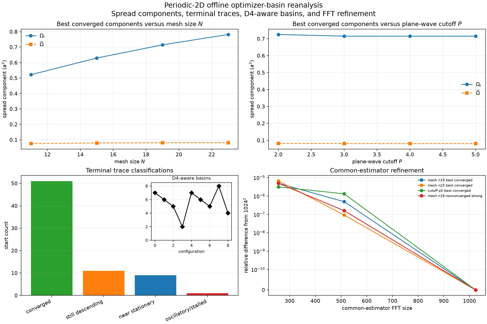

# Deterministic Multi-Initialization and Convergence Follow-up

## Status

**Paper-ready controlled synthetic non-DFT numerical-verification appendix;
not yet peer reviewed, submitted, deposited, or released.**

The exact local execution was human-authorized at
`RM-PERIODIC-2D-OPTIMIZER-BASIN-EXECUTION-HC07`. The accepted periodic-2D
exercise remains closed and unchanged. The combined appendix is paper-ready under the selected synthetic publication
standard: the standalone optimizer-convergence execution is complete,
extracted, independently verified, plotted, archived locally, and incorporated.
It has not been peer reviewed, submitted, publicly deposited, or released. It does not validate a material, DFT workflow, production
Wannierization, or a general optimizer.

## Question

The earlier one-start sensitivity study showed that changing mesh, cutoff, or
the auxiliary third-direction embedding could select different localized
gauges. This study asks two narrower questions:

1. Do eight deterministic smooth periodic initial frames repeatedly reach the
   same observed converged basin at fixed numerical controls?
2. Do the best observed converged and median converged-start diagnostics satisfy
   a predeclared finest-pair mesh-and-cutoff convergence gate?

## Method

The rank-three synthetic parent and Wannier90 interface are unchanged. Nine
configurations combine mesh $N=11,15,19,23$, cutoff $P=2,3,4,5$, and auxiliary
length $c=15,19,23$ along declared one-axis sequences. At every configuration,
the baseline trial-overlap matrix is right-multiplied by identity or one of seven
deterministic smooth periodic $U(3)$ fields. These transformations preserve the
retained subspace and overlap singular values while changing the initial gauge
trajectory.

All starts use `num_iter = 5000`, `conv_tol = 1.0d-12`, a five-step convergence
window, and preconditioning. A zero process exit code is distinguished from the
native Wannier90 convergence statement. Nonconverged 5000-step endpoints remain
negative evidence.

Native Wannier90 spread owns optimizer-basin and finite-parameter convergence
classification. A separate $512^2$ common finite-supercell estimator supports
within-configuration represented comparisons without being substituted for the
native objective. Basin classification uses total spread and unordered periodic
active-plane centers. The exact rules are given in `protocol.md` and were frozen
before execution.

## Execution result

All 72 serial localization processes exited successfully within the declared
bounds. The execution required 417.95 seconds. The slowest localization stage
required 15.27 seconds and the maximum observed resident memory was 34,668,544
bytes. Native output occupied 283,014,453 bytes at execution completion.

Only 51 starts satisfied the native convergence criterion. The remaining 21
reached 5000 iterations without satisfying it:

| configuration | converged starts | nonconverged starts |
|---|---:|---:|
| $P=4,N=11,c=11$ | 7 | 1 |
| $P=4,N=15,c=15$ | 6 | 2 |
| $P=4,N=19,c=19$ | 5 | 3 |
| $P=4,N=23,c=23$ | 2 | 6 |
| $P=2,N=19,c=19$ | 7 | 1 |
| $P=3,N=19,c=19$ | 6 | 2 |
| $P=5,N=19,c=19$ | 5 | 3 |
| $P=4,N=19,c=15$ | 8 | 0 |
| $P=4,N=19,c=23$ | 5 | 3 |

A completed executable process therefore substantially overstates the number of
converged optimizer outcomes in this benchmark.

## Basin result

Under the frozen $10^{-8}a^2$ native-spread and $10^{-5}$-cell center-set
criteria, every converged start is assigned to a separate observed basin. The
best observed basin has occupancy one in every configuration, below the required
occupancy of two.

Several endpoints have nearly equal native spread but materially different
center sets. The classifier treats them separately after orbital permutation and
periodic wrapping. It does not quotient all spatial symmetries. Consequently,
this is conservative evidence of initialization-sensitive endpoint structure,
not proof that each class is a distinct mathematical local minimum.

The best observed converged endpoint is also not a proven global minimum. The
seven perturbations are deterministic probes, not exhaustive initialization
coverage or a statistical ensemble.

## Mesh sequence

The best observed converged native spreads are:

| $N$ | spread ($a^2$) | gauge | radius-50 tail ($E_G$) |
|---:|---:|---|---:|
| 11 | 0.597822970 | `y02_soft` | 0 |
| 15 | 0.709283240 | `diagonal_wind` | $1.3391\times10^{-3}$ |
| 19 | 0.796140901 | `y02_soft` | $3.4280\times10^{-3}$ |
| 23 | 0.863253246 | `rough_smooth` | $3.2654\times10^{-3}$ |

For the frozen $N=19\to23$ pair, the best observed converged spread changes by
7.77%, the center-set distance is 0.187 cell, and the hopping tail changes by
4.98%. Spread and center criteria fail. Best-basin occupancy also fails.

The median converged-start spread changes by 41.5%, its center-set medoid moves
by 0.105 cell, and its hopping tail changes by 87.1%. Only two of eight starts
converge at $N=23$. The mesh sequence therefore does not support the declared
convergence classification.

Because balanced embedding uses $c=N$, this sequence simultaneously preserves
the intended reciprocal-neighbor balance rather than holding the auxiliary
length fixed. The separate embedding controls below prevent that convention
from being mistaken for physical third-direction convergence.

## Cutoff sequence

At fixed $N=c=19$, the best observed converged native spreads are:

| $P$ | spread ($a^2$) | gauge | radius-50 tail ($E_G$) |
|---:|---:|---|---:|
| 2 | 0.807170149 | `y02_soft` | $3.3651\times10^{-3}$ |
| 3 | 0.796161345 | `rough_smooth` | $3.4278\times10^{-3}$ |
| 4 | 0.796140901 | `y02_soft` | $3.4280\times10^{-3}$ |
| 5 | 0.796140404 | `rough_smooth` | $3.4292\times10^{-3}$ |

The $P=4\to5$ best-spread relative change is
$6.24\times10^{-7}$ and the tail change is $3.54\times10^{-4}$, both inside
their scalar tolerances. The center-set distance is nevertheless 0.118 cell,
and best-basin occupancy remains one. The median converged-start center-set
distance is 0.105 cell. Thus selected scalar metrics stabilize with cutoff, but
the complete predeclared cutoff gate fails.

This distinction matters: stable objective values do not demonstrate a stable
localized representation.

## Inactive-embedding sensitivity

At $P=4,N=19$, the best observed converged native spreads for $c=15,19,23$ are
0.796140642, 0.796140901, and 0.796140989 $a^2$. Their lowest observed tails are
also close to $3.43\times10^{-3}E_G$. However, the number of converged starts is
8, 5, and 5, respectively, and every converged endpoint remains a separate
observed basin under the frozen classifier.

The auxiliary embedding can therefore leave the lowest observed scalar objective
nearly unchanged while changing optimizer convergence and endpoint selection.
Only active-plane quantities are interpreted; $c$ is not treated as a physical
length or a material parameter.

## Offline spread-component and trajectory reanalysis

A subsequent human-authorized offline reanalysis uses the retained native files
without rerunning Wannier90. It separates
$\Omega_I$ from $\widetilde\Omega=\Omega_D+\Omega_{OD}$, applies all eight
square-lattice $D_4$ operations in center-set matching, diagnoses terminal
iteration traces, replaces radius 50 with the all-mesh-supported radius-18 tail,
and refines four common-estimator cases through $1024^2$.

For the best converged mesh endpoints:

| $N$ | $\Omega_I$ ($a^2$) | $\widetilde\Omega$ ($a^2$) | radius-18 tail ($E_G$) |
|---:|---:|---:|---:|
| 11 | 0.521862227 | 0.075960743 | $1.02098\times10^{-2}$ |
| 15 | 0.629638123 | 0.079645117 | $1.23883\times10^{-2}$ |
| 19 | 0.715001744 | 0.081139157 | $9.07071\times10^{-3}$ |
| 23 | 0.782030130 | 0.081223115 | $8.60785\times10^{-3}$ |

The $N=19\to23$ change is therefore dominated by the invariant contribution:
$\Omega_I$ changes by 8.57%, whereas $\widetilde\Omega$ changes by 0.103%.
The radius-18 tail changes by 5.38%. This corrects the interpretation of the
original total-spread failure: the gauge-dependent objective is substantially
more stable than the total, but center-set reproducibility, best-basin occupancy,
and the number of converged starts still fail.

At $N=c=19$, the best converged $\widetilde\Omega$ values for $P=3,4,5$ are
0.081140696, 0.081139157, and 0.081138668 $a^2$, respectively. The radius-18
tail changes by only $3.56\times10^{-5}$ relatively from $P=4$ to $P=5$.
Thus cutoff stabilization of the objective and the commonly supported hopping
tail is strong, while representation selection remains initialization
sensitive.

The $D_4$ quotient merges only `identity` and `rough_smooth` at the $c=23$
embedding point. That basin has occupancy two but is not the best observed
basin; best-basin occupancy remains one in every configuration. Symmetry
quotienting therefore reduces one overcount without changing the repeated-best
negative conclusion.

Among the 21 nonconverged endpoints, the exploratory terminal-trace classifier
finds 11 still descending at the iteration limit, nine near stationary without
meeting the five-step convergence window, and one oscillatory or stalled. These
labels diagnose why a longer or different optimizer protocol might matter, but
they do not reclassify any endpoint as converged.

The independently reconstructed common-estimator spread changes from $512^2$ to
$1024^2$ by $9.25\times10^{-8}$ to $1.32\times10^{-6}$ relatively across the
four sampled endpoints. Matched centers change only at roundoff. The $512^2$
common-estimator discretization is therefore adequate for these sampled cases;
this does not establish convergence for every possible gauge or parameter.

## Disposition

The overall result is **negative** under the frozen methodology:

- the best-basin occupancy requirement fails on both finest pairs;
- the frozen total-spread mesh gate and center criteria fail, although the
  offline reanalysis shows that the gauge-dependent spread is much more stable;
- the cutoff center criterion fails despite stable best gauge-dependent spread
  and commonly supported hopping tail;
- 21 of 72 starts do not satisfy the native convergence criterion; and
- the median converged-start sequence is not stable on the mesh axis.

The study supplies a stronger basis for retaining, rather than relaxing, the
existing conclusion: no mesh-, cutoff-, embedding-, or initialization-independent
localized gauge has been demonstrated for this synthetic benchmark.

## Independent verification and provenance

The independent verifier checks all original native manifests, final spreads,
iterations, convergence statements, unitary matrices, hopping tails, basin
assignments, and convergence gates. It additionally reconstructs every converged
start through the independent represented-operator and common-estimator route.
The reanalysis verifier separately reconstructs native spread components,
terminal trace metrics, radius-18 tails, $D_4$ basin membership, parent frames,
and all three FFT-grid estimators. Summary/manifest, native-external, and offline
reanalysis modes pass.

The extracted native tree contains 1,459 files and 327,638,192 bytes after
analysis. A local untransmitted gzip archive contains the exact tree:

- archive bytes: 63,801,989;
- SHA-256:
  `c775d55d6b904700b73d5ea2c7654a84c616b2d4ef3344f938501bec7c7725a2`.

The archive is prepared evidence, not a public deposit, DOI, release, or
publication artifact.

## Limitations

1. Eight starts are systematic but not exhaustive and define no probability
   distribution over initial gauges.
2. The observed-basin classifier does not quotient every point-group or
   continuous gauge equivalence.
3. A best observed converged endpoint is not a proven global minimum.
4. The mesh sequence contains four finite points and the cutoff sequence four
   finite truncations; failure or success would not establish an asymptotic
   theorem.
5. The common finite-supercell spread and native Berry-link spread remain
   different estimators and are not combined.
6. The auxiliary third direction is an interface construction, not a physical
   dimension.
7. This is a synthetic continuum benchmark, not DFT or material evidence.
8. No scientific validation or uncertainty quantification is claimed.

## Reproduction

Exact verification and plotting commands are retained in `README.md`. Native
Wannier90 rerun commands are historical protected-execution records and require
new authorization before use. Repository checksums cover every compact retained
artifact; the separate archive manifest covers the external native tree.
