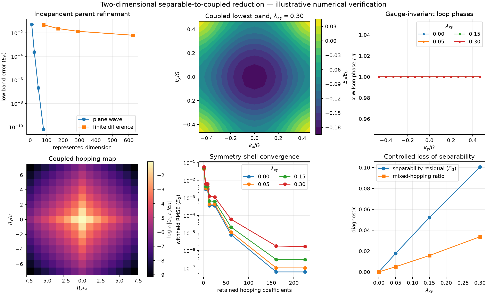
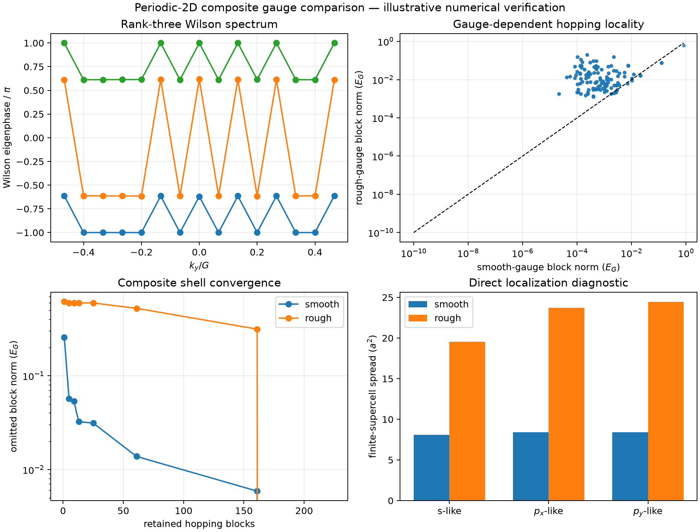
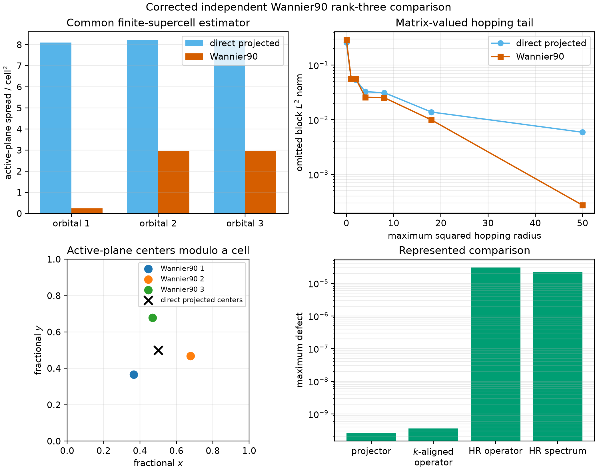
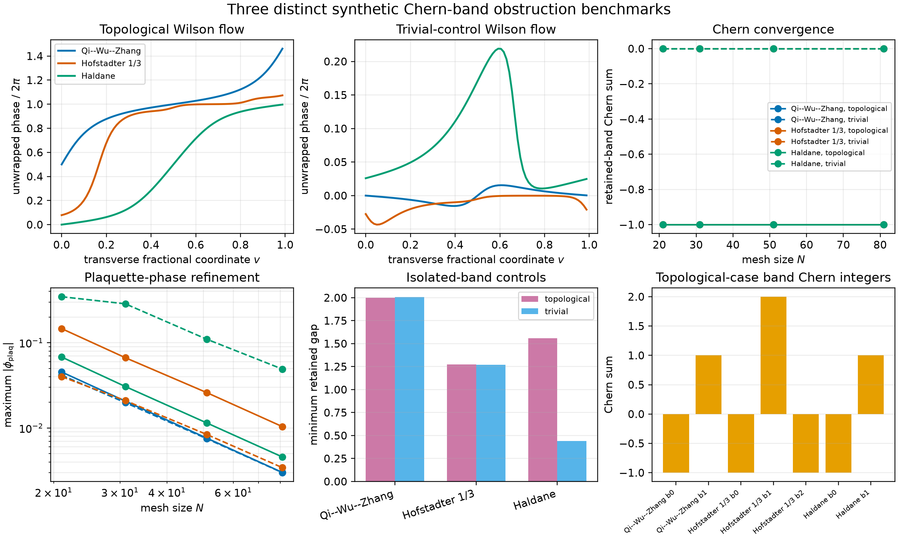
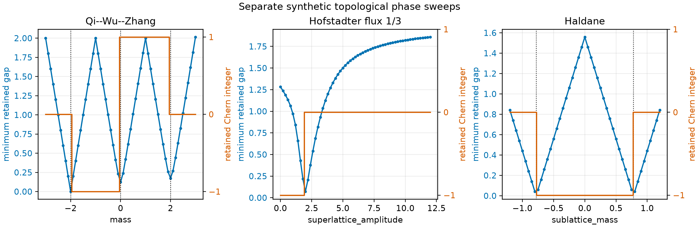

# From Separable Products to Coupled Two-Dimensional Hoppings

## Status

**Human-accepted controlled exercise; provisional calculated research note —
illustrative numerical verification.**

This mini-paper reports a frozen synthetic calculation. It has not been peer
reviewed and does not validate a two-dimensional material, silicon, a production
Wannier workflow, or transferability of the resulting hopping hierarchy.

## Abstract

A two-dimensional Wannier reduction introduces degeneracies, reciprocal-space
loops, directional hopping shells, and tensor observables that do not occur in
a one-dimensional chain. We study a square-lattice scalar cosine Hamiltonian
whose separable limit supplies exact matrix, spectral, and product-subspace
references, then turn on a frozen diagonal reciprocal coupling. The represented
Kronecker-sum defect is exactly zero and the complete product-spectrum defect is
$3.55\times10^{-14}E_G$. A rank-two degeneracy control shows why projectors,
not individual eigenvectors, are stable comparison objects. Independent
plane-wave and Bloch finite-difference parents converge monotonically; the
finest declared errors are $6.27\times10^{-11}E_G$ and
$6.27\times10^{-3}E_G$, respectively. Across
$\lambda_{xy}=0,0.05,0.15,0.30$, the lowest band remains isolated, sewn
nearest-neighbor overlaps exceed 0.978, the lattice Chern diagnostic is zero,
and Wilson phases show no transverse winding. Mixed-direction hopping grows
from a $3.00\times10^{-15}E_G$ numerical floor to
$1.94\times10^{-3}E_G$, directly exposing loss of separability. Matched direct
least-squares and Fourier-mediated shell reductions agree within
$3.37\times10^{-16}E_G$. Full-shell reconstruction is at binary64 scale on the
transform mesh, while a $1.70\times10^{-6}E_G$ withheld error at the strongest
coupling remains as a distinct reciprocal-mesh interpolation effect. An
anisotropic control splits the principal masses without breaking time reversal
or reflection. A subsequent rank-three extension verifies that non-Abelian
Chern and Wilson diagnostics are invariant under a rough internal gauge while
localization and hopping range are not. Three separately represented QWZ,
Hofstadter, and Haldane extensions each produce an isolated lower band with
Chern integer $-1$ and unit Wilson winding, while their declared trivial
controls produce zero Chern and winding. The first authorized Wannier90 attempt
stops in preprocessing because the auxiliary unit-cell embedding produces too
many nearest neighbors. A separately authorized one-line embedding correction
then preprocesses successfully and converges in 94 iterations. On the common
finite-supercell estimator and the same external mesh it reduces total
active-plane spread from $24.52a^2$ in the corrected direct projected gauge to
$6.136a^2$; the separate native Wannier90 Berry-link value is $0.709a^2$. The
exercise verifies the
declared represented reduction chain and
independent synthetic localization comparison; material adequacy remains
unresolved.

## 1. Question and evidence boundary

The calculation asks:

> Which conclusions survive when the verified one-dimensional periodic
> reduction is extended to a full two-dimensional reciprocal mesh, and which
> new failure modes require separate controls?

The evidence is software and numerical verification for a frozen synthetic
operator family. It does not establish scientific validation, uncertainty
quantification, production localization, or a model for any material.

## 2. Parent operator and represented spaces

In units $a=2\pi$, $G=1$, and $E_G=1$, the parent is

$$
H=-\nabla^2+\lambda_x\cos x+\lambda_y\cos y
  +\lambda_{xy}\cos x\cos y.
$$

The isotropic family fixes $\lambda_x=\lambda_y=0.5$ and varies
$\lambda_{xy}=0,0.05,0.15,0.30$. The anisotropic control instead uses
$(\lambda_x,\lambda_y,\lambda_{xy})=(0.3,0.7,0)$.

The plane-wave matrix uses ordered reciprocal pairs $(p,q)$ with $p$ outer and
$q$ inner. The independent real-space matrix uses an $N\times N$ grid with
$x$ outer and $y$ inner and explicit Bloch phases at both cell boundaries.
Units, lattice geometry, Bloch momentum, energy zero, spinless convention, and
basis order are retained. Full matrices of unequal dimension are not
subtracted. The finite-difference operator is first transported to the common
$|p|,|q|\leq1$ sector.

## 3. Exact separable reference

At $\lambda_{xy}=0$,

$$
H(k_x,k_y)=H_x(k_x)\otimes I+I\otimes H_y(k_y).
$$

The implementation checks this identity entry by entry at the represented
matrix level, then compares the complete spectrum with all sorted pair sums.
At $\Gamma$, the $E_0+E_1$ level is a rank-two cluster spanned by
$|0\rangle\otimes|1\rangle$ and $|1\rangle\otimes|0\rangle$. A fixed Hadamard
rotation supplies an adversarial internal gauge: each original vector has
maximum overlap $1/\sqrt2$ with a rotated vector even though the cluster
projector is unchanged.

Calculated defects are:

| Control | Defect |
|---|---:|
| represented Kronecker-sum Frobenius defect | $0$ |
| complete product-spectrum maximum defect | $3.55\times10^{-14}E_G$ |
| direct/product rank-two projector defect | $8.08\times10^{-14}$ |
| controlled rotated-projector defect | $2.68\times10^{-16}$ |

The larger direct/product projector residual reflects eigensolver coordinates
inside an exact represented degeneracy; it remains below the declared
$2\times10^{-13}$ criterion.

## 4. Independent parent refinement

The coupled comparison parent uses $\lambda_{xy}=0.15$. Plane-wave cutoffs are
compared with $P=5$ at four declared momenta for the lowest four bands.

| $P$ | dimension | maximum low-band error ($E_G$) |
|---:|---:|---:|
| 1 | 9 | $5.25\times10^{-2}$ |
| 2 | 25 | $2.37\times10^{-4}$ |
| 3 | 49 | $2.13\times10^{-7}$ |
| 4 | 81 | $6.27\times10^{-11}$ |

The independent centered finite-difference sequence gives:

| points per direction | dimension | spectral error ($E_G$) | common-sector operator defect ($E_G$) |
|---:|---:|---:|---:|
| 9 | 81 | $4.83\times10^{-2}$ | $4.00\times10^{-1}$ |
| 13 | 169 | $2.32\times10^{-2}$ | $1.95\times10^{-1}$ |
| 17 | 289 | $1.35\times10^{-2}$ | $1.15\times10^{-1}$ |
| 25 | 625 | $6.27\times10^{-3}$ | $5.34\times10^{-2}$ |

Both diagnostics decrease monotonically. The finite-difference result is less
accurate than the retained plane-wave parent and remains a convergence study,
not an equal-accuracy duplicate.

## 5. Degeneracy, loops, and topology

The lowest isolated band is solved on a complete $15\times15$ mesh. Boundary
links explicitly sew plane-wave indices under reciprocal translation. The
minimum neighbor overlap decreases from 0.9904 in the separable case to 0.9785
at the strongest coupling, remaining above the frozen 0.85 stop threshold.

For every coupling:

- the lattice Chern sum is zero to the recorded precision;
- elementary plaquette phases are zero to the recorded precision;
- $x$- and $y$-cycle Wilson phases are $\pi$ without transverse winding; and
- a deterministic momentum-dependent phase attack changes the loop phases by
  at most $1.14\times10^{-15}$ and leaves the Chern sum unchanged.

The $\pi$ loop phase records the cell-origin convention and corresponding
Wannier-center class. It is not a nonzero Chern number. The calculation verifies
the expected trivial family; it does not test a topological obstruction.

## 6. Coupling continuation



**Figure 1.** Two-dimensional numerical-verification summary. The full
reciprocal mesh, not only a high-symmetry path, controls the band, loop, hopping,
and shell results.

The coupling continuation remains inside an isolated-band regime:

| $\lambda_{xy}$ | minimum gap ($E_G$) | maximum separability residual ($E_G$) | mixed hopping norm ($E_G$) | mixed/nonlocal ratio | principal mass ($m$) |
|---:|---:|---:|---:|---:|---:|
| 0.00 | 0.4971 | $9.95\times10^{-15}$ | $3.00\times10^{-15}$ | $7.00\times10^{-14}$ | 1.534 |
| 0.05 | 0.4685 | $1.78\times10^{-2}$ | $2.25\times10^{-4}$ | $4.98\times10^{-3}$ | 1.488 |
| 0.15 | 0.4112 | $5.22\times10^{-2}$ | $7.85\times10^{-4}$ | $1.57\times10^{-2}$ | 1.408 |
| 0.30 | 0.3251 | $1.01\times10^{-1}$ | $1.94\times10^{-3}$ | $3.37\times10^{-2}$ | 1.313 |

Thus the diagonal reciprocal coupling has two independently visible effects:
it invalidates product-energy factorization and generates mixed-direction
hoppings. Neither effect is inferred from a band path alone.

Time reversal, both reflections, and fourfold rotation remain satisfied to at
most $1.53\times10^{-14}E_G$ over the full mesh because the coupled term
preserves square symmetry.

## 7. Hopping shells and route comparison

The complete scalar Wannier Hamiltonian is the inverse $15\times15$ transform
of the lowest-band energy. The frozen hierarchy retains complete squared-radius
shells $r_x^2+r_y^2\leq s$ for
$s=0,1,2,4,8,18,50,98$.

At $\lambda_{xy}=0.30$, the withheld RMS error decreases as follows:

| $s$ | retained coefficients | withheld RMS error ($E_G$) |
|---:|---:|---:|
| 0 | 1 | $5.75\times10^{-2}$ |
| 1 | 5 | $6.44\times10^{-3}$ |
| 2 | 9 | $6.18\times10^{-3}$ |
| 4 | 13 | $1.27\times10^{-3}$ |
| 8 | 25 | $1.10\times10^{-3}$ |
| 18 | 61 | $6.04\times10^{-5}$ |
| 50 | 161 | $1.81\times10^{-6}$ |
| 98 | 225 | $1.70\times10^{-6}$ |

Matched direct least squares and mediated Fourier truncation agree within
$3.37\times10^{-16}E_G$ over all cases and shells. Parseval residuals remain at
binary64 scale. The full shell reconstructs the original transform mesh within
$1.11\times10^{-15}E_G$.

The nonzero full-shell withheld error is important: adding all finite-transform
coefficients cannot remove reciprocal-mesh interpolation error. Shell
truncation and reciprocal sampling are distinct limits.

## 8. Effective-mass tensor and anisotropy

At $\Gamma$, the isotropic coupled family retains equal principal masses and a
negligible mixed derivative. Its principal mass decreases from $1.534m$ at the
separable point to $1.313m$ at $\lambda_{xy}=0.30$.

The anisotropic separable control yields principal masses $1.184m$ and $2.112m$.
Time reversal and both reflections remain within $3.60\times10^{-14}E_G$, while
the deliberately invalid fourfold comparison produces a
$7.46\times10^{-2}E_G$ defect. Anisotropy is therefore detected independently
of nonseparable mixed hopping.

## 9. Independent verification

The verifier does not import the runner. It independently assembles the
plane-wave matrix through reciprocal-index differences and the finite-
difference matrix through explicit two-dimensional neighbor loops. It then
reconstructs spectra, common-basis transport, separable projectors, all retained
mesh energies, sewn topology, hoppings, shell fits, withheld errors, and mass
tensors.

The retained verification result is:

```text
periodic_2d_verification=PASS
maximum_reconstructed_energy_defect=0.000e+00
maximum_reconstructed_hopping_defect=0.000e+00
```

This establishes agreement between two implementations under the frozen
binary64 contract. It is not evidence of material validity.

## 10. Rank-three composite gauge and localization

The human-requested extension retains the lowest three bands at
$\lambda_{xy}=0.15$. They are separated from the exterior by at least
$3.48\times10^{-2}E_G$ on the full mesh. Centered Gaussian $s$, $p_x$, and
$p_y$ trials produce a minimum projection singular value of 0.886; sewn
neighbor overlaps remain full rank with minimum singular value 0.785.



**Figure 2.** Direct rank-three composite comparison. The smooth projected
frame and a deterministic rough internal gauge have the same represented
subspace, spectra, total Chern diagnostic, and Wilson eigenphase sets. Their
localization and hopping ranges differ because these are gauge-coordinate
properties.

The smooth and rough frames agree in mesh spectra within
$1.22\times10^{-15}E_G$, in Wilson eigenphase sets within
$2.22\times10^{-15}$ after branch-aware assignment, and in zero total Chern
number. The rough gauge nevertheless increases total finite-supercell spread
from $24.90a^2$ to $67.70a^2$. At squared-radius shell 18, its omitted
hopping-block norm is $5.25\times10^{-1}E_G$, compared with
$1.38\times10^{-2}E_G$ for the smooth projected frame. This separates invariant
subspace content from gauge-dependent locality.

The provisional calculation had formed $AA^{-1}$ from the square trial-overlap
matrix and therefore returned the raw eigengauge rather than the declared polar
projected frame. Independent Wannier90 reconstruction exposed the semantic
error. The corrected runner uses $A(A^\dagger A)^{-1/2}$ through the SVD polar
factor; the verifier uses a separate Hermitian eigendecomposition. The
superseded and corrected diagnostics are retained in
`composite-projected-gauge-correction.md`.

Both full matrix-valued transforms reconstruct their mesh within
$4.08\times10^{-15}E_G$ in maximum Frobenius norm. Matched direct and mediated
matrix coefficients agree within $2.27\times10^{-15}E_G$. An independent
verifier reconstructs the parent, trial projection, non-Abelian links, Wilson
spectra, hopping blocks, shell errors, and finite-supercell density identities.
It reports:

```text
periodic_2d_composite_verification=PASS
minimum_composite_gap=3.478419056606e-02
minimum_projection_singular_value=8.860918498705e-01
smooth_total_spread=2.489507290525e+01
rough_total_spread=6.770300726672e+01
```

This is a direct projected-gauge comparison. It does not infer an independent
Wannier90 result.

## 11. Retained failure and corrected Wannier90 comparison

The single authorized Wannier90 3.1.0 attempt stops during preprocessing with:

```text
kmesh_get: something wrong, found too many nearest neighbours
```

It exits with code 1 after 0.31 s, with 22,118,400 bytes maximum resident memory
and 302,287 bytes of external output. Both resource bounds are respected.
Wannier90 emits no `.nnkp`; consequently the interface generator does not write
`.mmn` and localization is not started. The failure is retained rather than
retried or interpreted as a spread-minimization result. An independent verifier
checks the executable and input identities, native log identities, exit code,
1,430 enumerated candidate vectors, resource disposition, and absence of every
post-preprocessing output.

The frozen `$15\times15\times1$` mesh was embedded in a unit cubic auxiliary
cell. Its inactive reciprocal increment is therefore 15 times the active
increments. Wannier90's three-dimensional completeness search encounters too
many shorter in-plane shells before reaching the inactive direction and exceeds
its compiled 12-neighbor limit. This is an interface-embedding failure, not
evidence against localization of the rank-three subspace.

A separately authorized correction changes only the inactive direct-lattice
length from 1 to 15, balancing the three reciprocal increments while leaving
the active parent, mesh, rank, projections, and localization controls unchanged.
Preprocessing then identifies six axial neighbors in 0.28 s, and localization
converges in 94 iterations and 0.47 s with maximum resident memory 27.3 MB.



**Figure 3.** Independent Wannier90 comparison after correcting the auxiliary
embedding. On one common finite-supercell estimator, the optimized frame
strongly reduces active-plane spread and the long-range hopping tail. Projector
and exactly aligned operator agreement are limited by the printed external
$U$ matrices, while `_hr.dat` reconstruction is limited by its six-decimal
serialization.

The three native Berry-link spreads are $0.2072a^2$, $0.2509a^2$, and
$0.2513a^2$, for a total $0.7094a^2$. They are not compared directly with the
direct finite-supercell values. Reconstructing the Wannier90 frame on the same
$128^2$ grid gives $0.2358a^2$, $2.9532a^2$, and $2.9469a^2$, totaling
$6.1359a^2$, versus $24.5163a^2$ for the corrected direct projected frame
reconstructed from that same external mesh. The separate centered-mesh direct
route gives $24.8951a^2$. At squared-radius shell 50, the omitted hopping norm
decreases from
$5.90\times10^{-3}E_G$ to $2.72\times10^{-4}E_G$. The two frames span the same
retained subspace within $2.65\times10^{-10}$; after the exact $k$-dependent
unitary alignment, their represented operators agree within
$3.57\times10^{-10}E_G$.

Integer translations in $[-1,1]^2$ for each orbital plus one constant orbital
unitary do not align the gauges: the best per-orbital frame RMS defect is 1.188.
This retained negative result shows that external spread minimization found a
genuinely momentum-dependent gauge rather than a mere translated or constantly
rotated copy of the direct projected frame. Native `_hr.dat` blocks reconstruct
the external mesh within $3.06\times10^{-5}E_G$ in Frobenius norm and the
spectrum within $2.23\times10^{-5}E_G$; this larger defect is separately labeled
as decimal serialization error.

An independent verifier reconstructs the parent through explicit reciprocal-
index loops, builds the direct polar frame through a Hermitian inverse square
root, searches the bounded alignments, parses native hoppings, and recomputes
the common-grid densities and all reported spreads and shell tails without
importing the extractor.

## 12. Three distinct Chern-band controls

The human-selected extension also evaluates Qi--Wu--Zhang, flux-$1/3$
Hofstadter, and Haldane models. These are separate finite-dimensional Bloch
operators, not representations or approximations of the scalar continuum
operator. Their state spaces, parameters, gaps, and errors remain separate.



**Figure 4.** Three topological cases and three declared trivial controls. Each
topological retained band has nonzero Chern sum and unit Wilson winding; every
trivial control has zero Chern sum and zero winding.

At the finest $81^2$ mesh, the topological retained gaps are 2.000, 1.274, and
1.559 in the respective model units. The retained band has Chern integer $-1$
and Wilson winding $+1$ for every topological case on all four meshes from
$21^2$ through $81^2$. QWZ and Haldane have full-band Chern tuples
$(-1,+1)$; Hofstadter has $(-1,+2,-1)$. The three declared trivial controls
have zero band Chern sums and zero retained winding.

A deterministic periodic phase attack changes a Chern sum by at most
$2.3\times10^{-16}$ and a Wilson phase by at most $1.5\times10^{-15}$.
Reciprocal-seam projector defects remain below $1.9\times10^{-15}$. The
independent verifier reconstructs the Bloch matrices and evaluates projector
Bargmann products instead of importing the runner or repeating its normalized
link route.

The nonzero Chern integer and Wilson winding evaluate the numerical premises of
the standard rank-one Wannier obstruction. They do not prove the general
theorem, establish topology for the scalar continuum family, or provide
material validation. Full contracts and model-specific limitations are retained
in `topological-report.md`.

## 13. Non-DFT Wannier90 sensitivity study

Six additional one-attempt cases vary mesh, plane-wave cutoff, and inactive
embedding around $(P,N,c)=(3,15,15)$. All executable stages complete within the
declared limits, but the localization measures are nonmonotone. The common
finite-supercell spread is $4.6847a^2$ at $N=11$, $6.1359a^2$ at $N=15$, and
$8.4973a^2$ at $N=19$. The $P=2$ and $P=4$ values are $9.3161a^2$ and
$10.3654a^2$, with radius-50 tails near $3.3\times10^{-2}E_G$ rather than the
reference $2.72\times10^{-4}E_G$.


**Figure 5.** Native and common-estimator spreads, localization ratios, hopping
tails, center-set sensitivity, and optimizer iterations for the reference and
six new cases.

Changing only the inactive length to $c=12$ closely reproduces the reference
total spreads and tail, while $c=18$ converges to a different basin. These
records do not support cutoff-, mesh-, or embedding-independent localization.
They strengthen the evidence by exposing that limitation rather than selecting
or retrying a favorable result. Portable and native-run study verifiers pass.

## 14. Topological phase sweeps

Separate $51^2$ sweeps recover QWZ changes at $m=-2,0,2$ and bracket the
Haldane changes around the analytic values $M=\pm0.7794$. The Hofstadter
lower-band Chern integer changes from $-1$ to zero between $\Delta=1.8$ and
$2.0$ and remains zero through the sampled continuation to $\Delta=12$.
Thus $\Delta=4$ has a numerical connection to the large-superlattice trivial
sector, not a claimed exact analytic transition value.



**Figure 6.** Model-resolved gaps and Chern sectors. Dotted lines mark analytic
boundaries only for QWZ and Haldane; model energy units remain separate.

Every sweep sample is independently reconstructed through projector Bargmann
loops. The sweeps are numerical verification of finite synthetic models, not
material phase diagrams.

## 15. Limitations

1. Plane-wave and finite-difference parents remain finite numerical
   representations.
2. The composite calculation treats one frozen isolated rank-three group and
   one declared synthetic trial family; it is not a general disentanglement
   study.
3. The first Wannier90 preprocessing failure, corrected reference, and bounded
   study all use an auxiliary third direction; only active-plane centers and
   spreads are interpreted.
4. The nonmonotone Wannier90 study does not establish a converged localization
   limit, and the $c=18$ case demonstrates optimizer-basin sensitivity to the
   auxiliary embedding.
5. The topological models are synthetic and distinct from the scalar parent;
   their errors and energy scales are not combined.
6. The finite coupling sequence, topological meshes, and finite-supercell
   spreads are not a convergence theorem or uncertainty analysis.
7. No two-dimensional material, DFT calculation, silicon model, scientific
   validation, or transferability claim is presented.

## 16. Reproduction

From `python/`:

```bash
uv run python \
  ../calculations/research-monograph/periodic-2d/run_experiment.py \
  --input ../calculations/research-monograph/periodic-2d/input.json \
  --output ../calculations/research-monograph/periodic-2d/result.json

uv run python \
  ../calculations/research-monograph/periodic-2d/verify_result.py \
  ../calculations/research-monograph/periodic-2d/result.json

uv run --extra notebooks python \
  ../calculations/research-monograph/periodic-2d/plot_result.py \
  ../calculations/research-monograph/periodic-2d/result.json \
  --output ../calculations/research-monograph/periodic-2d/summary.png

uv run python \
  ../calculations/research-monograph/periodic-2d/run_composite.py \
  --input ../calculations/research-monograph/periodic-2d/composite-input.json \
  --output ../calculations/research-monograph/periodic-2d/composite-result.json

uv run python \
  ../calculations/research-monograph/periodic-2d/verify_composite.py \
  ../calculations/research-monograph/periodic-2d/composite-result.json

uv run --extra notebooks python \
  ../calculations/research-monograph/periodic-2d/plot_composite.py \
  ../calculations/research-monograph/periodic-2d/composite-result.json \
  --output ../calculations/research-monograph/periodic-2d/composite-summary.png

uv run python \
  ../calculations/research-monograph/periodic-2d/run_topological.py \
  --input ../calculations/research-monograph/periodic-2d/topological-input.json \
  --output ../calculations/research-monograph/periodic-2d/topological-result.json

uv run python \
  ../calculations/research-monograph/periodic-2d/verify_topological.py \
  ../calculations/research-monograph/periodic-2d/topological-result.json

uv run --extra notebooks python \
  ../calculations/research-monograph/periodic-2d/plot_topological.py \
  ../calculations/research-monograph/periodic-2d/topological-result.json \
  --output ../calculations/research-monograph/periodic-2d/topological-summary.png

uv run python \
  ../calculations/research-monograph/periodic-2d/verify_wannier90_execution.py \
  ../calculations/research-monograph/periodic-2d/wannier90-execution.json

uv run python \
  ../calculations/research-monograph/periodic-2d/verify_wannier90_balanced.py \
  ../calculations/research-monograph/periodic-2d/wannier90-balanced-result.json \
  --portable

uv run --extra notebooks python \
  ../calculations/research-monograph/periodic-2d/plot_wannier90_balanced.py \
  ../calculations/research-monograph/periodic-2d/wannier90-balanced-result.json \
  --output ../calculations/research-monograph/periodic-2d/wannier90-balanced-summary.png

uv run python \
  ../calculations/research-monograph/periodic-2d/verify_wannier90_study.py \
  ../calculations/research-monograph/periodic-2d/wannier90-study-result.json \
  --portable

uv run python \
  ../calculations/research-monograph/periodic-2d/verify_topological_phase_sweep.py \
  ../calculations/research-monograph/periodic-2d/topological-phase-sweep-result.json

uv run python \
  ../calculations/research-monograph/periodic-2d/verify_native_evidence_archive.py \
  ../calculations/research-monograph/periodic-2d/native-evidence-archive.json
```

The portable mode verifies the numerical claims from the compact extracted
fixture retained in the result. Omitting `--portable` additionally verifies the
native file identities, formats, and execution logs when the recorded external
run is available. `SHA256SUMS` identifies the retained artifacts.
