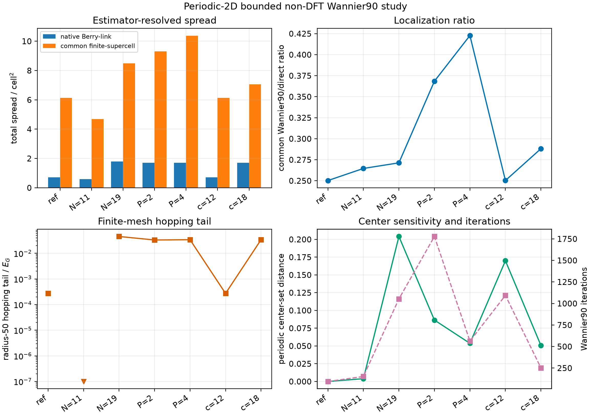

# Non-DFT Wannier90 convergence and embedding study

## Status and boundary

This is calculated synthetic numerical-verification evidence authorized by
`RM-PERIODIC-2D-NONDFT-STUDY-HC06`. It contains no DFT or material calculation.
Six new local Wannier90 3.1.0 cases were run once, serially, without retry. All
completed within the retained resource limits and all portable and native-run
study verifiers pass.

The reference is $(P,N,c)=(3,15,15)$, where $P$ is the plane-wave cutoff,
$N^2$ is the active reciprocal mesh, and $c$ is the auxiliary inactive
lattice length. Mesh, cutoff, and embedding are varied one axis at a time.

## Calculated results

| Case | Iterations | Native spread ($a^2$) | Common spread ($a^2$) | Common W90/direct ratio | Radius-50 tail ($E_G$) |
|---|---:|---:|---:|---:|---:|
| reference $P3,N15,c15$ | 94 | 0.7094 | 6.1359 | 0.2503 | $2.72\times10^{-4}$ |
| mesh $N=11$ | 152 | 0.5979 | 4.6847 | 0.2647 | $0$* |
| mesh $N=19$ | 1053 | 1.7901 | 8.4973 | 0.2713 | $4.52\times10^{-2}$ |
| cutoff $P=2$ | 1778 | 1.7072 | 9.3161 | 0.3685 | $3.30\times10^{-2}$ |
| cutoff $P=4$ | 563 | 1.7024 | 10.3654 | 0.4228 | $3.38\times10^{-2}$ |
| embedding $c=12$ | 1094 | 0.7093 | 6.1368 | 0.2503 | $2.72\times10^{-4}$ |
| embedding $c=18$ | 252 | 1.7024 | 7.0647 | 0.2882 | $3.38\times10^{-2}$ |

*For $N=11$, squared radius 50 already contains every represented translation;
the zero is finite-support bookkeeping and is not evidence of a vanishing
infinite-range tail.



## Interpretation

The retained $N=15$, $P=3$, $c=15$ result is a valid converged optimizer output
for its frozen interface, but it is **not a demonstrated cutoff- or
reciprocal-mesh-converged localization result**. The $N=19$, $P=2$, and $P=4$
cases converge to larger native and common spreads and substantially larger
radius-50 tails. The sequence is nonmonotone and does not support extrapolation.

The inactive embedding is also not innocuous for the optimizer. The $c=12$
case reproduces the reference total spreads and tail closely, whereas $c=18$
converges to a different localization basin. Active-plane operator and subspace
comparisons remain separately verified, but the selected localized gauge and
its spread are sensitive to the auxiliary finite-difference geometry and
optimization path.

Accordingly, the strongest supported claim is limited to deterministic outputs
of the declared finite cases. The study does not support a mesh-independent,
cutoff-independent, or embedding-independent localization claim. No failed or
less-localized case is discarded, and no further initializations or automatic
retries were run.

## Reproduction

From `python/`, repository-only verification is:

```bash
uv run python \
  ../calculations/research-monograph/periodic-2d/verify_wannier90_study.py \
  ../calculations/research-monograph/periodic-2d/wannier90-study-result.json \
  --portable
```

Omitting `--portable` additionally verifies the retained external execution
record and native file identities. The protected executable stages are not
repeated by either verification command.
