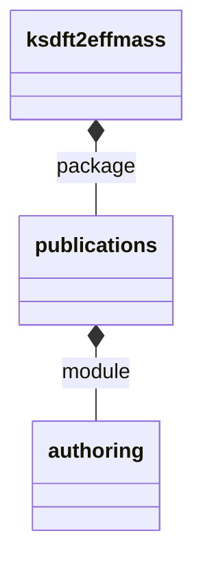

# `ksdft2effmass` implementation status

The source-mirrored architecture begins with one bounded publication-authoring slice.
It adds no shared base class, dependency, serializer, persistence layer, external
retrieval implementation, or manuscript mutation path.

The root package initializer is not changed into a re-export facade.
`ksdft2effmass.publications` is the supported import boundary for this slice. Existing
v1/v2 architecture continues to own untouched legacy code and prospective system
architecture.
