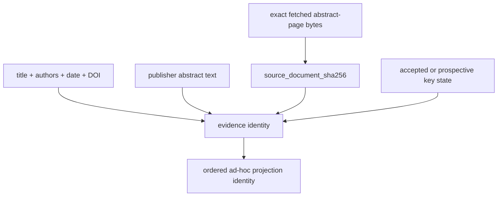

# `ad_hoc_evidence` implementation

`AuthorSuppliedPublisherAbstractEvidence` accepts only the three authorized
`journals.aps.org/.../abstract/...` URLs. Every record fixes
`EvidenceProvenanceStatus.AUTHOR_SUPPLIED_AD_HOC` and
`EvidenceSourceScope.PUBLISHER_ABSTRACT`, binds the exact fetched-page SHA-256,
metadata, abstract, citation disposition, and warnings, and rejects a full-text URL.

Warnings are retained rather than normalized away. The authoring Action fails closed
before inference when either a record or projection carries a warning. An absence of
warnings establishes only that this bounded extraction reported none; it does not
establish full-paper review, rights clearance, or scientific correctness.
