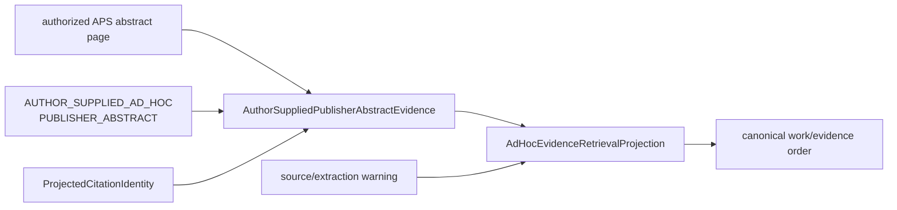

# `ad_hoc_evidence` schematic

```mermaid
flowchart LR
    Page["authorized APS abstract page"] --> Evidence["AuthorSuppliedPublisherAbstractEvidence"]
    Evidence --> Projection["AdHocEvidenceRetrievalProjection"]
    Scope["AUTHOR_SUPPLIED_AD_HOC<br/>PUBLISHER_ABSTRACT"] --> Evidence
    Owner["ProjectedCitationIdentity"] --> Evidence
    Warning["source/extraction warning"] --> Projection
    Projection --> Order["canonical work/evidence order"]
```

The record contains publisher metadata and abstract text only. No full-text link is an
admissible source URL.
