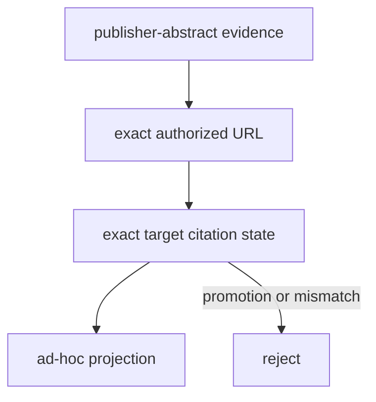

# `ad_hoc` adapter implementation

The adapter fixes these target-snapshot states:

- `PhysRev.97.869` — accepted canonical `luttingerKohn1955`;
- `PhysRev.98.915` — prospective `kohnLuttinger1955donor`, never canonical; and
- `PhysRevB.8.2697` — prospective `baldereschiLipari1973`, never canonical.

It may project an authorized subset while an author builds evidence iteratively, but
it cannot change these states. Fetching and cache persistence are runtime preparation
outside the ActionObject.
