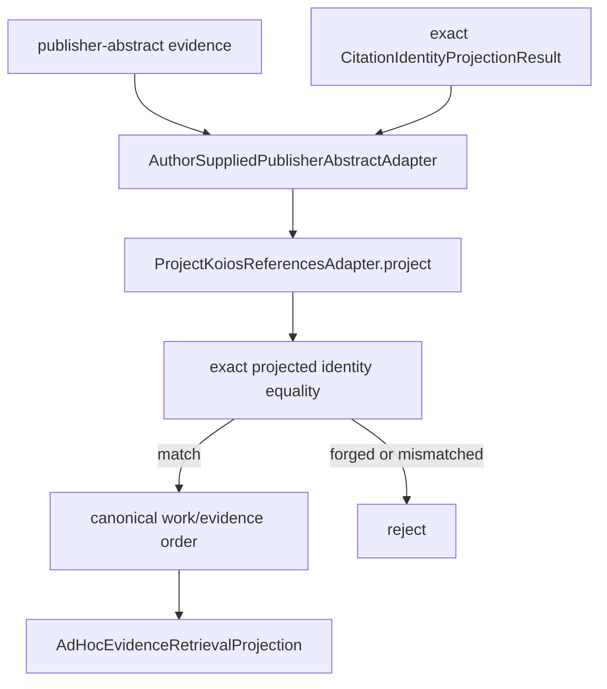

# `ad_hoc` adapter implementation

The adapter derives each work's `ProjectedCitationIdentity` from the supplied exact
Project Koios References result and rejects any abstract whose embedded identity
differs. It does not hardcode or independently assert accepted status or canonical
keys. Candidate labels remain local, explicitly noncanonical metadata.

Input order is normalized by bibliographic-work and evidence identities so one bounded
set yields one prompt order and projection identity. Fetching and cache persistence
remain runtime preparation outside this ActionObject.
