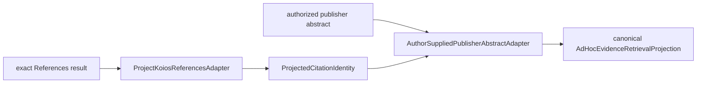

# `ad_hoc` adapter schematic

```mermaid
flowchart LR
    Owner["exact References result"] --> Strict["ProjectKoiosReferencesAdapter"]
    Strict --> Identity["ProjectedCitationIdentity"]
    Abstract["authorized publisher abstract"] --> Adapter["AuthorSuppliedPublisherAbstractAdapter"]
    Identity --> Adapter
    Adapter --> Projection["canonical AdHocEvidenceRetrievalProjection"]
```

The adapter has no fetch, full-text, citation-resolution, status-assertion, or
key-promotion capability. Forged or mismatched References lineage is rejected.
