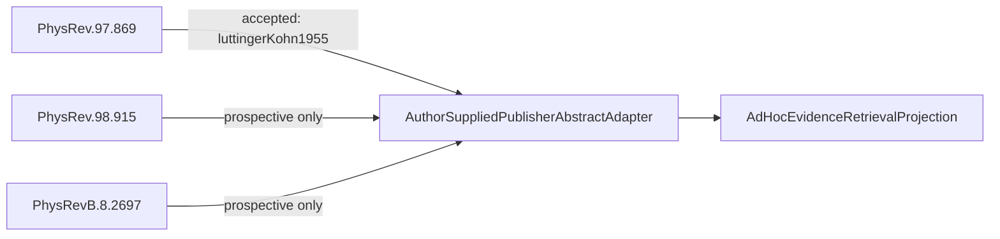

# `ad_hoc` adapter schematic

```mermaid
flowchart LR
    LK["PhysRev.97.869"] -->|"accepted: luttingerKohn1955"| Adapter["AuthorSuppliedPublisherAbstractAdapter"]
    Donor["PhysRev.98.915"] -->|"prospective only"| Adapter
    Acceptor["PhysRevB.8.2697"] -->|"prospective only"| Adapter
    Adapter --> Projection["AdHocEvidenceRetrievalProjection"]
```

The adapter has no fetch, full-text, citation-resolution, or key-promotion capability.
