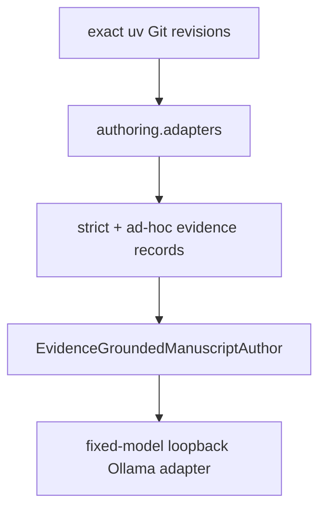

# `adapters` implementation

The production imports are exactly
`projectkoios.references.citation_identity`,
`projectkoios.ingestion.transcript.evidence.selection`, and
`projectkoios.search.evidence_retrieval`. Dependencies and source revisions are owned
by `python/pyproject.toml` and `python/uv.lock`.

Each adapter fails closed on missing or ambiguous correlation. Candidate proposed
citekeys are never represented as canonical keys, warning-inspection transcript
selections expose no evidence, and Search ranked records are projected in their
existing order with their exact IDs and ranks.

The [`ollama`](ollama/index.md) adapter implements the existing local-inference port
through literal IPv4 loopback with a fixed model tag and digest, bounded request and
response sizes, strict structured-output parsing, no tools, and no remote fallback.
The [`ad_hoc`](ad_hoc/index.md) adapter is an explicit separate path over only the
three authorized APS publisher abstract pages. It cannot promote prospective keys.
The runtime gate requires warning-free exact abstract inputs and a pre-execution
scale/resource report; full text remains outside authorization.
