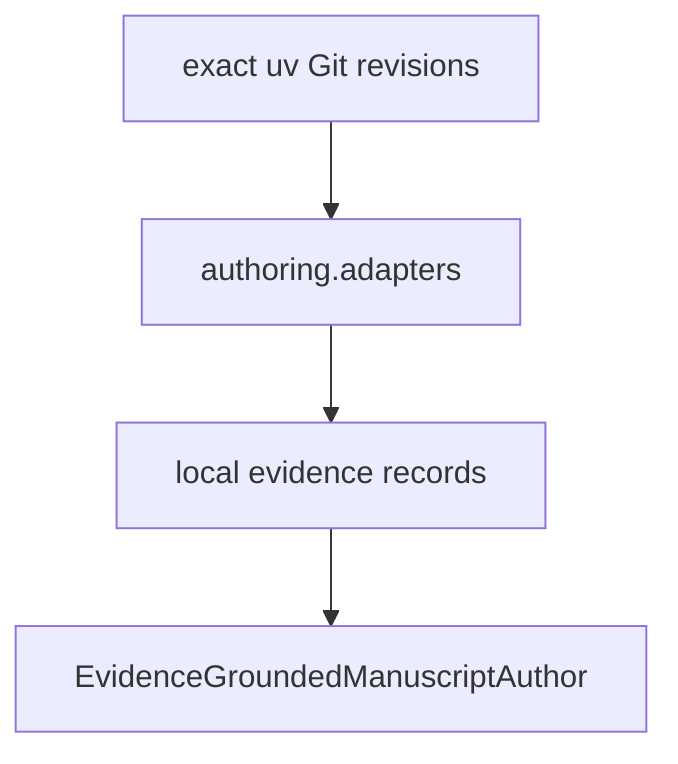

# `adapters` implementation

The production imports are exactly
`projectkoios.references.citation_identity`,
`projectkoios.ingestion.transcript.evidence.selection`, and
`projectkoios.search.evidence_retrieval`. Dependencies and source revisions are owned
by `python/pyproject.toml` and `python/uv.lock`.

Each adapter fails closed on missing or ambiguous correlation. Candidate proposed
citekeys are never represented as canonical keys, warning-inspection transcript
selections expose no evidence, and Search ranked records are projected in their
existing order with their exact IDs and ranks.
