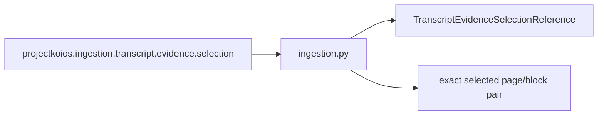

# `ingestion` adapter implementation

All five owner outcomes map explicitly and retain the selection result ID. Inspection
warnings remain attached to the warning outcome. `match_exact_pair` returns evidence
only for `EVIDENCE_AVAILABLE` and requires exact transcript, page, block, clean text,
raw text, digest, and mapping-basis agreement.
