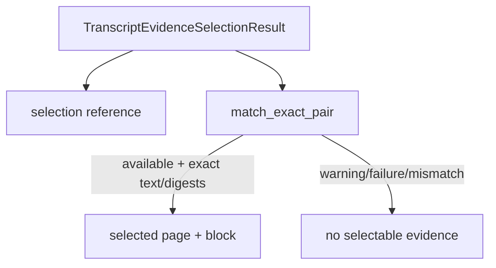

# `ingestion` adapter schematic

```mermaid
flowchart TD
    Result["TranscriptEvidenceSelectionResult"] --> Projection["selection reference"]
    Result --> Match["match_exact_pair"]
    Match -->|available + exact text/digests| Pair["selected page + block"]
    Match -->|warning/failure/mismatch| Closed["no selectable evidence"]
```
