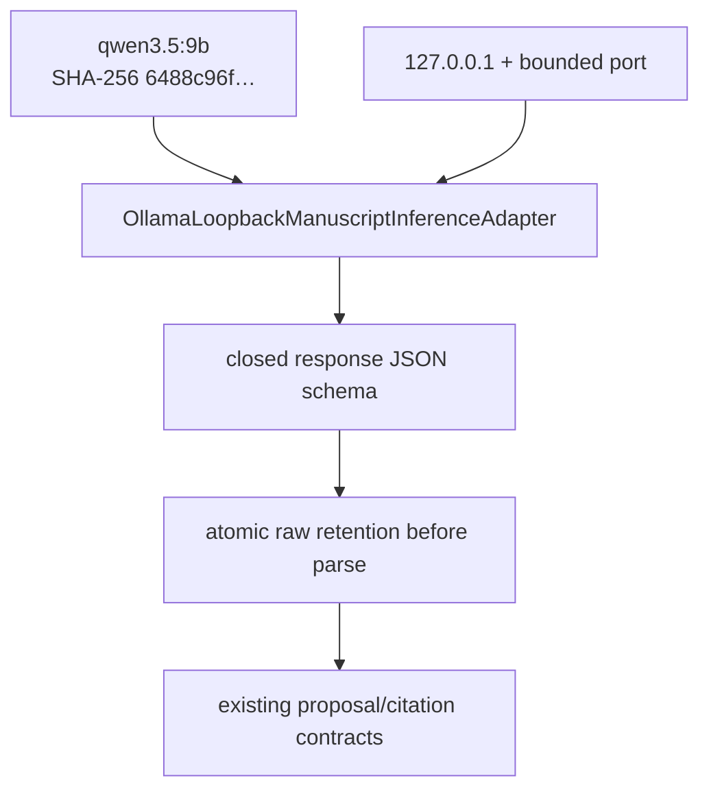

# `ollama` implementation

The adapter uses the standard-library `http.client.HTTPConnection` directly against
`127.0.0.1`. It ignores proxy configuration, follows no redirect, and has no fallback.
The model tag and complete digest are checked through `/api/tags` before every chat
request. `/api/chat` receives one user message, `stream=false`, `think=false`, no
`tools` field, fixed generation options including seed zero and temperature zero, a
32,768-token context bound,
a 4,096-token prediction bound, and an explicit closed JSON schema covering text,
canonical citations, all evidence IDs, gap-marker IDs, and warnings. The schema
explicitly defines `warning_codes=[]` for compliant abstract-only marker-bearing output;
nonempty warnings represent inability or ambiguity beyond those declared constraints
and remain failed closed. Prompt input is
limited to 32,768 UTF-8 bytes, each HTTP response to 65,536 bytes, and each request to
a 300-second timeout. The model is requested with `keep_alive="0s"`.

Exact bounded chat-response bytes are atomically retained mode `0600` before parsing;
a parsed metadata record preserving the exact warning tuple is retained before the
typed response returns to composition. Outer and generated JSON are decoded into a
closed recursive representation. The
adapter rejects a model mismatch, incomplete or abnormal termination, tool calls,
non-UTF-8 or malformed JSON, an unknown generated member, and values rejected by the
existing `ProposedCitation` or `ManuscriptInferenceResponse` contracts.

## Runtime boundary

The adapter is software-ready, but model availability alone never authorizes a run.
The explicitly authorized ad-hoc run may use only the three warning-free APS publisher
abstract records with their exact `AUTHOR_SUPPLIED_AD_HOC` / `PUBLISHER_ABSTRACT`
limitations after an exact pre-execution scale/resource report. Full text, manuscript
self-evidence, and synthetic test evidence remain excluded.

An authorized proposal may be retained only as a repository-ignored local review
artifact at
`.pi/cache/evidence-authoring/runtime`, created with mode `0600` by the required
retention Action. Raw bytes, parsed status metadata, and terminal authoring metadata
remain separate. Metadata must not contain source or target excerpts and artifacts must
never be committed or treated as manuscript edits or accepted scientific results.
