# `ollama` schematic

```mermaid
flowchart LR
    Request["ManuscriptInferenceRequest<br/>owner-owned lineage"] --> Bound["UTF-8 byte bound"]
    Bound --> Tags["GET 127.0.0.1 /api/tags"]
    Tags --> Identity["exact model name + digest"]
    Identity --> Chat["POST 127.0.0.1 /api/chat<br/>text + warnings only; no tools"]
    Chat --> Raw["retain exact raw bytes"]
    Raw --> Outer["strict outer JSON decode"]
    Outer -->|"outer contract rejection"| OuterRejection["decoded rejection<br/>outer_response_validation"]
    Outer --> Generated["strict generated JSON decode"]
    Generated -->|"keys/fields rejected"| GeneratedRejection["decoded rejection<br/>generated_response_validation"]
    Generated --> Response["ManuscriptInferenceResponse<br/>request lineage + candidate text"]
    Response -->|"typed rejection"| TypedRejection["decoded rejection<br/>typed_response_construction"]
    Identity -->|"mismatch"| Stop["fail closed"]
```

The host is not configurable and no path reaches a remote service, manuscript, or
bibliography boundary. The model never supplies citation/evidence/marker identities.
Every post-outer-decode contract rejection has a distinct excerpt-free retained record.
