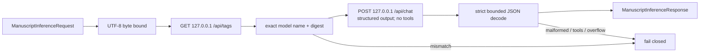

# `ollama` schematic

```mermaid
flowchart LR
    Request["ManuscriptInferenceRequest"] --> Bound["UTF-8 byte bound"]
    Bound --> Tags["GET 127.0.0.1 /api/tags"]
    Tags --> Identity["exact model name + digest"]
    Identity --> Chat["POST 127.0.0.1 /api/chat<br/>structured output; no tools"]
    Chat --> Decode["strict bounded JSON decode"]
    Decode --> Response["ManuscriptInferenceResponse"]
    Identity -->|"mismatch"| Stop["fail closed"]
    Decode -->|"malformed / tools / overflow"| Stop
```

The host is not configurable and no path reaches a remote service, manuscript,
bibliography, or persistence boundary.
