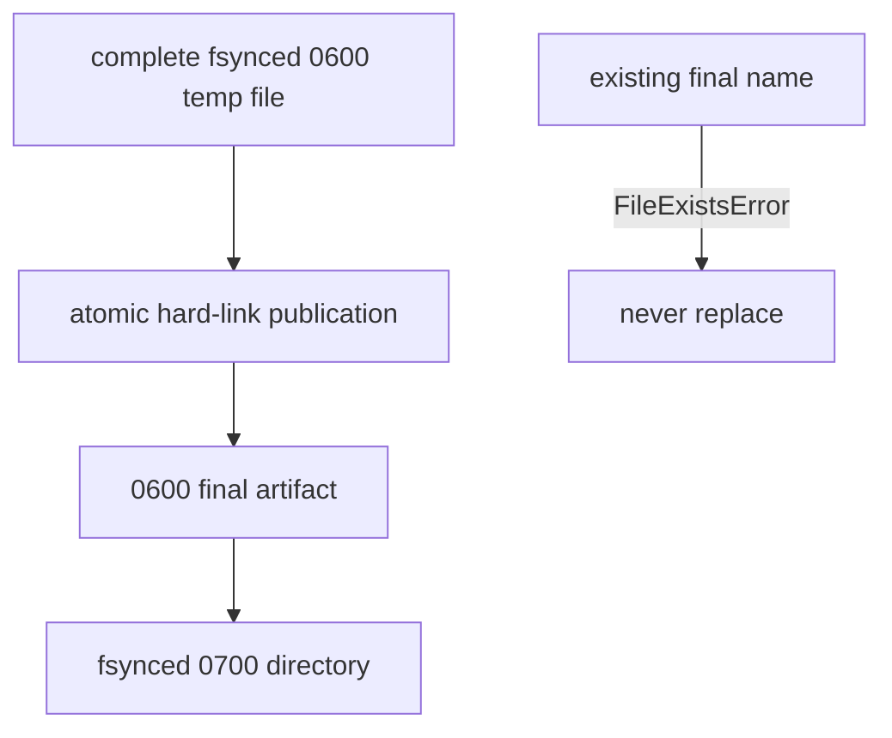

# `ollama_retention` implementation

`OllamaResponseRetention` accepts a local directory selected by runtime composition.
Production composition uses ignored `.pi/cache/evidence-authoring/runtime`; tests use
framework-isolated temporary directories. Response bytes must contain 1 to 65,536
bytes and use the exact inference-request identity grammar. Complete temporary bytes
are fsynced and atomically published with a hard link, so an existing final artifact
is never replaced. Files are mode `0600`; the retention directory is mode `0700`.

The raw artifact contains exact local service bytes. Parsed metadata separately records
raw path name/digest/count, model name/digest, inference request/response/implementation
IDs, replacement-text digest and character count, citation/evidence mappings, gap IDs,
and the exact warning tuple—never replacement, target, or evidence text. Terminal
metadata separately records the authoring outcome, issues, response/result/proposal
IDs, and `NOT_EVALUATED` acceptance. Both metadata records use canonical unversioned
record types and omit `schema_version`. Retention grants no manuscript, bibliography,
publication, remote-network, or retry capability.
