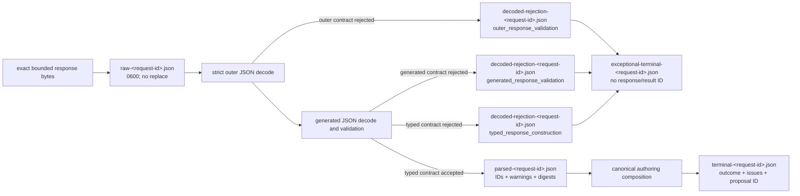

# `ollama_retention` schematic

Raw bytes are published before parsing. Rejection metadata preserves only bounded safe
structure, hashes, counts, types, and stable failure information without replacement,
target, or evidence excerpts. Exceptional terminal metadata records the failed run
without fabricating a typed response or authoring result.
