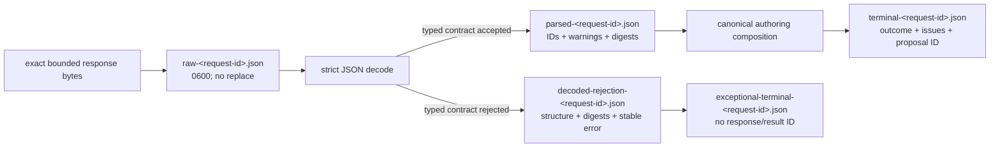

# `ollama_retention` schematic

Raw bytes are published before parsing. Decoded-rejection metadata preserves exact
bounded structure, hashes, counts, warnings, and stable failure information without
replacement, target, or evidence excerpts. Exceptional terminal metadata records the
failed run without fabricating a typed response or authoring result.
