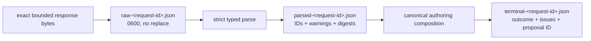

# `ollama_retention` schematic

```mermaid
flowchart LR
    HTTP["exact bounded response bytes"] --> Raw["raw-&lt;request-id&gt;.json<br/>0600; no replace"]
    Raw --> Parse["strict typed parse"]
    Parse --> Parsed["parsed-&lt;request-id&gt;.json<br/>IDs + warnings + digests"]
    Parsed --> Compose["canonical authoring composition"]
    Compose --> Terminal["terminal-&lt;request-id&gt;.json<br/>outcome + issues + proposal ID"]
```

Raw bytes are published before parsing. Parsed metadata contains no replacement text,
target excerpt, or evidence excerpt. Terminal metadata is separate from both.
