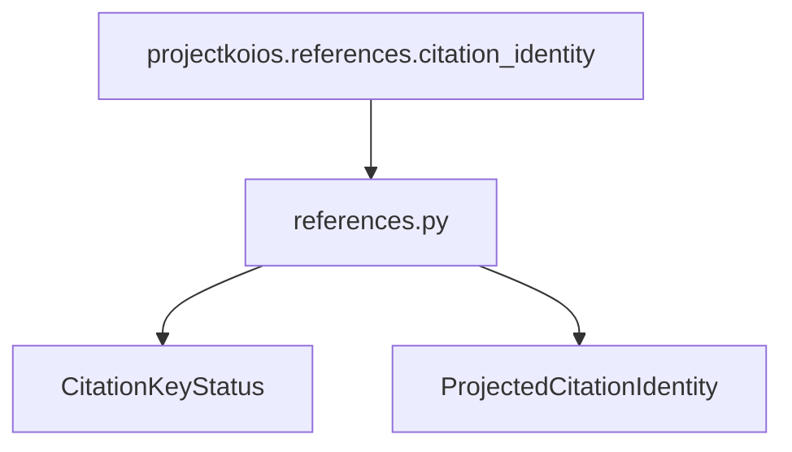

# `references` adapter implementation

`project` requires exactly one item correlated to the requested bibliographic work.
The result, source projection, and item identities are retained. All five owner
statuses map explicitly. Only `accepted-active-canonical` copies
`canonical_citekey`; there is deliberately no proposed-citekey field in the local
record.
