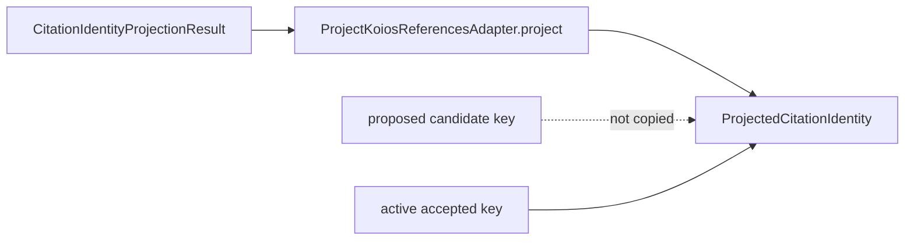

# `references` adapter schematic

```mermaid
flowchart LR
    Result["CitationIdentityProjectionResult"] --> Adapter["ProjectKoiosReferencesAdapter.project"]
    Adapter --> Local["ProjectedCitationIdentity"]
    Candidate["proposed candidate key"] -. "not copied" .-> Local
    Canonical["active accepted key"] --> Local
```
