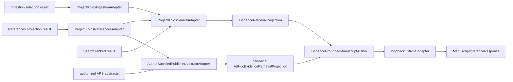

# `adapters` schematic

```mermaid
flowchart LR
    References["References projection result"] --> RefAdapter["ProjectKoiosReferencesAdapter"]
    Ingestion["Ingestion selection result"] --> IngAdapter["ProjectKoiosIngestionAdapter"]
    Search["Search ranked result"] --> SearchAdapter["ProjectKoiosSearchAdapter"]
    RefAdapter --> SearchAdapter
    IngAdapter --> SearchAdapter
    SearchAdapter --> Local["EvidenceRetrievalProjection"]
    Abstracts["authorized APS abstracts"] --> AdHoc["AuthorSuppliedPublisherAbstractAdapter"]
    RefAdapter --> AdHoc
    AdHoc --> AdHocProjection["canonical AdHocEvidenceRetrievalProjection"]
    Local --> Author["EvidenceGroundedManuscriptAuthor"]
    AdHocProjection --> Author
    Author --> Ollama["loopback Ollama adapter"]
    Ollama --> Response["ManuscriptInferenceResponse"]
```

Search rank order is retained; the evidence adapters perform no retrieval or
reranking. The inference adapter has only a bounded literal-loopback HTTP capability.
