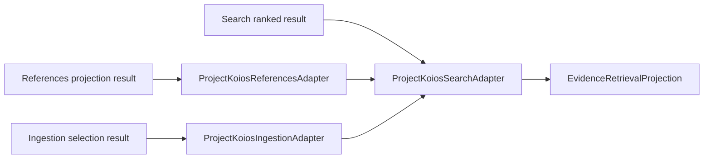

# `adapters` schematic

```mermaid
flowchart LR
    References["References projection result"] --> RefAdapter["ProjectKoiosReferencesAdapter"]
    Ingestion["Ingestion selection result"] --> IngAdapter["ProjectKoiosIngestionAdapter"]
    Search["Search ranked result"] --> SearchAdapter["ProjectKoiosSearchAdapter"]
    RefAdapter --> SearchAdapter
    IngAdapter --> SearchAdapter
    SearchAdapter --> Local["EvidenceRetrievalProjection"]
```

Search rank order is retained; the adapters perform no retrieval or reranking.
