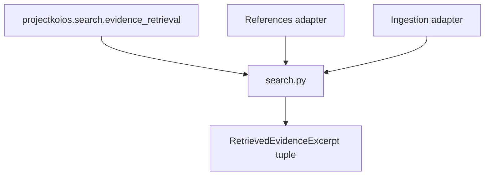

# `search` adapter implementation

`project` iterates the owner ranked tuple without sorting. Every excerpt retains the
Search result, evidence-item, ranked-item and rank identities; References result,
projection and item identities; and Ingestion selection, transcript, selected-page,
selected-block, page, block, and block-record identities. Search/References status or
citekey disagreement, ambiguous joins, warning-only selections, and text/digest
mismatch fail closed.
