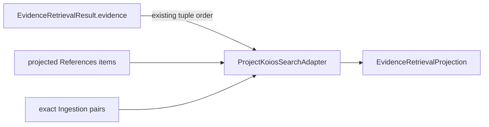

# `search` adapter schematic

```mermaid
flowchart LR
    Ranked["EvidenceRetrievalResult.evidence"] -->|existing tuple order| Adapter["ProjectKoiosSearchAdapter"]
    Citations["projected References items"] --> Adapter
    Blocks["exact Ingestion pairs"] --> Adapter
    Adapter --> Projection["EvidenceRetrievalProjection"]
```
