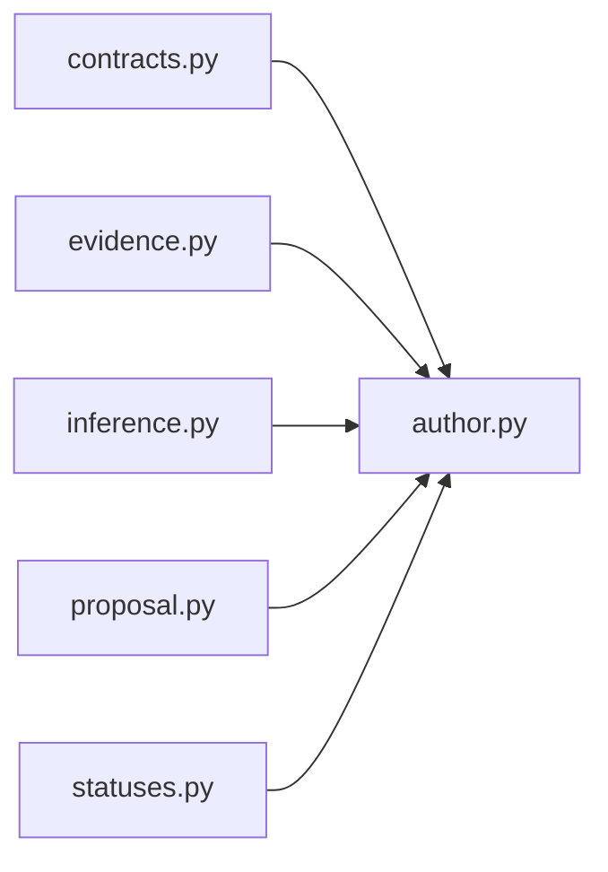

# `author` implementation

`EvidenceGroundedManuscriptAuthor.execute` is the sole proposal-composition path.
`prompt_for` constructs the deterministic prompt but performs no inference or
admission. The response must reproduce the request-owned citation tuple exactly;
equivalent sets, reordered citations, or duplicated/repartitioned evidence fail with a
closed citation-evidence mismatch before proposal construction. The action invokes no
filesystem, Git, retrieval, ranking, bibliography, manuscript-write, network, or
publication capability.
