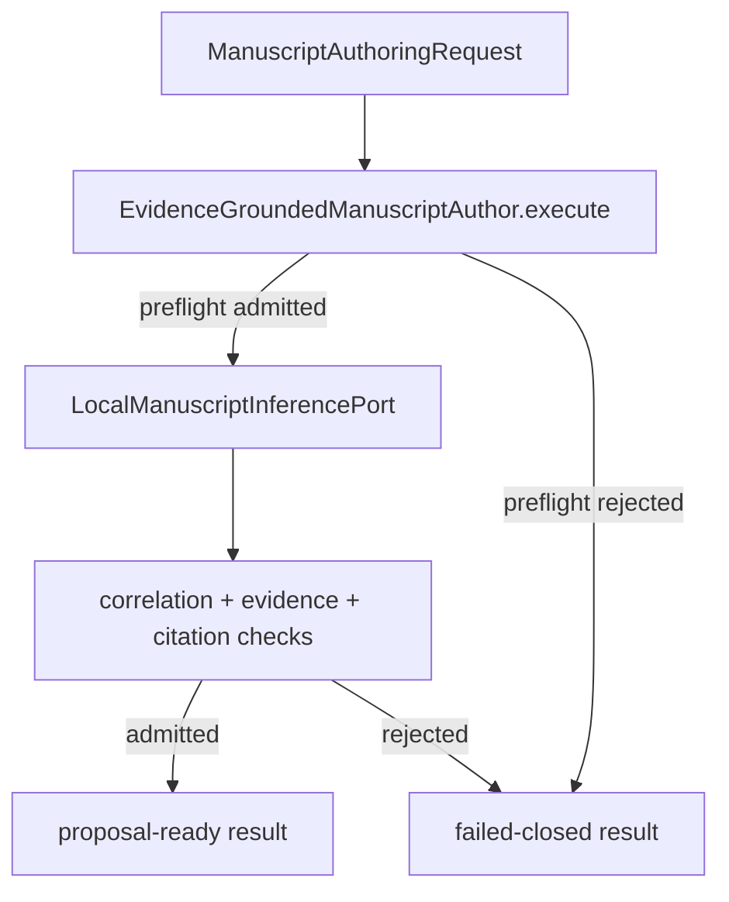

# `author` schematic

```mermaid
flowchart TD
    Request["ManuscriptAuthoringRequest"] --> Author["EvidenceGroundedManuscriptAuthor.execute"]
    Author -->|preflight admitted| Inference["LocalManuscriptInferencePort"]
    Author -->|preflight rejected| Failure["failed-closed result"]
    Inference --> Checks["correlation + evidence + citation checks"]
    Checks -->|admitted| Proposal["proposal-ready result"]
    Checks -->|rejected| Failure
```
