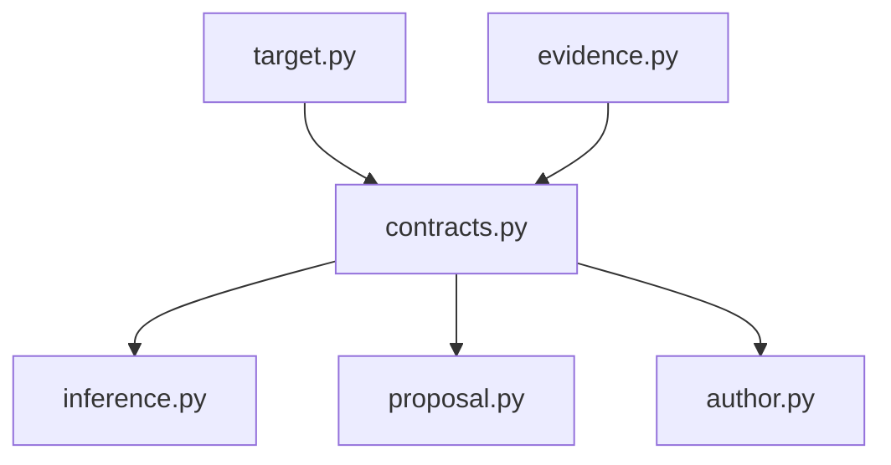

# `contracts` implementation

`ManuscriptAuthoringRequest` validates exact owner types, unique bounded required-work
identities, trimmed instruction text, and caller-selected output limits. Its identity
binds target/span, retrieval projection, required works, instruction, and bounds.
