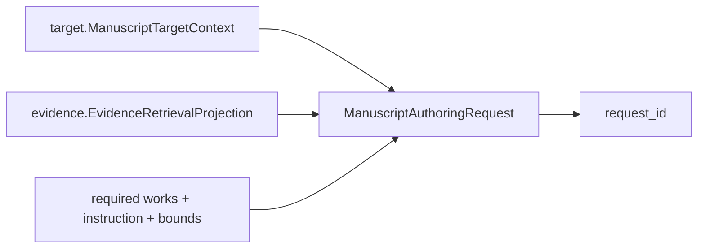

# `contracts` schematic

```mermaid
flowchart LR
    Target["target.ManuscriptTargetContext"] --> Request["ManuscriptAuthoringRequest"]
    Evidence["evidence.EvidenceRetrievalProjection"] --> Request
    Intent["required works + instruction + bounds"] --> Request
    Request --> RequestId["request_id"]
```
