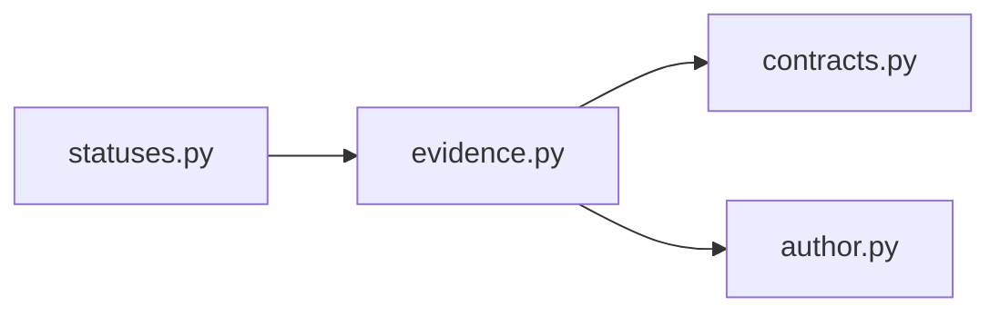

# `evidence` implementation

The records preserve selection, transcript, page, block, block-record, work, citation
projection, source-span, text, digest, and warning identities. Only
`CLEAN_TRANSCRIPT_BLOCK_EXACT_PAIR` is admitted. Warning-inspection selections cannot
expose evidence, and available retrievals require exact selection correlation.
