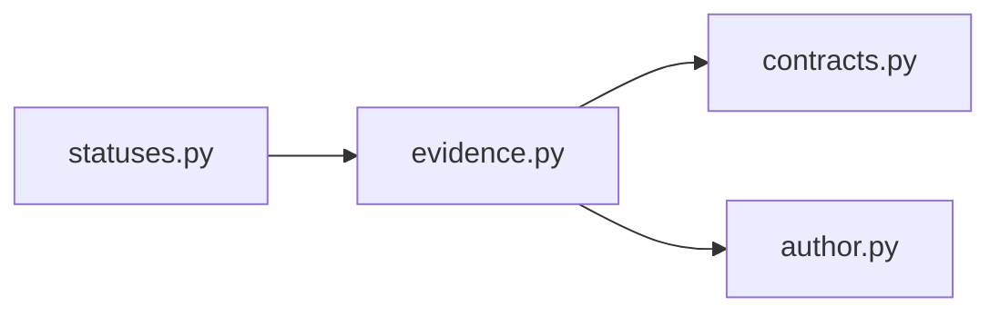

# `evidence` implementation

The records preserve Search result, evidence-item, ranked-item and rank; References
result, projection and item; Ingestion selection, transcript, selected-page,
selected-block, page, block and block-record; work, source-span, text, digest, outcome,
and warning identities. Only
`CLEAN_TRANSCRIPT_BLOCK_EXACT_PAIR` is admitted. Warning-inspection selections cannot
expose evidence, and available retrievals require exact selection correlation.
