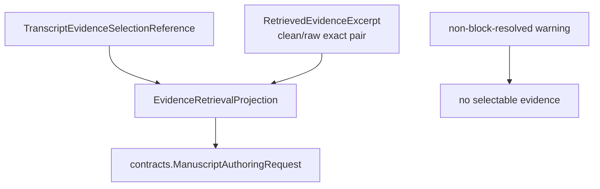

# `evidence` schematic

```mermaid
flowchart TD
    Selection["TranscriptEvidenceSelectionReference"] --> Projection["EvidenceRetrievalProjection"]
    Excerpt["RetrievedEvidenceExcerpt<br/>clean/raw exact pair"] --> Projection
    Warning["non-block-resolved warning"] --> Closed["no selectable evidence"]
    Projection --> Request["contracts.ManuscriptAuthoringRequest"]
```

Every selectable excerpt correlates to an available retained selection result.
