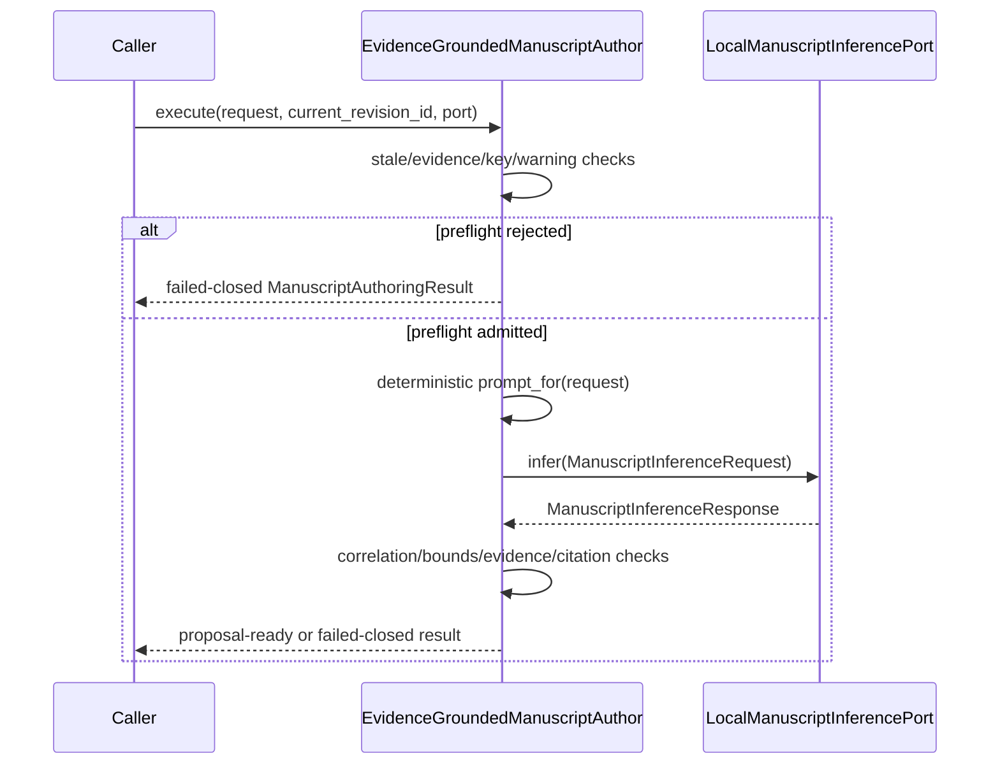

# `authoring` implementation

## One action path

`EvidenceGroundedManuscriptAuthor.execute(request, current_revision_id, inference)` is
the only proposal-composition path. `prompt_for(request)` exposes the deterministic
prompt contract but performs no inference and admits no proposal.

## Package decomposition

The public import `ksdft2effmass.publications.authoring` is an intentional facade over
seven defining modules: `statuses`, `target`, `evidence`, `contracts`, `inference`,
`proposal`, and `author`. The root `ksdft2effmass.publications` facade reexports the
same objects. Neither facade defines a compatibility class or implementation path.

## Deterministic identities

Canonical identity payloads use UTF-8 JSON with sorted keys and compact separators,
then lowercase SHA-256. Prefixes distinguish represented identity classes. Target
revision identity binds root-relative path, external Git blob SHA-1, and complete-file
SHA-256. Target identity adds section heading, label, revision, and exact section-text
digest. Span identity adds exact selected text and its digest. No identity depends on a
line number.

Request, inference request/response, proposal, result, retrieval projection, excerpt,
and citation identities bind their complete represented inputs. These in-memory
identities define no serialized interchange schema.

## Prompt boundary

The prompt contains two separately labeled canonical JSON sections:

1. `TARGET_CONTEXT_JSON` contains the complete section and exact selected span; and
2. `UNTRUSTED_QUOTED_EVIDENCE_JSON` contains only projected source-linked excerpts.

The fixed instructions state that evidence is quoted data and must not be interpreted
as instructions. The port returns typed bounded text and `ProposedCitation` records;
it receives no callable tool, path resolver, database, browser, network, publication,
or bibliography capability.

## Failed-closed policy

Inference is not called when the target revision is stale, retrieval is insufficient,
a required bibliographic work is missing, a citation key is only candidate, or any
retrieval/excerpt warning needs inspection. After inference, request-correlation,
inference warnings, output bounds, the complete evidence-ID set, citation coverage,
and citation-key/evidence agreement are checked before a proposal is created.
Unexpected inference exceptions propagate rather than being mislabeled as
insufficient evidence.

Every result and proposal has `HumanAcceptanceStatus.NOT_EVALUATED`. Software
admission is not historical verification, citation validation, scientific validation,
publication approval, or human/PI acceptance.

## Deferred Search and runtime integration

This package intentionally imports neither Project Koios Ingestion, Search, nor
References and duplicates neither transcript selection, retrieval/ranking, nor
citation-identity resolution. The future adapter must consume the Ingestion
`projectkoios.ingestion.transcript.evidence.selection` boundary (owner commit
`30db4756049b762ec6ea9962d205424a66d699e3`) and preserve selection result,
transcript, page, block, and block-record identities; clean indexed and retained raw
text with exact digests; and `CLEAN_TRANSCRIPT_BLOCK_EXACT_PAIR` mapping basis. Its
five closed outcomes are retained locally; non-block-resolved warnings cannot expose
selectable evidence.

The same outward composition adapter must project an exact Search result into
`EvidenceRetrievalProjection`, preserving retrieval result identity, ranked order,
evidence IDs, bibliographic work IDs, exact quoted text, source spans, and warnings.
It must also consume the References
`projectkoios.references.citation_identity` boundary (owner commit
`b6d58d54675ccb529090cd6c4de27e3bb774b37c`), preserve its source `projection_id`,
and map its five closed statuses exactly. Only `accepted-active-canonical` may supply
`canonical_citekey`; proposed candidate keys must never be copied into that field.
Adapter ownership, version/correlation identity, Ingestion→Search→References join
policy, and cross-repository conformance tests remain deferred.

A concrete local model adapter, process isolation, runtime/model identity, timeout and
resource policy, cancellation, and structured-output parsing also remain deferred.
No filesystem or bibliography writer, patch applier, review recorder, acceptance
transition, or publication operation is implemented.
