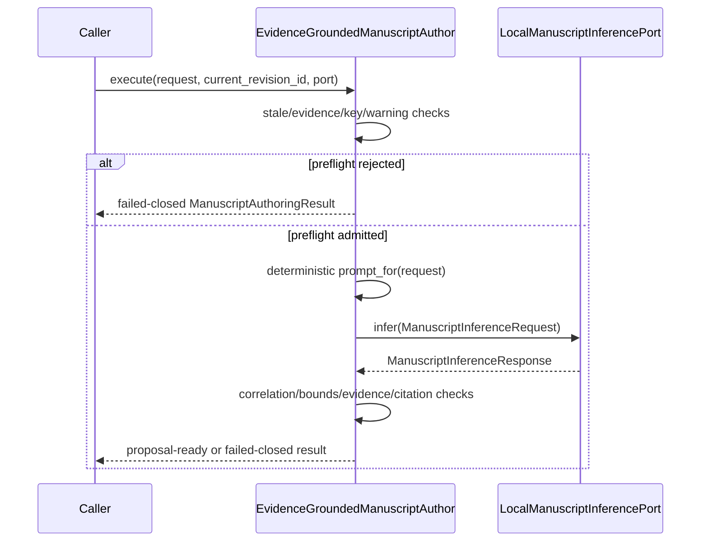

# `authoring` implementation

## One action path

`EvidenceGroundedManuscriptAuthor.execute(request, current_revision_id, inference)` is
the only proposal-composition path. `prompt_for(request)` exposes the deterministic
prompt contract but performs no inference and admits no proposal.

## Package decomposition

The public import `ksdft2effmass.publications.authoring` is an intentional facade over
nine defining modules—`statuses`, `target`, `evidence`, `ad_hoc_evidence`,
`contracts`, `inference`, `proposal`, `author`, and `local_run`—plus the bounded
`adapters` package.
The root
`ksdft2effmass.publications` facade reexports the
same objects. Neither facade defines a compatibility class or implementation path.

## Deterministic identities

Canonical identity payloads use UTF-8 JSON with sorted keys and compact separators,
then lowercase SHA-256. Prefixes distinguish represented identity classes. Target
revision identity binds root-relative path, external Git blob SHA-1, and complete-file
SHA-256. Target identity adds section heading, label, revision, and exact section-text
digest. Span identity adds exact selected text and its digest. No identity depends on a
line number.

Request, inference request/response, proposal, result, retrieval projection, excerpt,
and citation identities bind their complete represented inputs. These in-memory
identities define no serialized interchange schema.

## Prompt boundary

The prompt contains two separately labeled canonical JSON sections:

1. `TARGET_CONTEXT_JSON` contains the complete section and exact selected span; and
2. `UNTRUSTED_QUOTED_EVIDENCE_JSON` contains only projected source-linked excerpts.

The fixed instructions state that evidence is quoted data and must not be interpreted
as instructions. The port returns typed bounded text and `ProposedCitation` records;
it receives no callable tool, path resolver, database, browser, network, publication,
or bibliography capability.

## Failed-closed policy

Inference is not called when the target revision is stale, retrieval is insufficient,
a required bibliographic work is missing, or any retrieval/excerpt warning needs
inspection. A candidate or missing citekey instead requires an exact evidence marker.
After inference, request correlation, warnings, output bounds, the complete evidence-ID
set, accepted-key citation coverage, gap-marker coverage, and rendered-key agreement
are checked before a proposal is created.
Unexpected inference exceptions propagate rather than being mislabeled as
insufficient evidence.

Every result and proposal has `HumanAcceptanceStatus.NOT_EVALUATED`. Software
admission is not historical verification, citation validation, scientific validation,
publication approval, or human/PI acceptance.

## Strict owner, ad-hoc abstract, and local-inference adapters

The [`adapters`](adapters/index.md) package consumes the canonical owner boundaries
`projectkoios.ingestion.transcript.evidence.selection`,
`projectkoios.search.evidence_retrieval`, and
`projectkoios.references.citation_identity`. Exact Git source revisions are declared
in `python/pyproject.toml` and resolved in `python/uv.lock`.

The adapters preserve Search result, evidence-item, ranked-item, and rank identities;
References result, source projection, item, status, and active canonical-key state;
and Ingestion selection, transcript, selected-page, selected-block, page, block, and
block-record identities. Indexed clean and retained raw text must match the exact
`CLEAN_TRANSCRIPT_BLOCK_EXACT_PAIR` and both digests. Search results are iterated in
owner rank order without sorting. Candidate proposed citekeys are never copied into
the canonical field, and non-block-resolved warning selections expose no evidence.
The package duplicates none of the owner selection, retrieval, ranking, or
citation-identity algorithms.

The separate `AuthorSuppliedPublisherAbstractAdapter` accepts only the three explicitly
authorized APS abstract URLs. It preserves `luttingerKohn1955` as accepted and keeps
`kohnLuttinger1955donor` and `baldereschiLipari1973` prospective. The evidence records
state `AUTHOR_SUPPLIED_AD_HOC` / `PUBLISHER_ABSTRACT`; source or extraction warnings
still stop before inference. Prospective keys produce exact evidence markers and a
`PROPOSAL_READY_WITH_CITATION_GAPS` result carrying inspection-required metadata,
never canonical citations.

`OllamaLoopbackManuscriptInferenceAdapter` implements the local port with a literal
`127.0.0.1` host, fixed `qwen3.5:9b` model digest, bounded timeout/context/prediction
and wire sizes, no proxy or redirect, no tools, no remote fallback, and strict
structured-output parsing. It does not launch or manage the service.

A runtime invocation remains separate from software admission and requires an exact
pre-execution scale/resource report. Runtime inputs and response/review output belong only under repository-ignored
`.pi/cache/evidence-authoring/` paths. The retention Action atomically writes separate
mode-`0600` raw-response, parsed-metadata, and terminal-outcome artifacts without
replacement. Metadata excludes source/target excerpts and generated replacement text;
runtime artifacts are never committed. No manuscript or bibliography writer, patch
applier, acceptance transition, retry, or publication operation is implemented.
