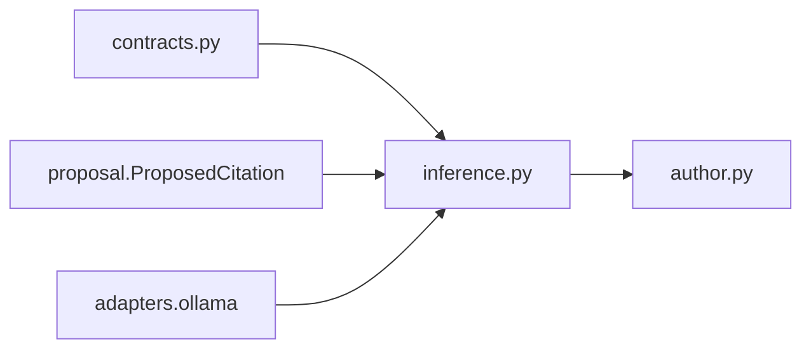

# `inference` implementation

The protocol exposes only `infer(ManuscriptInferenceRequest) ->
ManuscriptInferenceResponse`. Records impose hard size, identity, uniqueness, and
ordering bounds. The protocol remains runtime-neutral. The concrete
[`OllamaLoopbackManuscriptInferenceAdapter`](../adapters/ollama/index.md) fixes model
identity, loopback transport, timeout, generation bounds, no-tools policy, and
structured-output parsing; service launch and admitted-evidence selection remain
outside this module.
