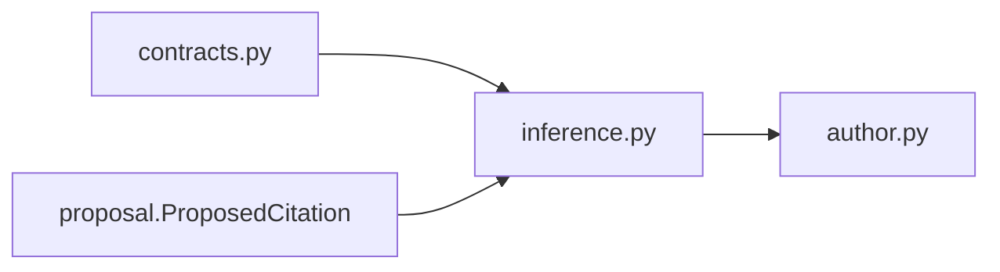

# `inference` implementation

The protocol exposes only `infer(ManuscriptInferenceRequest) ->
ManuscriptInferenceResponse`. Records impose hard size, identity, uniqueness, and
ordering bounds. Concrete runtime selection, process isolation, timeout, cancellation,
model identity, and structured-output parsing remain deferred.
