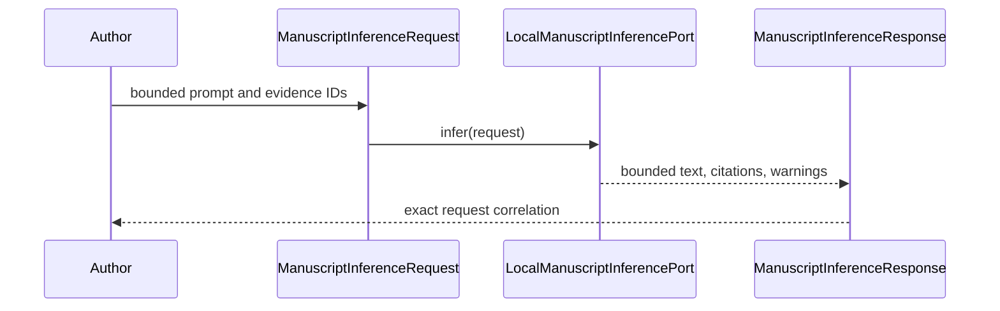

# `inference` schematic

```mermaid
sequenceDiagram
    participant Author
    participant Request as ManuscriptInferenceRequest
    participant Port as LocalManuscriptInferencePort
    participant Response as ManuscriptInferenceResponse
    Author->>Request: bounded prompt and evidence IDs
    Request->>Port: infer(request)
    Port-->>Response: bounded text, citations, warnings
    Response-->>Author: exact request correlation
```
