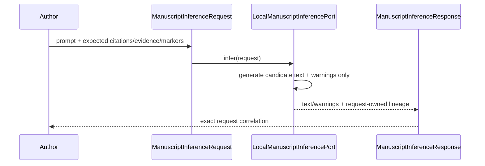

# `inference` schematic

```mermaid
sequenceDiagram
    participant Author
    participant Request as ManuscriptInferenceRequest
    participant Port as LocalManuscriptInferencePort
    participant Response as ManuscriptInferenceResponse
    Author->>Request: prompt + expected citations/evidence/markers
    Request->>Port: infer(request)
    Port->>Port: generate candidate text + warnings only
    Port-->>Response: text/warnings + request-owned lineage
    Response-->>Author: exact request correlation
```
