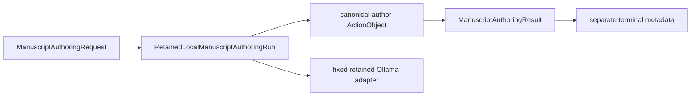

# `local_run` implementation

The Workflow asks the author owner for the exact inference-request identity, executes
the canonical author with an `OllamaLoopbackManuscriptInferenceAdapter`, and calls the
adapter's retention owner only to publish terminal metadata. Inspection-required and
post-parse mismatch results are retained just like proposal-ready results. The Workflow
adds no retry, warning reinterpretation, acceptance transition, manuscript write, or
bibliography write.
