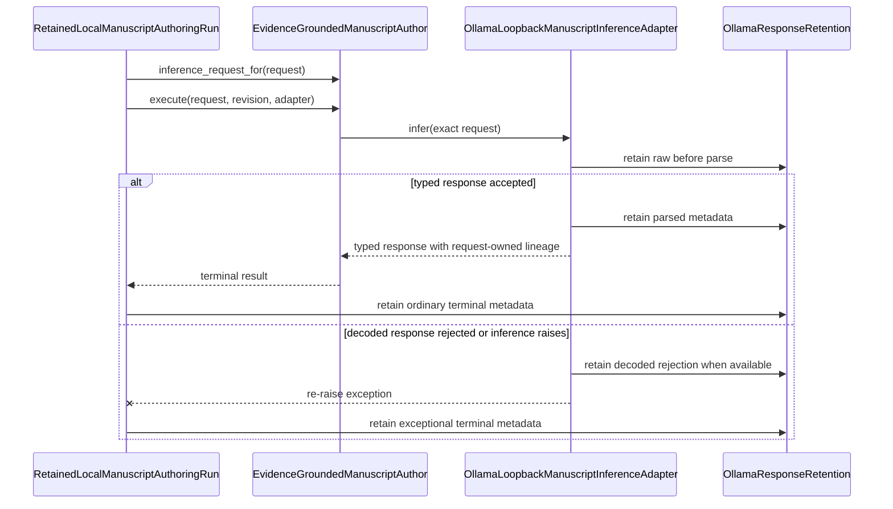

# `local_run` schematic

```mermaid
sequenceDiagram
    participant Workflow as RetainedLocalManuscriptAuthoringRun
    participant Author as EvidenceGroundedManuscriptAuthor
    participant Ollama as OllamaLoopbackManuscriptInferenceAdapter
    participant Cache as OllamaResponseRetention
    Workflow->>Author: inference_request_for(request)
    Workflow->>Author: execute(request, revision, adapter)
    Author->>Ollama: infer(exact request)
    Ollama->>Cache: retain raw before parse
    alt typed response accepted
        Ollama->>Cache: retain parsed metadata
        Ollama-->>Author: typed response with request-owned lineage
        Author-->>Workflow: terminal result
        Workflow->>Cache: retain ordinary terminal metadata
    else decoded response rejected or inference raises
        Ollama->>Cache: retain decoded rejection when available
        Ollama--xWorkflow: re-raise exception
        Workflow->>Cache: retain exceptional terminal metadata
    end
```

The Workflow does not duplicate authoring admission, reinterpret failures, or fabricate
a response/result identity for exceptional runs.
