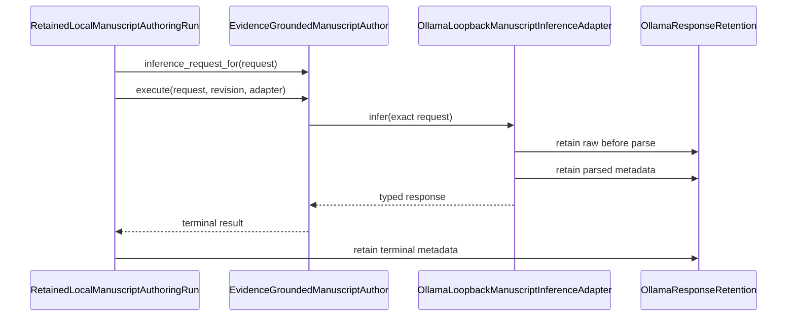

# `local_run` schematic

```mermaid
sequenceDiagram
    participant Workflow as RetainedLocalManuscriptAuthoringRun
    participant Author as EvidenceGroundedManuscriptAuthor
    participant Ollama as OllamaLoopbackManuscriptInferenceAdapter
    participant Cache as OllamaResponseRetention
    Workflow->>Author: inference_request_for(request)
    Workflow->>Author: execute(request, revision, adapter)
    Author->>Ollama: infer(exact request)
    Ollama->>Cache: retain raw before parse
    Ollama->>Cache: retain parsed metadata
    Ollama-->>Author: typed response
    Author-->>Workflow: terminal result
    Workflow->>Cache: retain terminal metadata
```

The Workflow does not duplicate authoring admission or proposal policy.
